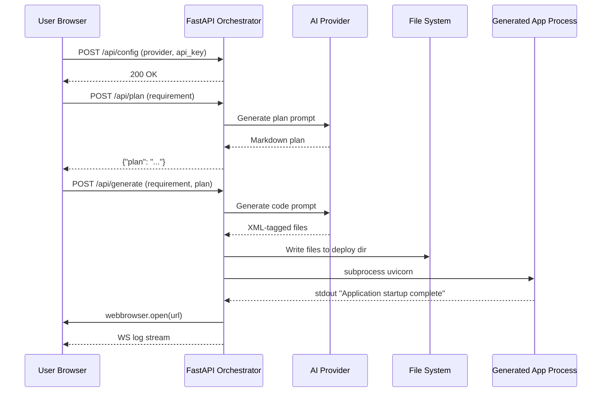

# AI Application Generator - Product Requirements Document (PRD)

**Document Version:** 2.0  
**Created:** March 6, 2026  
**Author:** Iain Reid  
**Status:** Final  
**Tech Stack:** Python 3.11+ / FastAPI  
**Security Standard:** FIPS 140-3, NIST SP 800-53, OWASP Top 10, DISA STIG, CIS Benchmark Level 2

---

## 1. Executive Summary

This Product Requirements Document (PRD) defines the specifications for an AI-powered web application generator that transforms natural language requirements into deployable Python web applications within a five-minute demonstration window. The system employs a two-stage AI process comprising plan generation followed by code generation, automatically deploys the resulting application to a local folder, and launches it in the user's default browser.

The core value proposition of this product is rapid prototyping and demonstration capability. Users can describe a web application in plain English, review and approve an AI-generated implementation plan, and receive a fully functional Python application that runs locally — all within minutes. This enables faster iteration on ideas, more effective client demonstrations, and reduced friction between concept and working prototype.

The entire system is implemented in Python. There is no dependency on Node.js, npm, or any JavaScript build tooling. The orchestrator backend, the serving frontend, and all generated applications are Python-based.

---

## 2. Original User Request

The following section captures the original requirement as expressed by the user:

> "I have a requirement to do a 5 minute demonstration of inputting a requirement into a web application and then when a submission button is clicked send that prompt immediately to a configurable AI provider such as Claude or Minimax to execute and deploy locally and startup the application. The functionality required is to take the requirement, stage 1 is to analyse the requirement and generate a plan. The plan should either be accepted or amended; when completed, there should be a submission button that sends the prompt for immediate execution against an AI framework. When completed, the generated application should then be deployed automatically to a defined folder and started and a browser window redirected to it to show the completed product that was asked for."

This request establishes the fundamental requirements: a configurable multi-provider AI backend, a two-stage workflow (plan then generate), local deployment, automatic browser launching, and operation within a five-minute timeframe.

---

## 3. Problem Statement

### 3.1 Current Challenges

Software development traditionally requires significant time investment before stakeholders can see a working prototype. The gap between conceptualisation and visualisation creates several problems:

First, non-technical stakeholders cannot easily communicate their vision without developer assistance. Writing code requires technical expertise that product managers, designers, and clients typically lack. This creates a bottleneck where ideas must pass through development teams before visualisation, often leading to misalignment between expectations and deliverables.

Second, even technical users face friction when rapidly prototyping ideas. Setting up a Python virtual environment, installing dependencies, and writing boilerplate code consumes time that could be spent on the core logic of the application. This overhead discourages exploratory prototyping.

Third, existing AI code generation tools operate in isolation. They generate code snippets or files but do not provide a complete path to a running application. Users must manually configure environments, resolve dependencies, and launch applications — tasks that negate the productivity benefits of AI-assisted development.

### 3.2 Market Opportunity

The emergence of capable large language models (LLMs) such as Claude and Minimax creates an opportunity to address these challenges. These models can understand complex requirements and generate functional Python code. The missing piece is an orchestration layer that connects requirements input through to a running application, managing the technical complexity of deployment automatically.

---

## 4. Product Goals and Objectives

### 4.1 Primary Goals

**Goal 1: Two-Stage AI Workflow.** The system must support a sequential workflow where the AI first generates an implementation plan that the user can review, amend, and approve before code generation begins. This ensures human oversight at a critical decision point while leveraging AI capabilities for detailed planning.

**Goal 2: Configurable AI Provider.** Users must be able to select between multiple AI providers (initially Claude and Minimax) without code changes. The system must abstract provider-specific details behind a unified Python interface, allowing demonstrations to proceed regardless of specific API availability.

**Goal 3: Automatic Local Deployment.** Generated Python applications must deploy automatically to a configurable local folder. The system must handle virtual environment activation, file creation, dependency management via `pip`, and process startup without manual intervention.

**Goal 4: Automatic Browser Launch.** Upon successful deployment, the system must launch the user's default browser and navigate to the running application automatically, using Python's built-in `webbrowser` module.

**Goal 5: Five-Minute Demonstration Window.** All operations from requirement submission to browser launch must complete within five minutes. This constraint drives key architectural decisions, particularly around the pre-installed base template that eliminates pip installation overhead at generation time.

### 4.2 Secondary Objectives

**Objective 6: Real-Time Feedback.** Users must receive continuous feedback during the generation and deployment process. Terminal-style log display via FastAPI WebSocket streaming helps users understand system progress and diagnose issues.

**Objective 7: Error Recovery.** The system must handle errors gracefully, providing actionable error messages and recovery options. Failed deployments must not leave the system in an inconsistent state.

**Objective 8: Extensibility.** The architecture must support adding new AI providers with minimal changes. The modular Python design must allow provider swapping without affecting core functionality.

**Objective 9: Security Compliance.** All components must meet FIPS 140-3, NIST SP 800-53, OWASP Top 10, DISA STIG, and CIS Benchmark Level 2 requirements.

---

## 5. Target Users

### 5.1 Primary User Personas

**Persona 1: Technical Presenter.** A developer or technical sales engineer who conducts product demonstrations. This user needs to rapidly generate working demos during sales calls or conference presentations. They value speed and reliability above all else.

**Persona 2: Product Manager.** A non-technical stakeholder who wants to visualise product ideas quickly. This user needs an intuitive interface that does not require coding knowledge. They value clear feedback and the ability to iterate on ideas.

**Persona 3: Rapid Prototyper.** A developer who wants to explore ideas quickly before committing to full implementation. This user needs the ability to generate working Python prototypes in minutes rather than hours.

---

## 6. Functional Requirements

### 6.1 Requirement Input (F1)

**F1.1** The system shall provide a text input area where users can enter their application requirement in natural language.

**F1.2** The system shall display example prompts to guide users toward effective requirement descriptions.

**F1.3** The system shall validate that the requirement meets minimum length (10 characters) and content criteria before accepting submission.

### 6.2 Configuration (F2)

**F2.1** The system shall provide a configuration panel for selecting the AI provider from available options (Claude, Minimax).

**F2.2** The system shall provide a secure password-type input field for entering the selected provider's API key.

**F2.3** The system shall validate API key credentials by making a minimal test request before allowing normal operations.

**F2.4** The system shall allow configuration of the output deployment folder path.

**F2.5** The system shall load default configuration values from environment variables using `pydantic-settings`.

### 6.3 Plan Generation – Stage 1 (F3)

**F3.1** Upon requirement submission, the system shall send the requirement to the configured AI provider with planning system prompt instructions.

**F3.2** The AI shall generate a structured implementation plan including file structure, component breakdown, and technical approach targeting FastAPI + Jinja2 + Tailwind CSS.

**F3.3** The system shall display the generated plan in rendered markdown format for user review.

**F3.4** Plan generation shall complete within 30 seconds under normal network conditions.

### 6.4 Plan Review and Amendment (F4)

**F4.1** The system shall display the original requirement alongside the generated plan for reference.

**F4.2** The system shall provide an editable text area where users can modify the generated plan.

**F4.3** The system shall provide a "Regenerate Plan" button that sends the requirement back to the AI with refinement instructions.

**F4.4** The system shall require explicit user approval of the plan before proceeding to code generation.

### 6.5 Code Generation – Stage 2 (F5)

**F5.1** Upon user approval, the system shall send both the requirement and approved plan to the AI provider for full code generation.

**F5.2** The AI shall generate complete Python application code including all necessary files (`pyproject.toml`, `requirements.txt`, `main.py`, templates, static assets).

**F5.3** The system shall parse the AI response using Python `re` module to extract individual file paths and contents from XML-tagged blocks.

**F5.4** Code generation shall complete within 90 seconds under normal network conditions.

### 6.6 Deployment (F6)

**F6.1** The system shall create the deployment folder if it does not exist.

**F6.2** The system shall clean previous deployment artefacts before writing new files.

**F6.3** The system shall write all generated files to the deployment folder using `pathlib.Path` operations.

**F6.4** The system shall copy the pre-installed base template virtual environment and overwrite only the source files.

**F6.5** The system shall start the application using `uvicorn` via Python `subprocess`, capturing stdout and stderr.

**F6.6** The system shall monitor the subprocess stdout to detect server readiness.

**F6.7** The deployment process shall complete within 15 seconds.

### 6.7 Browser Launch (F7)

**F7.1** Upon detecting server readiness, the system shall launch the user's default browser using `webbrowser.open()`.

**F7.2** The system shall navigate to the application's local URL (e.g., `http://localhost:8001`).

**F7.3** If browser launch fails, the system shall display the URL for manual navigation.

### 6.8 Process Management (F8)

**F8.1** The system shall use `psutil` to detect and terminate any existing process occupying the target port before starting a new deployment.

**F8.2** The system shall provide a "Stop" button to terminate the running application and all child processes.

**F8.3** The system shall handle unexpected process termination gracefully without leaving zombie processes.

---

## 7. Non-Functional Requirements

### 7.1 Performance Requirements

**NFR1:** End-to-end latency from requirement submission to browser launch shall not exceed 300 seconds (5 minutes) under normal operating conditions.

**NFR2:** Plan generation shall complete within 30 seconds.

**NFR3:** Code generation shall complete within 90 seconds.

**NFR4:** Deployment shall complete within 15 seconds, facilitated by the pre-installed base template.

### 7.2 Reliability Requirements

**NFR5:** The system shall handle AI API failures with appropriate error messages and retry options.

**NFR6:** The system shall validate all user inputs before processing using Pydantic v2 models.

**NFR7:** The system shall not leave orphaned processes after termination. `psutil` process tree termination must be used.

### 7.3 Usability Requirements

**NFR8:** The interface shall provide clear feedback for every user action via WebSocket log streaming.

**NFR9:** Error messages shall be actionable and help users resolve issues.

**NFR10:** The interface shall be intuitive enough for non-technical users to operate successfully.

### 7.4 Security Requirements

**NFR11:** API keys shall be stored only in server memory (Python process scope) and never persisted to disk or logged.

**NFR12:** The system shall sanitise all path inputs using `pathlib.Path.resolve()` to prevent directory traversal attacks (CWE-22).

**NFR13:** File system operations shall be restricted to the designated deployment directory.

**NFR14:** All subprocess commands shall use list-form arguments (never shell string interpolation) to prevent command injection (CWE-78).

**NFR15:** Cryptographic operations shall use the Python `cryptography` library, which is FIPS 140-3 validated.

**NFR16:** The system shall implement rate limiting on all API endpoints to mitigate denial-of-service risk (NIST SP 800-53 SC-5).

**NFR17:** All HTTP responses shall include appropriate security headers (CSP, HSTS, X-Frame-Options, X-Content-Type-Options).

---

## 8. Technical Architecture

### 8.1 System Architecture Overview

The system employs a client-server architecture consisting of three primary components:

**Frontend Client:** A server-rendered HTML interface delivered by the FastAPI backend using Jinja2 templates. Tailwind CSS is loaded via CDN. Vanilla JavaScript handles WebSocket connectivity and dynamic view transitions. No separate frontend server, build step, or npm dependency is required.

**Orchestrator Server:** A Python FastAPI application handling all backend operations including AI API communication, file system manipulation via `pathlib`, and process management via `subprocess` and `psutil`. The server exposes RESTful JSON endpoints for each workflow phase and streams execution logs to the browser via WebSocket.

**Pre-installed Base Template:** A minimal FastAPI + Jinja2 + Tailwind CSS application with a Python virtual environment and base dependencies pre-installed. Copying this template and overwriting source files constitutes a full deployment in under 15 seconds.

### 8.2 Component Interaction Diagram

### 8.3 Technology Stack

| Layer | Technology | Notes |
|-------|-----------|-------|
| Orchestrator Backend | Python 3.11+ / FastAPI 0.110+ | Async request handling |
| AI SDK – Claude | `anthropic` 0.25+ | Official Python SDK |
| AI SDK – Minimax | `httpx` 0.27+ | Async HTTP client |
| Template Engine | `Jinja2` 3.1+ | Server-side rendering |
| WebSocket | FastAPI built-in | Log streaming |
| Input Validation | `pydantic` v2 | Request / response models |
| Configuration | `pydantic-settings` 2.x | Env var loading |
| Process Management | `psutil` 5.9+ | Port detection, process kill |
| Browser Launch | `webbrowser` (stdlib) | Cross-platform |
| Env Variables | `python-dotenv` 1.0+ | `.env` file loading |
| FIPS Cryptography | `cryptography` 42.x+ | FIPS 140-3 validated |
| Container Runtime | Podman 4.x+ | Rootless container build |
| Generated App | FastAPI + Jinja2 + Tailwind CDN | Same Python stack |

---

## 9. User Interface Requirements

### 9.1 Layout Structure

The interface follows a single-page pattern delivered by Jinja2 templates with four sequential views controlled by JavaScript state:

**Input View:** Central requirement text area with example prompts, configuration panel (provider dropdown and API key field), and "Generate Plan" button.

**Plan View:** Two-panel layout with the original requirement (read-only) on the left, and an editable `<textarea>` for the plan on the right. Buttons for "Regenerate Plan" and "Submit for Execution."

**Execution View:** Terminal-style scrolling log panel receiving WebSocket messages, a progress phase indicator, and a "Cancel" button.

**Success View:** Success message with the application URL in a copyable field, plus "Open in Browser" and "Start New Generation" buttons.

### 9.2 Visual Design

**Colour Palette:** Background `#0f172a` (slate-900), surface `#1e293b` (slate-800), primary text `#f8fafc` (slate-50), secondary text `#94a3b8` (slate-400), accent `#3b82f6` (blue-500), success `#22c55e` (green-500), error `#ef4444` (red-500).

**Typography:** Inter for UI elements, JetBrains Mono for terminal log output (both loaded via Google Fonts CDN).

**Theme:** Dark mode, optimised for developer aesthetics and extended use.

---

## 10. API Requirements

### 10.1 Backend API Endpoints

All endpoints accept and return `application/json`. Pydantic v2 models define all request and response schemas.

| Method | Endpoint | Description |
|--------|----------|-------------|
| `POST` | `/api/config` | Configure AI provider and API key |
| `POST` | `/api/plan` | Generate implementation plan |
| `POST` | `/api/generate` | Generate code and deploy application |
| `GET` | `/api/status` | Query current execution status |
| `POST` | `/api/stop` | Terminate the running generated application |
| `WebSocket` | `/ws/logs` | Stream execution log messages to browser |

### 10.2 Request and Response Formats

All API endpoints use Pydantic v2 models for input validation and output serialisation. Error responses include a `detail` field with a descriptive message and a `code` field for programmatic handling. Status responses include `phase` (string), `progress` (integer 0–100), and `url` (string, when running).

---

## 11. Security Considerations

### 11.1 API Key Management (NIST SP 800-53 IA-5, OWASP A02)

API keys are received through the `/api/config` endpoint, validated against the provider, and stored only in a Python in-memory dictionary scoped to the running process. Keys are never written to disk, included in log output, or returned in any API response. Keys are discarded when the process terminates. Logging configuration must explicitly exclude the `api_key` field.

### 11.2 File System Security (CWE-22, NIST SP 800-53 AC-3)

All file system operations use `pathlib.Path`. User-supplied paths are resolved with `Path.resolve()` and checked to confirm they fall within the designated deployment root before any read or write is performed. Any path that resolves outside the deployment root is rejected with HTTP 400.

### 11.3 Subprocess Security (CWE-78, DISA STIG V-230264)

All subprocess calls use list-form arguments (e.g., `subprocess.Popen(["uvicorn", "main:app", "--port", "8001"])`). Shell string interpolation is strictly prohibited. User-provided values are never directly included in subprocess argument lists without explicit validation and allowlisting.

### 11.4 FIPS 140-3 Compliance

Any cryptographic operation (e.g., token generation, hashing) must use the Python `cryptography` library (version 42+), which uses OpenSSL as its backend and is FIPS 140-3 validated when running on a FIPS-enabled operating system. The `hashlib` stdlib module may be used for non-security-sensitive hashing. MD5 and SHA-1 are prohibited for any security-sensitive purpose.

### 11.5 Input Validation (OWASP A03, NIST SP 800-53 SI-10)

All API request bodies are validated by Pydantic v2 models before any business logic executes. Minimum and maximum length constraints are applied to all string fields. The requirement field minimum length is 10 characters. API key fields are validated with a provider test request before being accepted into memory.

### 11.6 Security Headers (OWASP A05, CIS Benchmark)

The FastAPI application shall include a middleware layer that sets the following HTTP response headers on all responses: `Content-Security-Policy`, `Strict-Transport-Security`, `X-Frame-Options: DENY`, `X-Content-Type-Options: nosniff`, `Referrer-Policy: no-referrer`.

---

## 12. Implementation Roadmap

### Phase 1: Foundation (Week 1)
Set up Python project structure with `pyproject.toml`. Create virtual environment. Implement FastAPI application skeleton with CORS and security header middleware. Implement `pathlib`-based file system utilities with path traversal protection. Create and verify the pre-installed base template.

### Phase 2: AI Integration (Week 2)
Implement AI provider abstraction layer as a Python Protocol class. Create plan generation endpoint with system prompt engineering. Develop code generation endpoint with XML file parser using Python `re`. Test with Claude and Minimax providers.

### Phase 3: Process Management and Deployment (Week 3)
Implement port detection using `psutil`. Build deployment workflow: copy base template, overwrite source files, start `uvicorn` subprocess. Implement stdout monitoring for readiness detection. Add `webbrowser.open()` browser launch. Implement `POST /api/stop` with full process tree termination.

### Phase 4: Frontend Development (Week 4)
Build all four Jinja2 template views. Implement WebSocket log streaming. Apply Tailwind CSS dark theme. Add vanilla JavaScript for view transitions and WebSocket client.

### Phase 5: Testing and Hardening (Week 5)
Conduct end-to-end testing across requirement types. Run `bandit` for security scanning. Run `pip-audit` for dependency vulnerability scanning. Measure phase timings. Verify cross-platform compatibility (Windows, macOS, Linux). Build and test Podman container image.

---

## 13. Success Criteria

**SC1:** Users can enter a requirement, review a generated plan, and receive a running Python application within five minutes.

**SC2:** The system supports both Claude and Minimax as selectable AI providers via a unified abstraction layer.

**SC3:** Generated Python applications deploy to the local file system and launch in the default browser automatically.

**SC4:** The interface provides real-time WebSocket feedback throughout the generation and deployment process.

**SC5:** Error conditions are handled gracefully with actionable error messages.

**SC6:** Security scanning with `bandit` produces no high-severity findings.

**SC7:** Dependency scanning with `pip-audit` produces no known critical vulnerabilities.

**SC8:** All API endpoints validate input using Pydantic v2 models.

---

## 14. Glossary

**AI Provider:** An external AI service (e.g., Claude by Anthropic, Minimax) that generates text responses based on input prompts.

**Base Template:** A pre-configured Python FastAPI application with a virtual environment and base dependencies pre-installed, used as the foundation for all generated applications.

**Deployment:** The process of copying generated Python files to a local folder and starting the application server using `uvicorn`.

**Orchestrator Server:** The FastAPI backend server that coordinates AI communication, file operations, and process management.

**Plan Generation:** Stage 1 of the workflow where the AI creates an implementation plan from the user's requirement.

**Code Generation:** Stage 2 of the workflow where the AI generates complete Python application code based on the approved plan.

**FIPS 140-3:** Federal Information Processing Standard for cryptographic modules. Compliance required for all cryptographic operations.

**psutil:** Python cross-platform library for process and system utilities, used for port detection and process tree management.

**uvicorn:** ASGI server used to run FastAPI applications locally.

---

**Document End**

---

**Sources and References:**

- FastAPI Documentation: https://fastapi.tiangolo.com
- Anthropic Python SDK: https://github.com/anthropic-ai/anthropic-sdk-python
- Python `cryptography` FIPS documentation: https://cryptography.io/en/latest/faq/#fips
- NIST SP 800-53 Rev 5: https://csrc.nist.gov/publications/detail/sp/800-53/rev-5/final
- OWASP Top 10: https://owasp.org/www-project-top-ten/
- CWE-22 Path Traversal: https://cwe.mitre.org/data/definitions/22.html
- CWE-78 Command Injection: https://cwe.mitre.org/data/definitions/78.html
- DISA STIG Application Security: https://public.cyber.mil/stigs/
- CIS Benchmark Level 2: https://www.cisecurity.org/cis-benchmarks
- psutil Documentation: https://psutil.readthedocs.io
- pydantic-settings: https://docs.pydantic.dev/latest/concepts/pydantic_settings/
