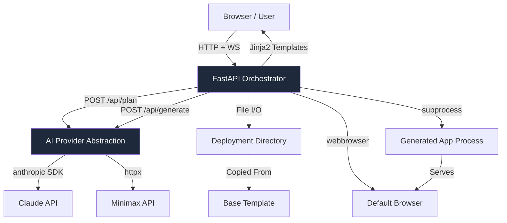

# AI Application Generator - Project Documentation

**Project Name:** AI Application Generator  
**Version:** 2.0  
**Last Updated:** March 6, 2026  
**Tech Stack:** Python 3.11+ / FastAPI  
**Security Standard:** FIPS 140-3, NIST SP 800-53, OWASP Top 10, DISA STIG, CIS Benchmark Level 2

---

## Overview

This folder contains the complete planning and requirements documentation for an AI-powered web application generator. The system is designed to transform natural language requirements into fully functional web applications within a five-minute demonstration window.

The core functionality enables users to describe a web application in plain English, review and approve an AI-generated implementation plan, and receive a running application that launches automatically in their browser. This dramatically accelerates the prototyping and demonstration process by eliminating the traditional gap between conceptualization and working prototype.

The system is built entirely in Python, using FastAPI for the orchestration backend and serving a lightweight frontend using Jinja2 templating with Tailwind CSS via CDN. Generated applications are also Python-based (FastAPI + Jinja2), eliminating any dependency on Node.js, npm, or frontend build tooling.

---

## Folder Contents

This folder contains the following documentation files:

### 1. PRD-AI-App-Generator.md

The Product Requirements Document (PRD) provides a comprehensive specification of the AI Application Generator system. This document includes the original user request that drove the project definition, detailed problem statement explaining the challenges being addressed, complete functional requirements covering all phases of operation, non-functional requirements for performance and reliability, technical architecture design and component breakdown, user interface specifications and visual design guidelines, API endpoint definitions, security considerations aligned to FIPS 140-3 / NIST / OWASP / DISA STIG standards, and an implementation roadmap with four development phases.

The PRD serves as the authoritative reference for all product decisions and ensures alignment between stakeholders on system capabilities and constraints.

### 2. plan_for_a_plan.md

The Implementation Plan provides a detailed technical roadmap for building the AI Application Generator in Python. This document contains the complete system architecture including the client-server model and component interactions, Python technology stack with specific library versions, five distinct implementation phases with clear deliverables, detailed API endpoint specifications using FastAPI conventions, system prompt engineering guidelines for optimal AI responses, file parsing implementation details using Python standard library, configuration and environment setup with `pydantic-settings` and `python-dotenv`, Podman container build guidance, performance targets broken down by operation phase, comprehensive error handling scenarios and solutions, and security implementation guidelines aligned to FIPS 140-3 and OWASP standards.

The Implementation Plan serves as the practical guide for developers building the system, providing code-level specifications and step-by-step instructions.

### 3. PROGRESS.md

The Progress Tracker records the current state of implementation, completed milestones, open issues, and next actions. This file is updated as implementation progresses and serves as the single source of truth for project status.

---

## Key Features

The AI Application Generator includes the following key features designed to meet the five-minute demonstration requirement:

**Two-Stage AI Workflow:** The system employs a sequential workflow where the AI first generates an implementation plan that users can review, amend, and approve before code generation begins. This ensures human oversight at a critical decision point while leveraging AI capabilities for detailed planning.

**Configurable AI Providers:** Users can select between multiple AI providers including Claude (Anthropic) and Minimax without requiring code changes. The system abstracts provider-specific details behind a unified Python interface, allowing demonstrations to proceed regardless of specific API availability.

**Automatic Local Deployment:** Generated Python applications deploy automatically to a configurable local folder. The system handles virtual environment creation, file writing, dependency installation via pip, and process startup without manual intervention.

**Automatic Browser Launch:** Upon successful deployment, the system launches the user's default browser and navigates to the running application automatically using Python's built-in `webbrowser` module.

**Real-Time Feedback:** Users receive continuous feedback during the generation and deployment process through a terminal-style log display using FastAPI WebSocket streaming.

**No npm Required:** The entire stack — orchestrator, frontend, and generated applications — is pure Python. There is no Node.js, npm, or frontend build tooling anywhere in the system.

---

## System Architecture

The system employs a client-server architecture consisting of three primary components:

**Frontend Client:** A server-rendered HTML interface using Jinja2 templates, Tailwind CSS via CDN, and vanilla JavaScript for WebSocket connectivity. Served directly by the FastAPI backend, eliminating the need for a separate frontend server.

**Orchestrator Server:** A Python FastAPI application handling all backend operations including AI API communication, file system manipulation, subprocess management, and WebSocket log streaming. The server exposes RESTful endpoints for each workflow phase and manages the application lifecycle.

**Pre-installed Base Template:** A minimal FastAPI + Jinja2 + Tailwind CSS (CDN) application with a pre-created virtual environment and dependencies installed. This template serves as the foundation for all generated applications, enabling rapid deployment in under 15 seconds without reinstalling packages on every generation.

---

## System Architecture Diagram



---

## Workflow Description

The system operates through four distinct phases:

**Phase 1 – Requirement Input:** Users enter their application requirement in natural language through the browser interface. Example prompts guide users toward effective requirement descriptions. Users also configure their preferred AI provider and supply their API key via a secure password field.

**Phase 2 – Plan Generation:** The system sends the requirement to the configured AI provider using the Python `anthropic` SDK or `httpx`. The AI generates a structured implementation plan. Users can review, edit, and approve this plan before proceeding.

**Phase 3 – Code Generation:** Upon approval, the system sends both the requirement and approved plan to the AI provider for full code generation. The AI produces complete application code wrapped in XML file tags. Python's `re` module parses the response and writes files to the deployment directory.

**Phase 4 – Deployment and Launch:** The system copies the pre-installed base template to the deployment directory, overwrites source files with generated code, creates or activates a virtual environment, installs any additional dependencies via `pip`, starts the application using Python `subprocess`, detects server readiness from stdout output, and launches the default browser using `webbrowser.open()`.

---

## Performance Targets

| Phase | Maximum Duration |
|-------|-----------------|
| Plan Generation | 30 seconds |
| Code Generation | 90 seconds |
| Deployment | 15 seconds |
| Browser Launch | 2 seconds |
| **Total End-to-End** | **180 seconds (3 minutes)** |

The 15-second deployment target is achievable because the base template's virtual environment and dependencies are pre-installed. Deployment only copies files and starts the process — no pip install required at generation time.

---

## Technology Stack

| Layer | Technology | Version |
|-------|-----------|---------|
| Orchestrator Backend | Python / FastAPI | Python 3.11+, FastAPI 0.110+ |
| Async HTTP Client | httpx | 0.27+ |
| AI SDK (Claude) | anthropic | 0.25+ |
| Template Engine | Jinja2 | 3.1+ |
| WebSocket | FastAPI WebSocket (built-in) | — |
| Settings / Config | pydantic-settings | 2.x |
| Process Management | psutil | 5.9+ |
| Browser Launch | webbrowser (stdlib) | — |
| Env Vars | python-dotenv | 1.0+ |
| Generated App Backend | FastAPI + Jinja2 | Same versions |
| Generated App Styling | Tailwind CSS via CDN | 3.x |
| Container Runtime | Podman | 4.x+ |
| FIPS Crypto | cryptography (FIPS 140-3) | 42.x+ |

---

## Security Compliance

This project is designed to meet the following security standards:

| Standard | Relevance |
|----------|-----------|
| FIPS 140-3 | Cryptographic operations via Python `cryptography` library (FIPS-validated) |
| NIST SP 800-53 | Access control, audit logging, input validation, least privilege |
| OWASP Top 10 | Input sanitisation, injection prevention, secrets management |
| DISA STIG | Configuration hardening, no default credentials, secure defaults |
| CIS Benchmark Level 2 | Python runtime hardening, container image hardening |

---

## Getting Started

To build this system, follow the implementation phases outlined in `plan_for_a_plan.md`. The recommended sequence is:

1. **Phase 1:** Set up the Python project structure, virtual environment, and FastAPI foundation
2. **Phase 2:** Implement AI provider abstraction layer for Claude and Minimax
3. **Phase 3:** Build process management and deployment automation with `subprocess` and `psutil`
4. **Phase 4:** Develop the Jinja2 frontend with all four workflow views and WebSocket log streaming
5. **Phase 5:** Conduct comprehensive testing, security scanning with `bandit` and `pip-audit`, and performance optimisation

### Quick Start — Local Machine Deployment

The application runs directly on your local machine. No container runtime is required for standard use.

**Windows (PowerShell — recommended):**
```powershell
cd app
.\setup.ps1          # One-time setup: creates virtual environments and .env
.\start.ps1          # Start the orchestrator at http://127.0.0.1:8000
```

**Windows (Command Prompt):**
```cmd
cd app
setup.bat
start.bat
```

**Linux / macOS:**
```bash
cd app
./setup.sh
./start.sh
```

Open `http://127.0.0.1:8000` in your browser once the server is running. See `app/docs/09-DEPLOYMENT-GUIDE.md` for full deployment instructions.

#### Changing the Endpoint URL

The server host and port are controlled by `APP_HOST` and `APP_PORT` in `app/.env`. Edit that file before starting the server:

```env
# Bind to all interfaces on port 9000
APP_HOST=0.0.0.0
APP_PORT=9000
```

The start scripts (`start.sh`, `start.ps1`, `start.bat`) read these values automatically, so the application will be accessible at `http://<APP_HOST>:<APP_PORT>`. See `app/docs/09-DEPLOYMENT-GUIDE.md` Section 7 for full configuration details.

---

## Container Build (Podman)

The orchestrator can be containerised using Podman. The container image is built from the provided `Containerfile` (equivalent to a Dockerfile but Podman-native). See `plan_for_a_plan.md` Section 8 for the full Podman build and run instructions.

```bash
# Build
podman build -t ai-app-generator:2.0 .

# Run
podman run -p 8000:8000 --env-file .env ai-app-generator:2.0
```

---

## Documentation Version History

| Version | Date | Description |
|---------|------|-------------|
| 1.0 | March 6, 2026 | Initial documentation release (Node.js stack) |
| 2.0 | March 6, 2026 | Full refactor to Python / FastAPI stack; FIPS 140-3 compliance added |
| 2.1 | March 2026 | PowerShell scripts added for Windows local machine deployment (`setup.ps1`, `start.ps1`, `test.ps1`); Deployment Guide updated to v2.2 |

---

**Sources and References:**

- FastAPI Documentation: https://fastapi.tiangolo.com
- Anthropic Python SDK: https://github.com/anthropic-ai/anthropic-sdk-python
- Python `cryptography` (FIPS 140-3): https://cryptography.io/en/latest/
- NIST SP 800-53 Rev 5: https://csrc.nist.gov/publications/detail/sp/800-53/rev-5/final
- OWASP Top 10: https://owasp.org/www-project-top-ten/
- DISA STIG for Python: https://public.cyber.mil/stigs/
- CIS Benchmark Level 2: https://www.cisecurity.org/cis-benchmarks
- Podman Documentation: https://docs.podman.io

---

**For questions or additional information, refer to the PRD-AI-App-Generator.md and plan_for_a_plan.md files in this folder.**
