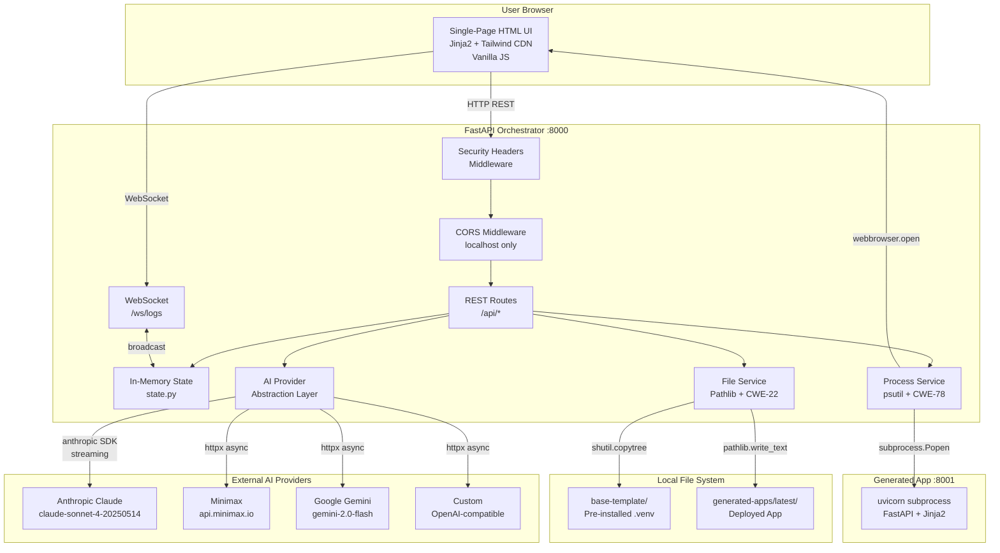
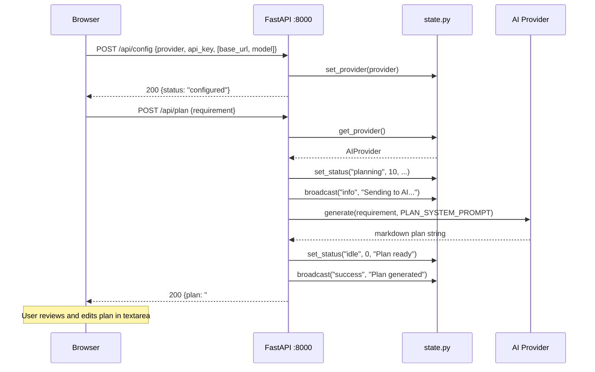
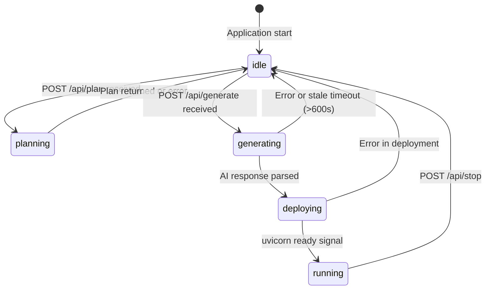
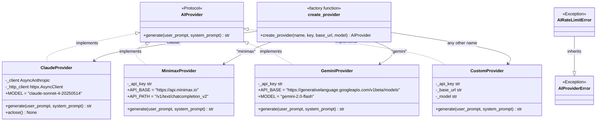
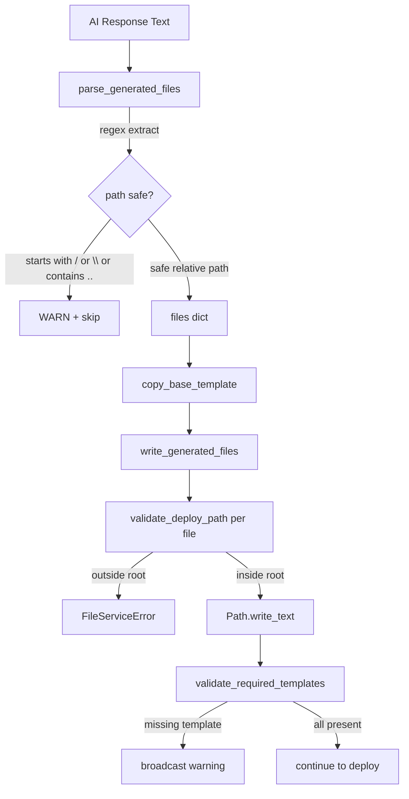
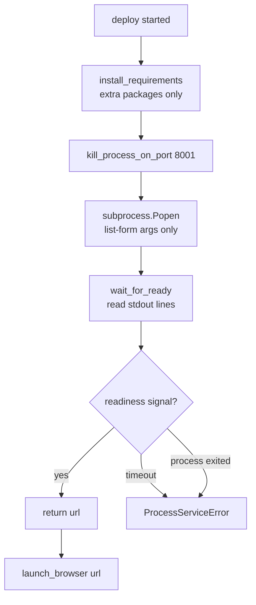
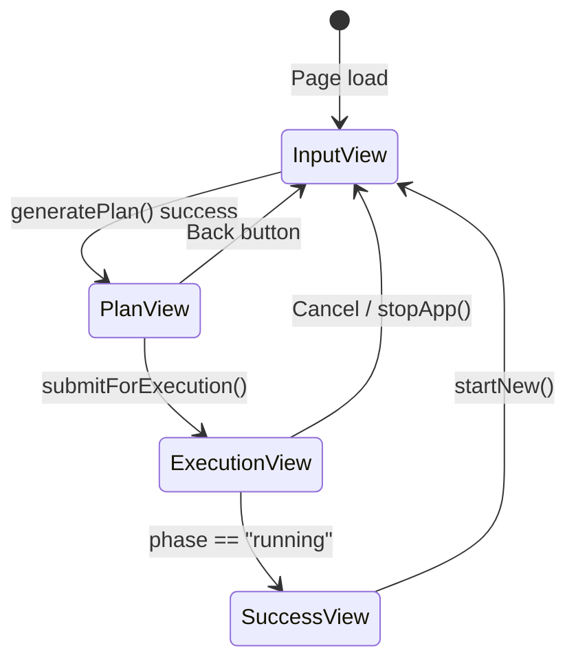
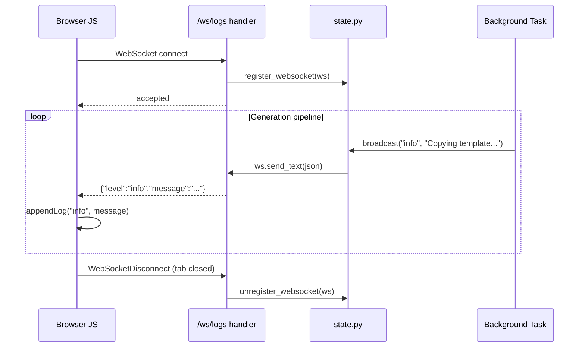
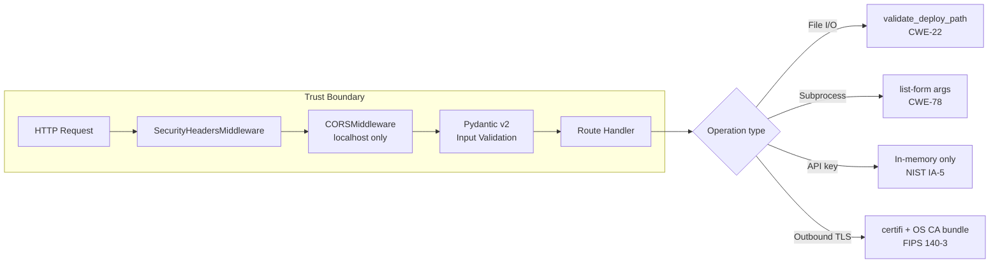
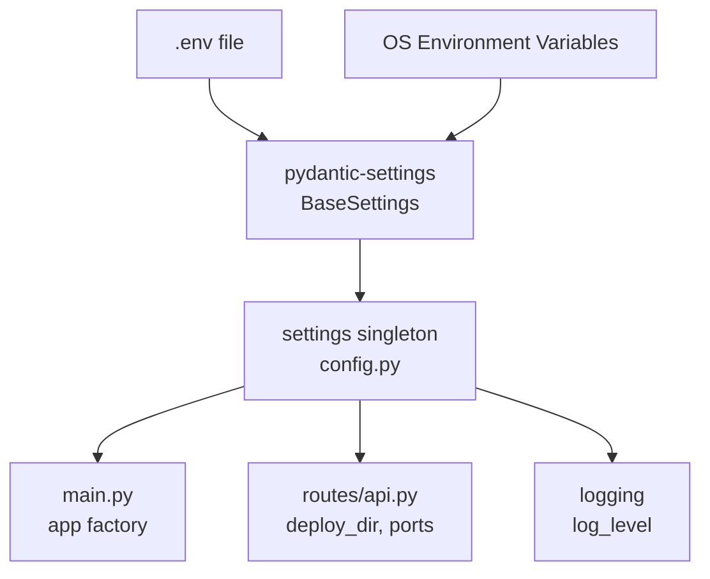

# AI Application Generator — Architecture Guide

**Version:** 2.1
**Date:** 2026-03-10
**Status:** Current
**Stack:** Python 3.11+ / FastAPI 0.115+ / Anthropic SDK 0.50+
**Security Standard:** FIPS 140-3 · NIST SP 800-53 · OWASP Top 10 · DISA STIG · CIS Benchmark Level 2

---

## Table of Contents

1. [System Overview](#1-system-overview)
2. [High-Level Architecture](#2-high-level-architecture)
3. [Component Breakdown](#3-component-breakdown)
4. [Module Reference](#4-module-reference)
5. [Request Lifecycle — Plan Generation](#5-request-lifecycle--plan-generation)
6. [Request Lifecycle — Code Generation and Deployment](#6-request-lifecycle--code-generation-and-deployment)
7. [In-Memory State Model](#7-in-memory-state-model)
8. [AI Provider Abstraction](#8-ai-provider-abstraction)
9. [File System Operations](#9-file-system-operations)
10. [Process Management](#10-process-management)
11. [Frontend Architecture](#11-frontend-architecture)
12. [WebSocket Log Streaming](#12-websocket-log-streaming)
13. [Security Architecture](#13-security-architecture)
14. [Configuration Model](#14-configuration-model)
15. [Dependency Map](#15-dependency-map)
16. [Data Flow Diagram](#16-data-flow-diagram)
17. [Error Handling Strategy](#17-error-handling-strategy)
18. [Performance Design](#18-performance-design)

---

## 1. System Overview

The AI Application Generator is a locally-hosted Python web application that transforms a natural language requirement into a running Python web application within a five-minute demonstration window.

The system operates through a strict two-stage workflow:

- **Stage 1 — Plan:** The AI analyses the user requirement and generates a structured implementation plan in markdown. The user reviews and optionally edits this plan before approving.
- **Stage 2 — Generate and Deploy:** The approved plan and original requirement are sent back to the AI, which generates a complete set of Python files wrapped in XML blocks. The orchestrator parses those files, writes them to a deployment directory, starts a `uvicorn` subprocess, monitors it for readiness, and opens the user's default browser at the application URL.

The entire system — orchestrator, frontend, and all generated applications — is Python-based. There is no Node.js, npm, React, or JavaScript build tooling anywhere in the stack.

---

## 2. High-Level Architecture



---

## 3. Component Breakdown

The system consists of four logical tiers:

| Tier | Components | Responsibility |
|------|-----------|----------------|
| **Presentation** | `templates/index.html`, Tailwind CDN, Vanilla JS | Four-view SPA; WebSocket client; status polling |
| **Orchestration** | `main.py`, `routes/api.py`, `routes/websocket.py` | Request routing; middleware; background task coordination |
| **Services** | `services/ai_provider.py`, `services/file_service.py`, `services/process_service.py` | AI calls; file I/O; process management |
| **Infrastructure** | `config.py`, `state.py`, `models/__init__.py`, `prompts.py` | Configuration; in-memory state; schemas; AI prompts |

---

## 4. Module Reference

### 4.1 `src/app/main.py` — Application Factory

Creates and returns the FastAPI application instance. This module is the composition root: it registers all middleware, mounts routes, and wires templates and static files.

**Key responsibilities:**
- `SecurityHeadersMiddleware` — injects X-Frame-Options, X-Content-Type-Options, Referrer-Policy, X-XSS-Protection, and Content-Security-Policy on every response.
- `CORSMiddleware` — restricts allowed origins to `http://127.0.0.1:8000` and `http://localhost:8000`. Only GET and POST methods permitted.
- Router registration — mounts `api.router` under `/api` prefix; `websocket.router` at root.
- Index route — `GET /` returns the Jinja2-rendered `index.html`, injecting `app_port` and `generated_app_port` as template variables.
- Logging initialisation — reads `LOG_LEVEL` from `config.Settings`.

---

### 4.2 `src/app/config.py` — Settings

Uses `pydantic-settings` `BaseSettings` to load all configuration from environment variables or a `.env` file. Provides a module-level `settings` singleton imported everywhere.

| Variable | Default | Description |
|----------|---------|-------------|
| `APP_HOST` | `127.0.0.1` | Orchestrator bind address |
| `APP_PORT` | `8000` | Orchestrator port |
| `DEPLOY_DIR` | `generated-apps/latest` | Where generated apps are written |
| `BASE_TEMPLATE_DIR` | `base-template` | Source of pre-installed template |
| `GENERATED_APP_PORT` | `8001` | Port for generated app uvicorn |
| `LOG_LEVEL` | `INFO` | Python logging level |
| `MAX_REQUIREMENT_LENGTH` | `4000` | Pydantic field constraint |
| `MIN_REQUIREMENT_LENGTH` | `10` | Pydantic field constraint |
| `MAX_PLAN_LENGTH` | `16000` | Pydantic field constraint |

API keys are **never** stored in configuration. They are submitted through the browser UI and held only in `state.py`.

---

### 4.3 `src/app/state.py` — In-Memory Session State

A module-level singleton that holds all mutable runtime state for a single user session. Because FastAPI serves all async routes on a single event loop thread, module-level globals are safe for async handlers. An `asyncio.Lock` is defined for future concurrent-access hardening.

**State variables:**

| Variable | Type | Description |
|----------|------|-------------|
| `_provider` | `AIProvider \| None` | Active AI provider instance |
| `_process` | `Popen \| None` | Running generated-app subprocess |
| `_phase` | `str` | `idle \| planning \| generating \| deploying \| running` |
| `_progress` | `int` | 0–100 progress percentage |
| `_message` | `str` | Human-readable status message |
| `_server_url` | `str \| None` | URL of running generated app |
| `_websockets` | `list` | Connected WebSocket client handles |
| `_phase_updated_at` | `float` | Monotonic timestamp of last `set_status()` call |

**Stale-phase guard:** `get_status()` checks whether an active phase (`generating` or `deploying`) has not been updated for longer than `_STALE_TIMEOUT` (600 seconds). If stale, the phase is auto-reset to `idle` with an error message. The heartbeat task in `routes/api.py` calls `set_status()` every second during AI generation to keep this timestamp current.

**Public functions:** `set_provider`, `get_provider`, `set_process`, `get_process`, `set_status`, `get_status`, `register_websocket`, `unregister_websocket`, `broadcast`.

The `broadcast` function sends JSON `{"level": "info|success|error", "message": "..."}` to all connected WebSocket clients, automatically removing dead connections.

---

### 4.4 `src/app/prompts.py` — AI System Prompts

Contains two module-level string constants:

- **`PLAN_SYSTEM_PROMPT`** — Instructs the AI to act as a senior Python/FastAPI developer and produce a structured markdown implementation plan. Explicitly prohibits Node.js, npm, React, and Vue. Targets FastAPI + Jinja2 + Tailwind CDN.

- **`CODE_SYSTEM_PROMPT`** — Instructs the AI to generate complete application files wrapped in `<file path="...">...</file>` XML blocks. Specifies required files (`main.py`, `requirements.txt`, `templates/index.html`), flat import path rules, Pydantic v2 compatibility rules, the exact uvicorn startup command, and a mandatory pre-flight checklist the AI must satisfy before finishing.

---

### 4.5 `src/app/models/__init__.py` — Pydantic Schemas

All API request and response models are defined here with Pydantic v2. FastAPI validates all requests against these models before any business logic executes, returning HTTP 422 automatically for invalid input.

| Model | Used by | Key constraints |
|-------|---------|-----------------|
| `ConfigRequest` | `POST /api/config` | `provider` matches `^[A-Za-z0-9_-]+$` 1–64 chars; `api_key` 10–512 chars; optional `base_url`, `model` |
| `PlanRequest` | `POST /api/plan` | `requirement` 10–4000 chars; `refine` bool |
| `GenerateRequest` | `POST /api/generate` | `requirement` 10–4000; `plan` 10–16000 chars |
| `PlanResponse` | `POST /api/plan` | `plan` string |
| `StatusResponse` | `GET /api/status` | `phase`, `progress` 0–100, `message`, optional `url` |
| `GenerateResponse` | `POST /api/generate` | `status`, `message` |
| `StopResponse` | `POST /api/stop` | `status`, `message` |
| `ErrorResponse` | All error paths | `code`, `detail` |

---

### 4.6 `src/app/routes/api.py` — REST Route Handlers

Registers all REST endpoints on an `APIRouter`. The router is mounted at `/api` in `main.py`.

**Endpoints:**

| Method | Path | Handler | Description |
|--------|------|---------|-------------|
| `GET` | `/api/health` | `health()` | Liveness check — returns `{"status": "ok"}` |
| `POST` | `/api/config` | `configure()` | Creates and stores provider in state; no probe call |
| `POST` | `/api/plan` | `generate_plan()` | Stage 1 — calls AI, returns markdown plan |
| `POST` | `/api/generate` | `generate_app()` | Stage 2 — enqueues background task, returns immediately |
| `GET` | `/api/status` | `get_status()` | Returns current phase, progress, message, url |
| `POST` | `/api/stop` | `stop_app()` | Kills process tree, resets state to idle |

The `_generate_and_deploy` private coroutine is the core background task. It executes the full pipeline: AI code generation (streaming) → XML parse → template copy → file write → template completeness validation → dependency install → port clear → uvicorn launch → readiness wait → browser open. A `_heartbeat` async task runs concurrently during AI generation, calling `state.set_status()` every second to keep the stale-phase guard from triggering while the stream is in-flight.

---

### 4.7 `src/app/routes/websocket.py` — WebSocket Handler

Accepts WebSocket connections at `/ws/logs`. On connection, the client handle is registered in `state._websockets`. A `while True: receive_text()` loop keeps the connection alive. On disconnect, the handle is removed from state.

---

### 4.8 `src/app/services/ai_provider.py` — AI Abstraction Layer

Defines the `AIProvider` Protocol and four concrete implementations.

**Protocol:**
```python
class AIProvider(Protocol):
    async def generate(self, user_prompt: str, system_prompt: str) -> str: ...
```

**`ClaudeProvider`** — wraps `anthropic.AsyncAnthropic`. Uses model `claude-sonnet-4-20250514` with `max_tokens=32768`. Uses `messages.stream()` (streaming API) because the Anthropic SDK requires streaming for large `max_tokens` values. Maps `AuthenticationError`, `RateLimitError`, and `APIError` to `AIProviderError`. The `httpx.AsyncClient` is configured with explicit timeouts: `connect=10s`, `read=480s`, `write=30s`, `pool=10s`. Uses the **certifi** CA bundle merged with the OS trust store to prevent `SSL: CERTIFICATE_VERIFY_FAILED` errors.

**`MinimaxProvider`** — uses `httpx.AsyncClient`. Posts to `https://api.minimax.io/v1/text/chatcompletion_v2` (native endpoint — not the OpenAI-compat path). The empty-string system message is suppressed (Minimax rejects it). Response parsing falls back to `reply` field if `choices` is absent.

**`GeminiProvider`** — uses `httpx.AsyncClient`. Posts to `https://generativelanguage.googleapis.com/v1beta/models/{model}:generateContent`. API key is sent via `x-goog-api-key` header (not URL parameter, to keep it out of access logs). Guards against safety blocks where `content` is absent in the candidate.

**`CustomProvider`** — generic OpenAI-compatible provider using `httpx.AsyncClient`. Posts to `{base_url}/chat/completions`. Used for OpenAI, Ollama, LM Studio, Azure OpenAI, OpenRouter, Mistral, and any other OpenAI-format service.

**`create_provider(name, key, base_url, model)`** — factory using Python 3.10+ `match` statement. Returns the appropriate provider for `claude`, `minimax`, `gemini`, or falls back to `CustomProvider` for any other name (requires `base_url` and `model`).

---

### 4.9 `src/app/services/file_service.py` — File System Service

All file I/O goes through this module. Four public functions:

**`validate_deploy_path(target, deploy_root)`** — Calls `target.resolve().relative_to(deploy_root.resolve())`. Raises `FileServiceError` if the path resolves outside the root. Primary CWE-22 control.

**`copy_base_template(source, destination)`** — Validates source exists, removes any existing destination with `shutil.rmtree`, then copies via `shutil.copytree`. This brings across the pre-installed `.venv/`.

**`write_generated_files(files, deploy_root)`** — Iterates the dict of `{relative_path: content}`. Calls `validate_deploy_path` for each file before writing. Creates parent directories as needed.

**`parse_generated_files(response)`** — Uses regex `r'<file\s+path="([^"]+)">(.*?)</file>'` to extract all file blocks. Rejects paths starting with `/`, `\`, or containing `..`. Returns a dict.

**`validate_required_templates(files, deploy_root)`** — Called after `write_generated_files()`. Checks that `templates/index.html` was in the AI output. Scans all `.py` files in the deploy directory via `rglob("*.py")` for `TemplateResponse()` calls and verifies each referenced template exists on disk. Returns a list of warning strings (empty if all present). Warnings are broadcast to the UI as `[Template warning]` error messages.

---

### 4.10 `src/app/services/process_service.py` — Process Service

Manages the lifecycle of the generated application subprocess.

**`kill_process_on_port(port)`** — Uses `psutil.net_connections(kind="inet")` to find processes on the target port. Terminates gracefully, then force-kills on timeout.

**`kill_process_tree(process)`** — Walks the process tree recursively with `psutil.Process.children(recursive=True)`. Terminates all children then the parent.

**`_uvicorn_executable(deploy_dir)`** — Returns the absolute path to the uvicorn binary. Checks `deploy_dir/.venv/Scripts/uvicorn.exe` (Windows) or `deploy_dir/.venv/bin/uvicorn` (POSIX) first, then falls back to the running interpreter's venv. Raises `ProcessServiceError` if uvicorn cannot be found in either location.

**`install_requirements(deploy_dir, log_callback)`** — Reads `requirements.txt` from the generated app. Filters out packages already present in `_BASE_PACKAGES` (fastapi, uvicorn, jinja2, starlette, pydantic, etc.) to avoid Windows `WinError 32` when pip tries to overwrite in-use executables. Only installs genuinely new packages using `sys.executable -m pip install`.

**`start_generated_app(deploy_dir, port, log_callback)`** — Constructs a list-form command `[uvicorn_path, "main:app", "--host", "127.0.0.1", "--port", str(int(port))]`. Never uses `shell=True` (CWE-78).

**`wait_for_ready(process, port, timeout, log_callback)`** — Reads stdout lines checking for `"Application startup complete"` or `"Uvicorn running on"`. Returns the app URL on detection.

**`launch_browser(url)`** — `webbrowser.open(url)`.

---

## 5. Request Lifecycle — Plan Generation



---

## 6. Request Lifecycle — Code Generation and Deployment

```mermaid
sequenceDiagram
    participant B as Browser
    participant F as FastAPI :8000
    participant BG as Background Task
    participant HB as Heartbeat Task
    participant S as state.py
    participant AI as AI Provider
    participant FS as File System
    participant P as Generated App :8001

    B->>F: POST /api/generate {requirement, plan}
    F-->>B: 200 {status: "deploying"}
    Note over F: Returns immediately; BG task runs async

    F->>BG: _generate_and_deploy(requirement, plan)

    BG->>S: set_status("generating", 20, ...)
    BG->>HB: start _heartbeat task
    Note over HB: Calls set_status() every 1s\nto keep stale guard alive
    BG->>AI: messages.stream(32768 tokens, CODE_SYSTEM_PROMPT)
    AI-->>BG: streaming XML file blocks

    BG->>HB: stop heartbeat
    BG->>S: broadcast("info", "Parsing files...")
    BG->>BG: parse_generated_files(response)
    BG->>BG: validate_required_templates(files, deploy_root)

    BG->>S: set_status("deploying", 60, ...)
    BG->>FS: copy_base_template(base, deploy_dir)
    BG->>FS: write_generated_files(files, deploy_dir)
    BG->>BG: install_requirements(deploy_dir) — extra pkgs only

    BG->>BG: kill_process_on_port(8001)
    BG->>P: subprocess.Popen [uvicorn, main:app, --port, 8001]
    BG->>S: set_process(process)

    loop Read stdout
        P-->>BG: stdout line
        BG->>S: broadcast("info", line)
        alt "Application startup complete"
            BG->>BG: url = "http://127.0.0.1:8001"
        end
    end

    BG->>S: set_status("running", 100, ..., url)
    BG->>S: broadcast("success", "App started at url")
    BG->>B: webbrowser.open(url)
```

---

## 7. In-Memory State Model



State transitions are managed exclusively through `state.set_status()`. The stale-phase guard in `get_status()` auto-resets any active phase that has not been updated for more than 600 seconds.

---

## 8. AI Provider Abstraction



New providers can be added by implementing the `AIProvider` Protocol and adding a `case` branch in `create_provider()`. No changes to routes, state, or any other module are required.

---

## 9. File System Operations



---

## 10. Process Management



**CWE-78 prevention:** Command list:
```python
cmd = [uvicorn_path, "main:app", "--host", "127.0.0.1", "--port", str(int(port))]
```
No string interpolation, no f-strings building shell commands, no `shell=True`. Port cast to `int` before `str`.

---

## 11. Frontend Architecture

The frontend is a single Jinja2 template (`src/app/templates/index.html`) served by FastAPI. No separate frontend server, build step, or npm dependency exists.

**View state machine (JavaScript):**



---

## 12. WebSocket Log Streaming



Message levels: `info` (grey), `success` (green), `error` (red).

---

## 13. Security Architecture



| Layer | Control | Standard |
|-------|---------|----------|
| HTTP Response | X-Frame-Options: DENY | OWASP A05, CIS L2 |
| HTTP Response | X-Content-Type-Options: nosniff | OWASP A05 |
| HTTP Response | Content-Security-Policy | OWASP A05 |
| HTTP Response | Referrer-Policy: no-referrer | OWASP A05 |
| Network | CORS: localhost only | OWASP A05 |
| Input | Pydantic v2 field validation | OWASP A03, NIST SI-10 |
| File I/O | Path.resolve() containment check | CWE-22, DISA STIG V-230264 |
| Subprocess | List-form args, no shell=True | CWE-78 |
| Credential | API key in process memory only | NIST IA-5, OWASP A02 |
| Credential | API key never logged | NIST AU-9 |
| TLS | certifi CA bundle merged with OS store | FIPS 140-3 |
| Container | Non-root user (appuser) | CIS Benchmark L2 |
| Container | HEALTHCHECK defined | CIS Benchmark L2 |

---

## 14. Configuration Model



Settings are loaded once at module import time. All modules import and use the `settings` singleton directly.

---

## 15. Dependency Map

**Runtime dependencies declared in `pyproject.toml`:**

| Package | Min Version | Purpose |
|---------|-------------|---------|
| `fastapi` | ≥0.115.0 | Web framework, routing, WebSocket |
| `uvicorn[standard]` | ≥0.34.0 | ASGI server for orchestrator |
| `anthropic` | ≥0.50.0 | Claude API SDK (streaming) |
| `httpx` | ≥0.27.0 | Async HTTP for Minimax, Gemini, Custom providers |
| `certifi` | ≥2024.0.0 | Mozilla CA bundle for SSL verification |
| `jinja2` | ≥3.1.5 | HTML template rendering (XSS CVE patched) |
| `pydantic` | ≥2.8.0 | Request/response schema validation |
| `pydantic-settings` | ≥2.3.0 | Environment variable configuration |
| `python-dotenv` | ≥1.0.0 | `.env` file loading |
| `psutil` | ≥6.0.0 | Port detection, process tree management |
| `cryptography` | ≥44.0.0 | FIPS 140-3 cryptographic operations |
| `python-multipart` | ≥0.0.18 | Form data parsing |

**Dev-only dependencies:**

| Package | Purpose |
|---------|---------|
| `pytest` + `pytest-asyncio` | Unit and async tests |
| `bandit` | Static security analysis |
| `pip-audit` | Dependency vulnerability scanning |
| `ruff` | Linting and import sorting |
| `mypy` | Static type checking |

---

## 16. Data Flow Diagram


---

## 17. Error Handling Strategy

All errors propagate through a consistent three-layer pattern:

1. **Service layer** — Domain-specific exceptions (`AIProviderError`, `AIRateLimitError`, `FileServiceError`, `ProcessServiceError`) wrap all external failure modes.
2. **Route layer** — Catches domain exceptions and maps them to `HTTPException` with appropriate status codes.
3. **Background task** — Catches all domain exceptions, sets state to `idle` with an error message, and broadcasts to WebSocket clients.

| Error Scenario | HTTP Code | User Sees |
|---------------|-----------|-----------|
| Invalid API key | 400/502 | "Invalid Claude API key." |
| Rate limit | 502 | "Rate limit exceeded. Please wait and retry." |
| Network error to AI | 502 | "Network error calling provider." |
| AI stream empty | — | WebSocket error: "Claude returned no content." |
| AI returns no XML files | — | WebSocket error: "No files extracted from AI response." |
| Missing template in AI output | — | WebSocket warning: "[Template warning] AI did not generate..." |
| Path traversal in AI output | — | File silently rejected, warning logged |
| Port in use | — | Auto-resolved via psutil |
| uvicorn startup timeout | — | WebSocket error: "Server startup timed out." |
| Generation stale >600s | — | Auto-reset to idle with timeout message |
| Pydantic validation fail | 422 | Field-level error details in response body |

---

## 18. Performance Design

| Phase | Target | Mechanism |
|-------|--------|-----------|
| Plan generation | ≤ 30 seconds | Single async AI API call |
| Code generation | ≤ 5 minutes | Async streaming; 32768 token limit; httpx read timeout 480s |
| Base template copy | < 2 seconds | `shutil.copytree` of pre-built directory |
| Dependency install | < 30 seconds | Only extra packages (not base packages already in venv) |
| File writes | < 1 second | Sequential `pathlib.write_text` |
| uvicorn startup | ≤ 30 seconds | Pre-installed venv; readiness wait timeout |
| Browser launch | < 1 second | `webbrowser.open()` |
| **Total** | **≤ 8 minutes** | Stale guard at 10 minutes gives ample margin |

---

*Document maintained at `C:\planforaplan\docs\01-ARCHITECTURE.md`*
*Sources: Source code in `C:\planforaplan\src\app\`*
