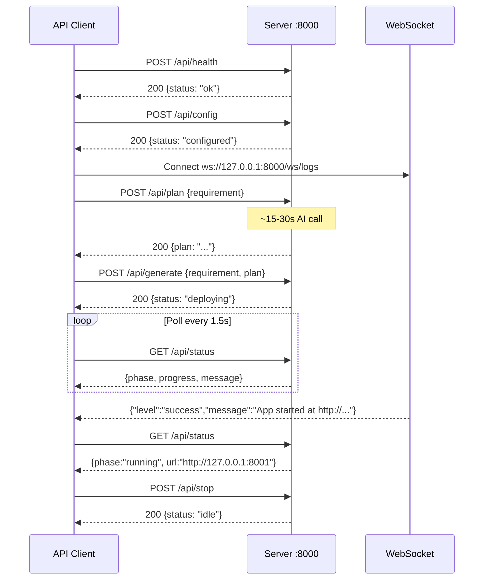

# AI Application Generator — API Guide

**Version:** 2.0  
**Date:** March 2026  
**Base URL:** `http://127.0.0.1:8000`  
**Interactive Docs:** `http://127.0.0.1:8000/docs` (FastAPI Swagger UI)

---

## Table of Contents

1. [Overview](#1-overview)
2. [Authentication](#2-authentication)
3. [Common Headers](#3-common-headers)
4. [Error Format](#4-error-format)
5. [Endpoints](#5-endpoints)
   - [GET /api/health](#get-apihealth)
   - [POST /api/config](#post-apiconfig)
   - [POST /api/plan](#post-apiplan)
   - [POST /api/generate](#post-apigenerate)
   - [GET /api/status](#get-apistatus)
   - [POST /api/stop](#post-apistop)
6. [WebSocket: /ws/logs](#6-websocket-wslogs)
7. [HTTP Status Code Reference](#7-http-status-code-reference)
8. [Workflow Sequence](#8-workflow-sequence)
9. [Integration Examples](#9-integration-examples)

---

## 1. Overview

The AI Application Generator exposes a REST + WebSocket API consumed by its own browser frontend. The same API can be called directly by automated scripts, test harnesses, or integration tools.

All REST endpoints:
- Accept and return `application/json`
- Validate request bodies using Pydantic v2 (HTTP 422 on validation failure)
- Are served on `http://127.0.0.1:8000` by default

The WebSocket endpoint streams real-time log messages to connected clients during generation and deployment.

---

## 2. Authentication

The API has no bearer token or session cookie authentication. It is designed for local single-user use on `127.0.0.1`. The CORS policy restricts cross-origin requests to localhost origins only.

AI provider credentials are submitted via `POST /api/config` and held in server process memory for the lifetime of the server process. They are never returned by any endpoint.

---

## 3. Common Headers

**Request:**

```
Content-Type: application/json
```

**Response (all endpoints):**

```
Content-Type: application/json
X-Frame-Options: DENY
X-Content-Type-Options: nosniff
Referrer-Policy: no-referrer
X-XSS-Protection: 1; mode=block
Content-Security-Policy: default-src 'self'; ...
```

---

## 4. Error Format

All error responses use this structure:

```json
{
  "detail": "Human-readable error message"
}
```

Pydantic validation errors (HTTP 422) return the standard FastAPI format:

```json
{
  "detail": [
    {
      "type": "string_pattern_mismatch",
      "loc": ["body", "provider"],
      "msg": "String should match pattern '^(claude|minimax)$'",
      "input": "openai"
    }
  ]
}
```

---

## 5. Endpoints

---

### GET /api/health

Liveness check. Returns immediately without touching any external services.

**Request:** No body required.

**Response 200:**
```json
{
  "status": "ok"
}
```

**Use for:** Container health probes, monitoring scripts, pre-flight checks.

---

### POST /api/config

Validates AI provider credentials and stores them in process memory. A probe call is made to the provider to confirm the key works before it is stored.

**Request body:**

| Field | Type | Required | Constraints | Description |
|-------|------|----------|-------------|-------------|
| `provider` | string | Yes | `^(claude\|minimax)$` | AI provider name |
| `api_key` | string | Yes | 10–512 characters | Provider API key |

```json
{
  "provider": "claude",
  "api_key": "sk-ant-api03-..."
}
```

**Response 200:**
```json
{
  "status": "configured"
}
```

**Response 401 — Invalid key:**
```json
{
  "detail": "Invalid Claude API key."
}
```

**Response 422 — Validation error:**
```json
{
  "detail": [
    {
      "type": "string_pattern_mismatch",
      "loc": ["body", "provider"],
      "msg": "String should match pattern '^(claude|minimax)$'"
    }
  ]
}
```

**Notes:**
- The probe call sends "Hello" with system prompt "Reply with the single word: ok". This consumes a minimal number of tokens.
- The API key is never returned in any response.
- Calling this endpoint again with a new provider or key replaces the stored provider.

---

### POST /api/plan

Stage 1 of the two-stage workflow. Sends the requirement to the configured AI provider and returns a markdown implementation plan.

This is a **synchronous** endpoint — it awaits the AI response before returning. Expect 15–30 seconds response time.

**Request body:**

| Field | Type | Required | Constraints | Description |
|-------|------|----------|-------------|-------------|
| `requirement` | string | Yes | 10–4000 characters | Natural language app description |
| `refine` | boolean | No | Default: `false` | If `true`, prefixes a refinement instruction |

```json
{
  "requirement": "Build a task management app with priorities and due dates",
  "refine": false
}
```

**Response 200:**
```json
{
  "plan": "## Implementation Plan\n\n### File Structure\n\n- `main.py` — FastAPI application\n..."
}
```

**Response 400 — Provider not configured:**
```json
{
  "detail": "Provider not configured."
}
```

**Response 502 — AI provider error:**
```json
{
  "detail": "Claude rate limit exceeded. Please wait and retry."
}
```

**Notes:**
- The `refine: true` flag prepends: `"Refine and improve the following plan based on the requirement:\n\n"` before the requirement text. Use this when calling plan generation a second time to improve an existing plan.
- The plan is a free-form markdown string. Its length depends on the AI provider and requirement complexity.

---

### POST /api/generate

Stage 2 of the workflow. Enqueues a background task to generate code, deploy the application, and launch the browser.

This endpoint returns **immediately** (HTTP 200) before generation is complete. Monitor progress via `GET /api/status` and the WebSocket `/ws/logs`.

**Request body:**

| Field | Type | Required | Constraints | Description |
|-------|------|----------|-------------|-------------|
| `requirement` | string | Yes | 10–4000 characters | Original user requirement |
| `plan` | string | Yes | 10–16000 characters | Approved implementation plan from Stage 1 |

```json
{
  "requirement": "Build a task management app with priorities and due dates",
  "plan": "## Implementation Plan\n\n### File Structure\n\n..."
}
```

**Response 200:**
```json
{
  "status": "deploying",
  "message": "Generation started."
}
```

**Response 400 — Provider not configured:**
```json
{
  "detail": "Provider not configured."
}
```

**Response 409 — Generation already in progress:**
```json
{
  "detail": "A generation is already in progress. Stop it first."
}
```

**Background task pipeline:**

The background task executes these steps in order, broadcasting WebSocket messages at each stage:

| Step | State phase | Progress |
|------|------------|---------|
| Start AI code generation | `generating` | 20% |
| AI response received, parsing files | `generating` | 50% |
| Copy base template | `deploying` | 60% |
| Write generated files | `deploying` | 70% |
| Start uvicorn subprocess | `deploying` | 80% |
| uvicorn ready signal received | `running` | 100% |

On success, the browser is opened automatically and state is set to `running` with the `url` field populated.

On any error, state is set to `idle` at progress 0, and the error message is broadcast via WebSocket.

---

### GET /api/status

Returns the current execution phase, progress percentage, message, and optionally the URL of the running generated application.

**Request:** No body required.

**Response 200:**

| Field | Type | Values |
|-------|------|--------|
| `phase` | string | `idle` \| `planning` \| `generating` \| `deploying` \| `running` |
| `progress` | integer | 0–100 |
| `message` | string | Human-readable status |
| `url` | string \| null | App URL when phase is `running`, otherwise null |

```json
{
  "phase": "deploying",
  "progress": 70,
  "message": "Writing generated files...",
  "url": null
}
```

When complete:
```json
{
  "phase": "running",
  "progress": 100,
  "message": "Application is running.",
  "url": "http://127.0.0.1:8001"
}
```

**Polling recommendation:** Poll every 1–2 seconds. Transition to success state when `phase === "running"`. Treat `phase === "idle"` with `message` starting with `"Error:"` as a failure condition.

---

### POST /api/stop

Terminates the running generated application and resets state to idle.

**Request:** No body required.

**Response 200:**
```json
{
  "status": "idle",
  "message": "Application stopped."
}
```

**Notes:**
- Uses `psutil` to terminate the full process tree (parent uvicorn and all children).
- Safe to call even when no app is running — returns 200 regardless.
- A WebSocket broadcast `{"level": "info", "message": "Generated application stopped."}` is emitted.

---

## 6. WebSocket: /ws/logs

**URL:** `ws://127.0.0.1:8000/ws/logs`

**Protocol:** Plain WebSocket (no subprotocol).

Connect before or during a generation to receive real-time log messages. All broadcast messages during `POST /api/generate` are delivered to connected clients.

### Message Format

All messages are JSON strings:

```json
{"level": "info", "message": "Copying base template to deployment directory..."}
{"level": "success", "message": "Application started at http://127.0.0.1:8001"}
{"level": "error", "message": "Server startup timed out after 30 seconds."}
```

| Level | Meaning |
|-------|---------|
| `info` | Normal progress message |
| `success` | A stage completed successfully |
| `error` | An error occurred; generation may have stopped |

### Keep-Alive

The server keeps the connection open by waiting for `receive_text()`. Send any text (e.g. `"ping"`) from the client to keep the connection alive if your WebSocket client requires it.

### JavaScript Example

```javascript
const ws = new WebSocket("ws://127.0.0.1:8000/ws/logs");

ws.onmessage = (event) => {
  const msg = JSON.parse(event.data);
  console.log(`[${msg.level}] ${msg.message}`);
};

ws.onerror = (err) => console.error("WebSocket error:", err);
ws.onclose = () => console.log("WebSocket closed.");
```

### Python Example

```python
import asyncio
import json
import websockets

async def watch_logs():
    async with websockets.connect("ws://127.0.0.1:8000/ws/logs") as ws:
        async for message in ws:
            msg = json.loads(message)
            print(f"[{msg['level']}] {msg['message']}")

asyncio.run(watch_logs())
```

---

## 7. HTTP Status Code Reference

| Code | Meaning | When Used |
|------|---------|-----------|
| 200 | OK | Successful GET or POST |
| 400 | Bad Request | Provider not configured; logic precondition failed |
| 401 | Unauthorised | AI provider rejected the API key |
| 409 | Conflict | Generation already in progress |
| 422 | Unprocessable Entity | Pydantic field validation failed |
| 502 | Bad Gateway | AI provider returned an error or network failure |

---

## 8. Workflow Sequence

The complete API call sequence for a full generation cycle:



---

## 9. Integration Examples

### Python — Full Workflow Script

```python
import httpx
import asyncio
import json
import time

BASE = "http://127.0.0.1:8000"

def configure(provider: str, api_key: str) -> None:
    r = httpx.post(f"{BASE}/api/config", json={"provider": provider, "api_key": api_key})
    r.raise_for_status()
    print("Configured:", r.json())

def generate_plan(requirement: str) -> str:
    print("Generating plan...")
    r = httpx.post(f"{BASE}/api/plan", json={"requirement": requirement}, timeout=60)
    r.raise_for_status()
    return r.json()["plan"]

def generate_app(requirement: str, plan: str) -> None:
    r = httpx.post(
        f"{BASE}/api/generate",
        json={"requirement": requirement, "plan": plan},
        timeout=10,
    )
    r.raise_for_status()

def wait_for_running(timeout: int = 180) -> str:
    deadline = time.monotonic() + timeout
    while time.monotonic() < deadline:
        r = httpx.get(f"{BASE}/api/status")
        status = r.json()
        print(f"  {status['phase']} — {status['message']}")
        if status["phase"] == "running" and status["url"]:
            return status["url"]
        if status["phase"] == "idle" and status["message"].startswith("Error"):
            raise RuntimeError(status["message"])
        time.sleep(2)
    raise TimeoutError("Generation did not complete in time.")

if __name__ == "__main__":
    configure("claude", "sk-ant-...")
    plan = generate_plan("Build a simple calculator with addition and subtraction")
    generate_app("Build a simple calculator with addition and subtraction", plan)
    url = wait_for_running()
    print(f"Application running at: {url}")
```

### cURL — Quick Workflow

```bash
# Health check
curl http://127.0.0.1:8000/api/health

# Configure
curl -X POST http://127.0.0.1:8000/api/config \
  -H "Content-Type: application/json" \
  -d '{"provider": "claude", "api_key": "sk-ant-..."}'

# Generate plan
curl -X POST http://127.0.0.1:8000/api/plan \
  -H "Content-Type: application/json" \
  -d '{"requirement": "Build a contact list app"}' \
  --max-time 60

# Generate app (returns immediately)
curl -X POST http://127.0.0.1:8000/api/generate \
  -H "Content-Type: application/json" \
  -d '{"requirement": "Build a contact list app", "plan": "..."}'

# Poll status
curl http://127.0.0.1:8000/api/status

# Stop app
curl -X POST http://127.0.0.1:8000/api/stop
```

---

*Document maintained at `C:\saabdemo\app\docs\03-API-GUIDE.md`*  
*Interactive API documentation available at `http://127.0.0.1:8000/docs` when the server is running.*
