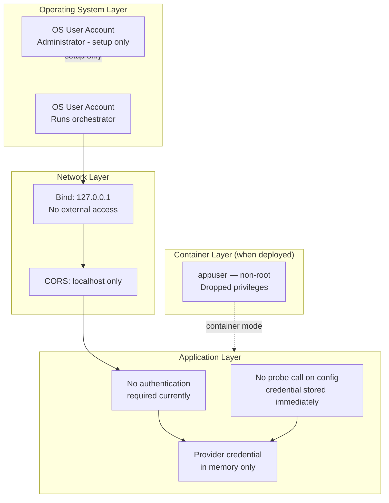

# AI Application Generator — RBAC Document

**Version:** 2.1
**Date:** 2026-03-10
**Standard:** Role-Based Access Control (RBAC)
**Compliance:** NIST SP 800-53 AC-2 (Account Management), AC-3 (Access Enforcement), AC-6 (Least Privilege)

---

## Table of Contents

1. [RBAC Overview](#1-rbac-overview)
2. [Current Access Model](#2-current-access-model)
3. [Role Definitions](#3-role-definitions)
4. [Permission Matrix](#4-permission-matrix)
5. [Sensitive Resource Access](#5-sensitive-resource-access)
6. [API Endpoint Access by Role](#6-api-endpoint-access-by-role)
7. [File System Access by Role](#7-file-system-access-by-role)
8. [Container Runtime Permissions](#8-container-runtime-permissions)
9. [AI Provider Credential Handling](#9-ai-provider-credential-handling)
10. [RBAC Gaps and Roadmap](#10-rbac-gaps-and-roadmap)
11. [Access Review Schedule](#11-access-review-schedule)

---

## 1. RBAC Overview

The AI Application Generator is a single-user, locally-hosted application. In its current form, it does not enforce authentication or authorisation at the application layer — access is implicitly controlled by network boundary (binding to `127.0.0.1`) and operating system user account permissions.

This document defines the intended RBAC model, the controls currently enforced at each layer, and the gaps that would need to be addressed for a multi-user or network-accessible deployment.

---

## 2. Current Access Model



---

## 3. Role Definitions

### Application Roles

| Role | Description | Who Holds It |
|------|-------------|-------------|
| **Local User** | Full access to all application features via the browser UI. No authentication required — access is implicitly granted by being on the local machine. | End user operating the machine |
| **API Consumer** | Accesses the REST API and WebSocket directly (e.g., script or test harness). Same permissions as Local User. | Developer, automated test |
| **Server Operator** | Starts, stops, and configures the orchestrator server. Has access to server logs and `.env` file. | System administrator, DevOps |
| **Setup Administrator** | Runs `setup.bat` / `setup.ps1` to create virtual environments and install dependencies. Requires write access to the application directory. | DevOps, initial installer |

### OS-Level Roles

| Role | OS Permissions Required |
|------|------------------------|
| **Local User** | Read access to `C:\planforaplan\src\app\templates\`; read access to static assets |
| **Server Operator** | Read/write to `.env`; read/write to `generated-apps\`; execute on `.venv\Scripts\` |
| **Setup Administrator** | Write access to `C:\planforaplan\` and all subdirectories; execute permission for Python |

### Container Role

| Role | Description |
|------|-------------|
| **appuser** | Non-root container user (UID/GID 1001) created during image build. Has write access only to `/home/appuser/app/generated-apps/`. Cannot write to system directories. Follows CIS Benchmark Level 2 least-privilege principle. |

---

## 4. Permission Matrix

| Permission | Local User | API Consumer | Server Operator | Setup Admin |
|-----------|-----------|-------------|----------------|------------|
| Access browser UI (`GET /`) | ✅ | ✅ | ✅ | ✅ |
| Submit AI provider config (`POST /api/config`) | ✅ | ✅ | ✅ | ✅ |
| Generate plan (`POST /api/plan`) | ✅ | ✅ | ✅ | ✅ |
| Generate and deploy app (`POST /api/generate`) | ✅ | ✅ | ✅ | ✅ |
| Query status (`GET /api/status`) | ✅ | ✅ | ✅ | ✅ |
| Stop application (`POST /api/stop`) | ✅ | ✅ | ✅ | ✅ |
| Connect WebSocket (`/ws/logs`) | ✅ | ✅ | ✅ | ✅ |
| Read server logs | ❌ | ❌ | ✅ | ✅ |
| Edit `.env` configuration | ❌ | ❌ | ✅ | ✅ |
| Start/stop orchestrator server | ❌ | ❌ | ✅ | ✅ |
| Install/update dependencies | ❌ | ❌ | ❌ | ✅ |
| Build container image | ❌ | ❌ | ✅ | ✅ |
| Write to `generated-apps/` | System (via app) | System (via app) | ✅ | ✅ |
| Read/write `base-template/` | ❌ | ❌ | ✅ | ✅ |

---

## 5. Sensitive Resource Access

| Resource | Classification | Who Can Access |
|----------|---------------|----------------|
| AI provider API key (in memory) | Secret | Process memory only — held in `state._provider`; not accessible externally |
| `.env` file | Confidential | Server Operator, Setup Admin |
| `generated-apps/latest/` (generated code) | Internal | Server Operator, Setup Admin; the generated app process |
| `base-template/.venv/` | Internal | Server Operator, Setup Admin; the orchestrator process |
| Server process stdout (logs) | Internal | Server Operator (terminal window) |
| WebSocket log stream | Internal | Any localhost WebSocket client |

---

## 6. API Endpoint Access by Role

All endpoints are accessible from `127.0.0.1` without authentication in the current deployment model. The `POST /api/config` endpoint stores credentials immediately without a probe call; an invalid key will surface on the first `/api/plan` or `/api/generate` call.

| Endpoint | Access Control | Notes |
|----------|---------------|-------|
| `GET /api/health` | Open | No credential required |
| `POST /api/config` | Open | Credential stored in memory immediately; no probe call |
| `POST /api/plan` | Requires prior `/api/config` | Returns HTTP 400 if provider not set |
| `POST /api/generate` | Requires prior `/api/config` | Returns HTTP 400 if no provider; 409 if generation in progress |
| `GET /api/status` | Open | Read-only state query |
| `POST /api/stop` | Open | Idempotent — safe when idle |
| `WebSocket /ws/logs` | Open | Any localhost client may connect |
| `GET /` | Open | Serves HTML interface |
| `GET /docs` | Open | FastAPI Swagger UI |

**Future enhancement:** For network-accessible deployment, all endpoints except `GET /api/health` and `GET /` should require bearer token authentication.

---

## 7. File System Access by Role

| Path | Type | App Process | Server Operator | Setup Admin |
|------|------|-------------|----------------|------------|
| `src/app/` | Read | ✅ | ✅ | ✅ |
| `src/app/templates/` | Read | ✅ | ✅ | ✅ |
| `src/app/static/` | Read | ✅ | ✅ | ✅ |
| `.env` | Read | ✅ | ✅ | ✅ |
| `.venv/` | Read/Execute | ✅ | ✅ | ✅ |
| `base-template/` | Read | ✅ (copy only) | ✅ | ✅ |
| `base-template/.venv/` | Read | ✅ (copy only) | ✅ | ✅ |
| `generated-apps/latest/` | Read/Write | ✅ | ✅ | ✅ |
| `generated-apps/` (parent) | Read | ✅ | ✅ | ✅ |
| `pyproject.toml` | Read | ✅ | ✅ | ✅ |
| Any path outside `generated-apps/` | Write | ❌ (CWE-22 enforced) | OS-dependent | ✅ |

The application enforces `validate_deploy_path()` on every file write to prevent writing outside `generated-apps/latest/`, regardless of OS permissions.

---

## 8. Container Runtime Permissions

When deployed as a Podman container (see `Containerfile`):

| Attribute | Value | Justification |
|-----------|-------|--------------|
| User | `appuser` (UID/GID 1001) | CIS Benchmark L2: no root container processes |
| Working directory | `/home/appuser/app` | Owned by appuser |
| Writable paths | `/home/appuser/app/generated-apps/` | Minimum required for deployment |
| Base image | `python:3.12-slim` | Minimal attack surface |
| Exposed port | `8000` (TCP) | Orchestrator port only |
| Capabilities | `--cap-drop ALL` recommended | NIST AC-6 least privilege |
| `--read-only` flag | Recommended with `--tmpfs /tmp` | Immutable root filesystem (CIS L2, NIST SC-28) |

**Recommended Podman run command with hardened flags:**
```bash
podman run \
  --read-only \
  --tmpfs /tmp:rw,noexec,nosuid,size=64m \
  --cap-drop ALL \
  --security-opt no-new-privileges \
  -p 127.0.0.1:8000:8000 \
  --env-file .env \
  ai-app-generator:2.0
```

---

## 9. AI Provider Credential Handling

| Control | Implementation | Standard |
|---------|---------------|----------|
| Keys never stored on disk | Keys held only in `state._provider` (process memory) | NIST IA-5 |
| Keys never logged | No `logger.*` call references `api_key` | NIST AU-9 |
| Keys never returned in responses | No endpoint returns stored key material | OWASP A02 |
| Keys cleared on server restart | Module-level `_provider = None` is initial state | NIST IA-5 |
| No probe call on config | Key stored immediately; not sent to provider at config time | NIST IA-5 |
| Key transmission | HTTPS required in production; localhost HTTP acceptable for local-only | OWASP A02 |

---

## 10. RBAC Gaps and Roadmap

The following gaps exist and should be addressed before any network-accessible deployment:

| Gap | Risk | Recommended Control |
|-----|------|-------------------|
| No authentication on API endpoints | Any localhost process can call `/api/generate` | Add bearer token auth (e.g., JWT or static secret in header) |
| No session management | Concurrent users share state | Add per-session provider storage and state isolation |
| WebSocket has no authentication | Any localhost client receives log messages | Add token query parameter to WebSocket URL |
| `/docs` Swagger UI publicly accessible | Exposes API schema | Disable `docs_url` in production or restrict to admin role |
| No rate limiting on API endpoints | A script could flood `/api/generate` | Add `slowapi` middleware for network deployment |
| Generated app inherits OS user permissions | Generated code runs as same user as orchestrator | Run generated app in a separate OS account or container |

---

## 11. Access Review Schedule

| Review Item | Frequency | Reviewer |
|-------------|-----------|---------|
| API key rotation (provider consoles) | Every 90 days | Security Officer |
| OS account permissions on deployment host | Every 6 months | Security Officer / DevOps |
| RBAC gaps and roadmap | Every release | Security Officer |
| Container user and capability settings | Every release | DevOps |
| Full RBAC document review | Annually | Application Owner + Security Officer |

---

*Document maintained at `C:\planforaplan\docs\06-RBAC.md`*
*References: NIST SP 800-53 AC-2, AC-3, AC-6; CIS Benchmark Level 2; OWASP A01 (Broken Access Control)*
