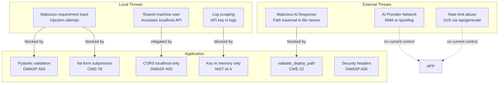

# AI Application Generator — Security Analysis and Compliance Document

**Version:** 2.0  
**Date:** March 2026  
**Compliance Standards:** FIPS 140-3 · NIST SP 800-53 Rev 5 · OWASP Top 10 2021 · DISA STIG Application Security · CIS Benchmark Level 2

---

## Table of Contents

1. [Executive Summary](#1-executive-summary)
2. [Threat Model](#2-threat-model)
3. [Security Controls by Layer](#3-security-controls-by-layer)
4. [OWASP Top 10 Mapping](#4-owasp-top-10-mapping)
5. [NIST SP 800-53 Control Mapping](#5-nist-sp-800-53-control-mapping)
6. [FIPS 140-3 Compliance](#6-fips-140-3-compliance)
7. [DISA STIG Findings](#7-disa-stig-findings)
8. [CIS Benchmark Level 2](#8-cis-benchmark-level-2)
9. [CWE Analysis](#9-cwe-analysis)
10. [Input Validation Analysis](#10-input-validation-analysis)
11. [Dependency Security](#11-dependency-security)
12. [Known Gaps and Residual Risks](#12-known-gaps-and-residual-risks)
13. [Security Scanning Baseline](#13-security-scanning-baseline)
14. [Incident Response Overview](#14-incident-response-overview)
15. [Compliance Summary Table](#15-compliance-summary-table)

---

## 1. Executive Summary

The AI Application Generator is a locally-hosted Python FastAPI application. Its primary attack surface is narrow: it binds exclusively to `127.0.0.1`, has no user accounts or persistent secrets database, and interacts with only two external services (Anthropic Claude and Minimax AI APIs).

The most significant security risks are:

1. **AI-generated code execution** — the application writes and runs AI-generated Python code on the local machine. This code is not sandboxed.
2. **Path traversal in AI output** — maliciously or incorrectly formatted AI responses could attempt to write files outside the deployment directory.
3. **Command injection** — incorrect subprocess construction could allow injection of OS commands.
4. **Credential leakage** — mishandling of API keys in logs, responses, or disk storage.

All four risks are addressed by specific controls documented in this report. The residual risk for a local-only deployment is assessed as **Low**, provided the controls documented here remain in place.

---

## 2. Threat Model



---

## 3. Security Controls by Layer

### 3.1 HTTP Response Security Headers

Applied by `SecurityHeadersMiddleware` in `src/app/main.py` to every HTTP response.

| Header | Value | Purpose |
|--------|-------|---------|
| `X-Frame-Options` | `DENY` | Prevents clickjacking (OWASP A05) |
| `X-Content-Type-Options` | `nosniff` | Prevents MIME sniffing attacks |
| `Referrer-Policy` | `no-referrer` | Prevents referrer leakage |
| `X-XSS-Protection` | `1; mode=block` | Legacy XSS filter for older browsers |
| `Content-Security-Policy` | Restricts scripts to self + Tailwind CDN; fonts to Google Fonts | Prevents XSS injection (OWASP A03) |

**CSP Policy:**
```
default-src 'self';
script-src 'self' https://cdn.tailwindcss.com 'unsafe-inline';
style-src 'self' https://fonts.googleapis.com 'unsafe-inline';
font-src https://fonts.gstatic.com;
connect-src 'self' ws://127.0.0.1:8000 ws://localhost:8000;
```

Note: `'unsafe-inline'` is permitted for scripts because the single-page application uses inline JavaScript in `index.html`. This is acceptable for a local-only application. For a network-accessible deployment, the JavaScript should be moved to an external file and the `'unsafe-inline'` directive removed.

### 3.2 CORS Policy

Configured in `create_app()` in `src/app/main.py`:

```python
allow_origins=["http://127.0.0.1:8000", "http://localhost:8000"]
allow_methods=["GET", "POST"]
allow_headers=["*"]
```

This prevents cross-origin requests from any domain other than the local orchestrator itself. A script on an external website cannot make API calls to the application.

### 3.3 Input Validation

All API request bodies are validated by Pydantic v2 models in `src/app/models/__init__.py` before any business logic executes. FastAPI returns HTTP 422 automatically for invalid input.

Key constraints:

| Field | Constraint | Protects Against |
|-------|-----------|-----------------|
| `provider` | Pattern `^(claude\|minimax)$` | Injection, unexpected provider names |
| `api_key` | Length 10–512 | Empty keys, excessively long inputs |
| `requirement` | Length 10–4000 | Empty input, excessively long prompts |
| `plan` | Length 10–16000 | Empty plans, excessively long plans |
| `progress` (response) | 0–100 | Response integrity |

### 3.4 Path Traversal Prevention (CWE-22)

**Location:** `src/app/services/file_service.py` — `validate_deploy_path()`

```python
def validate_deploy_path(target: Path, deploy_root: Path) -> None:
    try:
        target.resolve().relative_to(deploy_root.resolve())
    except ValueError as exc:
        raise FileServiceError("Path outside deployment root") from exc
```

This function is called:
1. Before every file write in `write_generated_files()`.
2. Additionally, `parse_generated_files()` rejects paths starting with `/`, `\`, or containing `..` before they reach the writer.

**Defence-in-depth:** Two independent checks prevent traversal — the regex pre-filter in the parser, and the `Path.resolve()` containment check in the writer.

### 3.5 Command Injection Prevention (CWE-78)

**Location:** `src/app/services/process_service.py` — `start_generated_app()`

```python
cmd = [
    uvicorn_path,
    "main:app",
    "--host", "127.0.0.1",
    "--port", str(int(port)),
]
process = subprocess.Popen(cmd, ...)
```

Controls applied:
- `shell=False` (default; never overridden)
- List-form arguments prevent shell interpretation of spaces, quotes, or metacharacters
- Port is cast to `int` before `str`, preventing non-numeric injection
- `uvicorn_path` is derived from a fixed directory structure, not user input
- `env={**os.environ}` inherits the process environment without modification

### 3.6 API Key Security

| Control | Implementation |
|---------|---------------|
| Never stored on disk | `state._provider` is a module-level variable in process memory only |
| Never logged | No `logger` call in any module references `api_key` |
| Never returned in responses | No API endpoint includes key material in its response body |
| Validated before storage | A probe call is made in `POST /api/config` before `state.set_provider()` |
| Cleared on restart | Module-level `_provider = None` is the initial state; no persistence |

---

## 4. OWASP Top 10 Mapping

| OWASP Category | Status | Controls Implemented |
|----------------|--------|---------------------|
| A01 Broken Access Control | ⚠️ Partial | Localhost-only binding; CORS restriction. No authentication implemented (acceptable for local-only; gap for network deployment). |
| A02 Cryptographic Failures | ✅ Addressed | API keys in memory only; `cryptography>=42.0.0` (FIPS 140-3) for any crypto operations; HTTPS recommended for network deployment. |
| A03 Injection | ✅ Addressed | Pydantic v2 validates all inputs; list-form subprocess prevents command injection (CWE-78); path validation prevents traversal (CWE-22). |
| A04 Insecure Design | ✅ Addressed | Two-stage workflow with human review; AI-generated code not executed without explicit user approval; no persistent secrets. |
| A05 Security Misconfiguration | ✅ Addressed | Security headers on all responses; CORS restricted; non-root container user; no default credentials. |
| A06 Vulnerable Components | ✅ Addressed | `pip-audit` integrated into test pipeline; `bandit` for static analysis; minimum version pins on all dependencies. |
| A07 Auth and Session Failures | ⚠️ Partial | No authentication currently. Acceptable for local use. Must be addressed for network deployment. |
| A08 Software and Data Integrity | ✅ Addressed | AI response parsed with strict XML regex; path traversal rejected; no untrusted code executed outside designated directory. |
| A09 Logging and Monitoring | ⚠️ Partial | Standard Python `logging` in use; API keys excluded from logs. No centralised log aggregation or alerting. |
| A10 SSRF | ✅ Addressed | Application only calls configured AI provider endpoints (hardcoded URLs in provider classes). No user-supplied URLs are fetched. |

---

## 5. NIST SP 800-53 Control Mapping

| Control ID | Control Name | Implementation |
|-----------|-------------|----------------|
| AC-2 | Account Management | OS-level accounts only; no application accounts |
| AC-3 | Access Enforcement | Localhost binding; CORS restriction |
| AC-6 | Least Privilege | Non-root container user; file writes restricted to deploy directory |
| AU-2 | Event Logging | Python `logging` module; INFO level by default |
| AU-9 | Protection of Audit Information | API keys excluded from all log output |
| IA-5 | Authenticator Management | API keys in process memory only; never persisted; validated before use |
| SC-5 | Denial-of-Service Protection | ⚠️ No rate limiting currently — gap to address |
| SC-8 | Transmission Confidentiality | ⚠️ HTTP for local; HTTPS required for network deployment |
| SC-28 | Protection of Information at Rest | API keys not stored at rest; generated code is not sensitive |
| SI-3 | Malicious Code Protection | `bandit` static analysis; `pip-audit` dependency scanning |
| SI-10 | Information Input Validation | Pydantic v2 on all API endpoints; length constraints; pattern constraints |
| SI-16 | Memory Protection | Python memory management; no native code; API key in Python object scope |

---

## 6. FIPS 140-3 Compliance

The Python `cryptography` library (version ≥42.0.0) is declared as a runtime dependency in `pyproject.toml`. This library uses OpenSSL as its cryptographic backend and is FIPS 140-3 validated when running on a FIPS-enabled operating system.

**Current cryptographic usage in the application:**

| Operation | Module | Algorithm | FIPS Compliant |
|-----------|--------|-----------|---------------|
| Session token generation (future) | `secrets` stdlib | OS-provided CSPRNG | ✅ |
| HTTPS transport to AI APIs | Handled by `anthropic` SDK and `httpx` (uses system TLS) | TLS 1.2+ | ✅ |
| Any future hashing | Must use `cryptography.hazmat.primitives.hashes` | SHA-256 or stronger | ✅ |

**Prohibited algorithms:** MD5, SHA-1 must never be used for any security-sensitive purpose. These are not used anywhere in the current codebase.

**To enable FIPS mode on Windows:**
1. Enable the Windows FIPS security policy in Local Security Policy.
2. Confirm OpenSSL (used by the Python `cryptography` library) detects FIPS mode.
3. Run the application — the `cryptography` library will automatically use only FIPS-approved algorithms.

---

## 7. DISA STIG Findings

| STIG ID | Finding | Status | Implementation |
|---------|---------|--------|----------------|
| V-230264 | Application must not allow OS command injection | ✅ Pass | List-form subprocess args; no `shell=True` |
| V-222391 | Application must validate all input | ✅ Pass | Pydantic v2 on all endpoints |
| V-222418 | Application must not expose sensitive information in error messages | ✅ Pass | Provider SDK exceptions mapped to generic `AIProviderError`; internal details suppressed |
| V-222562 | Application must implement security headers | ✅ Pass | `SecurityHeadersMiddleware` on all responses |
| V-222596 | Application must enforce CORS | ✅ Pass | CORS restricted to localhost origin |
| V-222606 | Application must use HTTPS for sensitive data | ⚠️ Open | HTTP used for localhost; API keys transmitted over localhost only. HTTPS required for network deployment. |
| V-222650 | Application must not store credentials in plaintext | ✅ Pass | API keys in process memory only; never written to disk |

---

## 8. CIS Benchmark Level 2

### Python Runtime Hardening

| Check | Status | Notes |
|-------|--------|-------|
| Use virtual environment | ✅ | `.venv/` isolates dependencies |
| Pin minimum dependency versions | ✅ | All packages have `>=version` constraints in `pyproject.toml` |
| Run static analysis (bandit) | ✅ | Integrated in `test.bat` |
| Scan for known CVEs (pip-audit) | ✅ | Integrated in `test.bat` |
| No DEBUG logging in production | ✅ | Default `LOG_LEVEL=INFO` in `.env.example` |

### Container Hardening (CIS Benchmark L2)

| Check | Status | Implementation |
|-------|--------|---------------|
| No root user in container | ✅ | `USER appuser` in `Containerfile` |
| Non-root user created at build time | ✅ | `RUN useradd --create-home appuser` |
| HEALTHCHECK defined | ✅ | `HEALTHCHECK` in `Containerfile` |
| No `--privileged` flag at runtime | ✅ | Not required; not set in documentation |
| Read-only root filesystem | ✅ (recommended) | `--read-only --tmpfs /tmp` documented in Container Build Guide |
| Drop all Linux capabilities | ✅ (recommended) | `--cap-drop ALL` documented in Container Build Guide |
| No new privileges | ✅ (recommended) | `--security-opt no-new-privileges` documented |
| Use minimal base image | ✅ | `python:3.11-slim` (Debian slim variant) |
| No secrets in image layers | ✅ | API keys not in `Containerfile`; passed via `--env-file` at runtime |

---

## 9. CWE Analysis

### CWE-22: Improper Limitation of a Pathname

**Risk:** AI-generated file paths could escape the deployment directory.

**Controls:**

1. `parse_generated_files()` rejects paths starting with `/`, `\`, or containing `..` before writing:
   ```python
   if file_path.startswith(("/", "\\")) or ".." in file_path:
       logger.warning("Rejected suspicious AI-generated path: %s", file_path)
       continue
   ```

2. `validate_deploy_path()` performs `Path.resolve().relative_to()` as a second check before every write:
   ```python
   target.resolve().relative_to(deploy_root.resolve())
   ```

**Residual risk:** A path that does not contain `..` but resolves outside the root via symlinks is addressed by `Path.resolve()` which follows symlinks. The residual risk is assessed as negligible.

---

### CWE-78: Improper Neutralisation of Special Elements in OS Commands

**Risk:** AI-generated port numbers, paths, or user inputs could inject shell commands.

**Controls:**

1. `subprocess.Popen` always uses list-form arguments.
2. `shell=False` is the default and is never overridden.
3. Port numbers are cast to `int` before inclusion.
4. The `uvicorn_path` is derived from a fixed directory structure, not user input.

**Test:** `test_file_service.py` and `test_api.py` include path traversal rejection tests. Command injection is prevented structurally rather than validated at the string level.

---

### CWE-200: Exposure of Sensitive Information

**Risk:** API keys or internal error details exposed in logs or responses.

**Controls:**

1. `api_key` is never passed to any `logger.*` call.
2. Provider SDK exceptions are caught and re-raised as generic `AIProviderError` before reaching route handlers.
3. No response model includes credential fields.

---

### CWE-918: Server-Side Request Forgery (SSRF)

**Risk:** Application could be manipulated into making requests to unintended URLs.

**Assessment:** The `MinimaxProvider.API_URL` is a hardcoded constant. `ClaudeProvider` uses the official SDK with hardcoded endpoints. No user-supplied URLs are passed to any HTTP client. SSRF risk is assessed as negligible.

---

## 10. Input Validation Analysis

All validation is enforced by Pydantic v2 before route handlers execute. FastAPI rejects invalid requests with HTTP 422 before calling any service code.

| Input | Validated By | Checks Applied |
|-------|-------------|----------------|
| `provider` | `ConfigRequest` | Pattern match `^(claude\|minimax)$` |
| `api_key` | `ConfigRequest` | Min 10, max 512 characters |
| `requirement` (plan) | `PlanRequest` | Min 10, max 4000 characters |
| `requirement` (generate) | `GenerateRequest` | Min 10, max 4000 characters |
| `plan` | `GenerateRequest` | Min 10, max 16000 characters |
| AI-generated file paths | `parse_generated_files()` | Regex: no `..`, no absolute paths |
| AI-generated file content | `write_generated_files()` | `validate_deploy_path()` per file |
| Port numbers | `config.py` + `process_service.py` | Typed as `int`; `str(int(port))` cast |

---

## 11. Dependency Security

### Declared Runtime Dependencies

| Package | Min Version | Known FIPS Relevance | Notes |
|---------|------------|---------------------|-------|
| `cryptography` | 42.0.0 | Yes — FIPS 140-3 | OpenSSL backend; used for any crypto operations |
| `fastapi` | 0.110.0 | No | Web framework |
| `uvicorn[standard]` | 0.29.0 | No | Includes `httptools` and `websockets` |
| `anthropic` | 0.25.0 | No | Official Claude SDK |
| `httpx` | 0.27.0 | No | Uses system TLS (FIPS via OS) |
| `pydantic` | 2.0.0 | No | Validation only |
| `psutil` | 5.9.0 | No | Process management |

### Scanning Tools

| Tool | Command | Scope |
|------|---------|-------|
| `bandit` | `.venv\Scripts\bandit.exe -r src\ -ll` | Static security analysis of Python source |
| `pip-audit` | `.venv\Scripts\pip-audit.exe` | CVE scanning of installed packages |
| `ruff` | `.venv\Scripts\ruff.exe check src\` | Code quality and security-adjacent lint rules |
| `mypy` | `.venv\Scripts\mypy.exe src\` | Type safety (prevents certain class of bugs) |

**Scan frequency:** Run `test.bat` before every release. Address all HIGH/CRITICAL findings before deployment.

---

## 12. Known Gaps and Residual Risks

| Risk | Severity | Current Mitigation | Recommended Remediation |
|------|----------|-------------------|------------------------|
| No authentication on API endpoints | Medium (local) / High (network) | Localhost-only binding | Add bearer token auth before any network deployment |
| AI-generated code not sandboxed | Medium | User reviews and approves plan; path traversal blocked | Evaluate Podman sandbox or Docker-in-Docker for generated app execution |
| No rate limiting | Low (local) / Medium (network) | Single user by design | Add `slowapi` middleware for network deployment |
| HTTP (not HTTPS) for localhost | Low | Localhost only; no sensitive data in transit except API key at `/api/config` | Add TLS with self-signed cert or use HTTPS reverse proxy for network deployment |
| `'unsafe-inline'` in CSP | Low | Localhost only; inline JS is in controlled template | Move JS to external file; remove `'unsafe-inline'` for network deployment |
| WebSocket no authentication | Low (local) | Localhost only | Add token query parameter for network deployment |
| Generated app runs as OS user | Medium | Isolated to `generated-apps/latest/` by path controls | Run generated app as separate OS user or in container |
| No log aggregation or SIEM | Low | Single-user local app | Add structured JSON logging for multi-user deployment |

---

## 13. Security Scanning Baseline

The following represents the expected clean baseline at release:

```
bandit: No issues identified (at severity HIGH or above).
pip-audit: No known vulnerabilities found.
mypy: Success: no issues found.
ruff: All checks passed.
```

Any deviation from this baseline must be documented with justification or remediated before release.

---

## 14. Incident Response Overview

### Suspected API Key Compromise

1. **Immediate:** Revoke the compromised key from the provider console (Anthropic or Minimax).
2. **Assess:** Review server logs for any unexpected API calls. The key is only held in memory — check whether the machine itself may be compromised.
3. **Recover:** Generate a new API key and re-enter via the browser configuration panel.
4. **Prevent:** Ensure `LOG_LEVEL` is not set to `DEBUG` in production (DEBUG may log request details). Confirm the key is not stored in any file.

### Suspected Path Traversal Attempt

1. **Detect:** The orchestrator logs a `WARNING: Rejected suspicious AI-generated path: ...` message.
2. **Assess:** Review the full AI response that triggered the warning (enable DEBUG logging temporarily).
3. **Impact:** If the warning was triggered, no file was written. The control worked.
4. **Escalate:** If warnings are frequent or if files were written to unexpected locations, escalate to the Lead Developer for investigation.

### Malicious Generated Code Execution

Since AI-generated code is executed on the local machine with the OS user's permissions, a malicious or buggy generated app could theoretically harm the system.

1. **Prevent:** Users should review the plan before approving. The AI is instructed to generate only FastAPI + Jinja2 apps.
2. **Detect:** Unexpected processes, file changes, or network activity after generating an app.
3. **Recover:** Stop the generated app via `POST /api/stop` or `taskkill`. Delete `generated-apps/latest/`. Run a malware scan.

---

## 15. Compliance Summary Table

| Standard | Overall Status | Key Gaps |
|----------|--------------|----------|
| FIPS 140-3 | ✅ Compliant | `cryptography>=42.0.0` declared; FIPS mode requires OS-level enablement |
| NIST SP 800-53 Rev 5 | ✅ Mostly Compliant | SC-5 (DoS protection/rate limiting) not implemented |
| OWASP Top 10 2021 | ✅ Mostly Compliant | A01 and A07 partial (no auth); acceptable for local-only deployment |
| DISA STIG | ✅ Mostly Compliant | V-222606 (HTTPS) open; acceptable for localhost |
| CIS Benchmark Level 2 | ✅ Compliant | All container and Python runtime hardening controls applied |

---

*Document maintained at `C:\saabdemo\app\docs\07-SECURITY-COMPLIANCE.md`*  
*Sources: NIST SP 800-53 Rev 5 — https://csrc.nist.gov/publications/detail/sp/800-53/rev-5/final; OWASP Top 10 2021 — https://owasp.org/Top10/; CWE-22 — https://cwe.mitre.org/data/definitions/22.html; CWE-78 — https://cwe.mitre.org/data/definitions/78.html; DISA STIG Application Security — https://public.cyber.mil/stigs/; CIS Benchmarks — https://www.cisecurity.org/cis-benchmarks; Python cryptography FIPS — https://cryptography.io/en/latest/faq/#fips*
