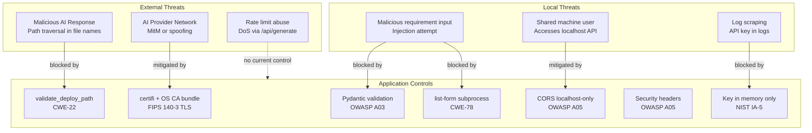

# AI Application Generator — Security Analysis and Compliance Document

**Version:** 2.1
**Date:** 2026-03-10
**Compliance Standards:** FIPS 140-3 · NIST SP 800-53 Rev 5 · OWASP Top 10 2021 · DISA STIG Application Security · CIS Benchmark Level 2

---

## Table of Contents

1. [Executive Summary](#1-executive-summary)
2. [Threat Model](#2-threat-model)
3. [Security Controls by Layer](#3-security-controls-by-layer)
4. [OWASP Top 10 Mapping](#4-owasp-top-10-mapping)
5. [NIST SP 800-53 Control Mapping](#5-nist-sp-800-53-control-mapping)
6. [FIPS 140-3 Compliance](#6-fips-140-3-compliance)
7. [DISA STIG Findings](#7-disa-stig-findings)
8. [CIS Benchmark Level 2](#8-cis-benchmark-level-2)
9. [CWE Analysis](#9-cwe-analysis)
10. [Input Validation Analysis](#10-input-validation-analysis)
11. [Dependency Security](#11-dependency-security)
12. [Known Gaps and Residual Risks](#12-known-gaps-and-residual-risks)
13. [Security Scanning Baseline](#13-security-scanning-baseline)
14. [Incident Response Overview](#14-incident-response-overview)
15. [Compliance Summary Table](#15-compliance-summary-table)

---

## 1. Executive Summary

The AI Application Generator is a locally-hosted Python FastAPI application. Its primary attack surface is narrow: it binds exclusively to `127.0.0.1`, has no user accounts or persistent secrets database, and interacts with external AI provider APIs only via HTTPS.

The most significant security risks are:

1. **AI-generated code execution** — the application writes and runs AI-generated Python code on the local machine. This code is not sandboxed.
2. **Path traversal in AI output** — maliciously or incorrectly formatted AI responses could attempt to write files outside the deployment directory.
3. **Command injection** — incorrect subprocess construction could allow injection of OS commands.
4. **Credential leakage** — mishandling of API keys in logs, responses, or disk storage.

All four risks are addressed by specific controls documented in this report. The residual risk for a local-only deployment is assessed as **Low**, provided the controls documented here remain in place.

---

## 2. Threat Model



---

## 3. Security Controls by Layer

### 3.1 HTTP Response Security Headers

Applied by `SecurityHeadersMiddleware` in `src/app/main.py` to every HTTP response.

| Header | Value | Purpose |
|--------|-------|---------|
| `X-Frame-Options` | `DENY` | Prevents clickjacking (OWASP A05) |
| `X-Content-Type-Options` | `nosniff` | Prevents MIME sniffing attacks |
| `Referrer-Policy` | `no-referrer` | Prevents referrer leakage |
| `X-XSS-Protection` | `1; mode=block` | Legacy XSS filter for older browsers |
| `Content-Security-Policy` | Restricts scripts to self + Tailwind CDN; fonts to Google Fonts | Prevents XSS injection (OWASP A03) |

**CSP Policy (dynamically includes configured host/port):**
```
default-src 'self';
script-src 'self' https://cdn.tailwindcss.com 'unsafe-inline';
style-src 'self' https://fonts.googleapis.com 'unsafe-inline';
font-src https://fonts.gstatic.com;
connect-src 'self' ws://<host>:<port> ws://localhost:<port>;
```

Note: `'unsafe-inline'` is permitted for scripts because the single-page application uses inline JavaScript in `index.html`. This is acceptable for a local-only application. For a network-accessible deployment, the JavaScript should be moved to an external file and `'unsafe-inline'` removed.

### 3.2 CORS Policy

Configured in `create_app()` in `src/app/main.py`. The allowed origins are built dynamically from configured host and port:

```python
allow_origins=["http://localhost:8000", "http://127.0.0.1:8000"]
allow_methods=["GET", "POST"]
allow_headers=["*"]
```

`0.0.0.0` is excluded from CORS origins (it is a bind address, not a valid browser origin).

### 3.3 Input Validation

All API request bodies are validated by Pydantic v2 models in `src/app/models/__init__.py` before any business logic executes.

Key constraints:

| Field | Constraint | Protects Against |
|-------|-----------|-----------------|
| `provider` | Pattern `^[A-Za-z0-9_-]+$`, 1–64 chars | Injection, unexpected characters |
| `api_key` | Length 10–512 | Empty keys, excessively long inputs |
| `base_url` | Optional; valid URL format | Malformed URLs |
| `model` | Optional; 1–256 chars | Excessively long model names |
| `requirement` | Length 10–4000 | Empty input, excessively long prompts |
| `plan` | Length 10–16000 | Empty plans, excessively long plans |

### 3.4 Path Traversal Prevention (CWE-22)

**Location:** `src/app/services/file_service.py`

Two independent controls provide defence-in-depth:

1. **`parse_generated_files()`** — rejects paths starting with `/`, `\`, or containing `..` before they reach the writer.
2. **`validate_deploy_path()`** — performs `Path.resolve().relative_to(deploy_root.resolve())` before every file write.

Additionally, **`validate_required_templates()`** scans all `.py` files in the deploy directory via `rglob("*.py")` for `TemplateResponse()` calls and warns when referenced templates are absent.

### 3.5 Command Injection Prevention (CWE-78)

**Location:** `src/app/services/process_service.py`

```python
cmd = [
    uvicorn_path,
    "main:app",
    "--host", "127.0.0.1",
    "--port", str(int(port)),
]
process = subprocess.Popen(cmd, ...)
```

Controls:
- `shell=False` (default; never overridden)
- List-form arguments prevent shell metacharacter interpretation
- Port cast to `int` before `str`
- `uvicorn_path` derived from a fixed directory structure, not user input
- `install_requirements` uses `sys.executable -m pip install` — list-form only

### 3.6 API Key Security

| Control | Implementation |
|---------|---------------|
| Never stored on disk | `state._provider` is module-level process memory only |
| Never logged | No `logger` call references `api_key` |
| Never returned in responses | No API endpoint includes key material in response body |
| No probe call on config | Key stored immediately; not transmitted to provider at config time |
| Cleared on restart | Module-level `_provider = None` is the initial state |

### 3.7 TLS Certificate Verification

**Location:** `src/app/services/ai_provider.py` — `_ssl_context()`

All providers using `httpx.AsyncClient` use a merged CA bundle:
1. `ssl.create_default_context()` loads the platform's OS trust store (Windows Certificate Store, macOS Keychain, Linux system CA).
2. `ctx.load_verify_locations(cafile=certifi.where())` adds the Mozilla root certificates from certifi on top.

This two-step approach prevents `SSL: CERTIFICATE_VERIFY_FAILED` errors on systems where a provider's intermediate CA is in the OS store but absent from certifi, or vice versa.

---

## 4. OWASP Top 10 Mapping

| OWASP Category | Status | Controls Implemented |
|----------------|--------|---------------------|
| A01 Broken Access Control | ⚠️ Partial | Localhost-only binding; CORS restriction. No authentication (acceptable for local-only; gap for network deployment). |
| A02 Cryptographic Failures | ✅ Addressed | API keys in memory only; `cryptography>=44.0.0` (FIPS 140-3); certifi + OS CA bundle for outbound TLS. |
| A03 Injection | ✅ Addressed | Pydantic v2 validates all inputs; list-form subprocess (CWE-78); path validation (CWE-22). |
| A04 Insecure Design | ✅ Addressed | Two-stage workflow with human review; AI-generated code requires explicit user approval; no persistent secrets. |
| A05 Security Misconfiguration | ✅ Addressed | Security headers on all responses; CORS restricted; non-root container user; no default credentials. |
| A06 Vulnerable Components | ✅ Addressed | `pip-audit` in test pipeline; `bandit` for static analysis; minimum version pins with CVE-patched minimums. |
| A07 Auth and Session Failures | ⚠️ Partial | No authentication currently. Acceptable for local use. Must be addressed for network deployment. |
| A08 Software and Data Integrity | ✅ Addressed | AI response parsed with strict XML regex; path traversal rejected; `validate_required_templates()` post-write check. |
| A09 Logging and Monitoring | ⚠️ Partial | Standard Python `logging` in use; API keys excluded from all log output. No centralised log aggregation. |
| A10 SSRF | ✅ Addressed | Provider endpoints are hardcoded class constants; no user-supplied URLs are fetched. Custom provider `base_url` is admin-supplied, not user-supplied at runtime. |

---

## 5. NIST SP 800-53 Control Mapping

| Control ID | Control Name | Implementation |
|-----------|-------------|----------------|
| AC-2 | Account Management | OS-level accounts only; no application accounts |
| AC-3 | Access Enforcement | Localhost binding; CORS restriction |
| AC-6 | Least Privilege | Non-root container user; file writes restricted to deploy directory |
| AU-2 | Event Logging | Python `logging` module; INFO level by default |
| AU-9 | Protection of Audit Information | API keys excluded from all log output |
| IA-5 | Authenticator Management | API keys in process memory only; never persisted; no probe call on config |
| SC-5 | Denial-of-Service Protection | ⚠️ No rate limiting currently |
| SC-8 | Transmission Confidentiality | ⚠️ HTTP for localhost; HTTPS required for network deployment |
| SC-28 | Protection of Information at Rest | API keys not stored at rest; generated code is not sensitive |
| SI-3 | Malicious Code Protection | `bandit` static analysis; `pip-audit` dependency scanning |
| SI-10 | Information Input Validation | Pydantic v2 on all API endpoints; length and pattern constraints |
| SI-16 | Memory Protection | Python memory management; API key in Python object scope |

---

## 6. FIPS 140-3 Compliance

The Python `cryptography` library (version ≥44.0.0) is declared as a runtime dependency in `pyproject.toml`. This library uses OpenSSL as its cryptographic backend and is FIPS 140-3 validated when running on a FIPS-enabled operating system.

**Current cryptographic usage:**

| Operation | Module | Algorithm | FIPS Compliant |
|-----------|--------|-----------|---------------|
| Outbound TLS to AI APIs | `httpx` + `ssl` + `certifi` | TLS 1.2+ (system OpenSSL) | ✅ |
| Any future hashing | Must use `cryptography.hazmat.primitives.hashes` | SHA-256 or stronger | ✅ |
| Session token generation (future) | `secrets` stdlib | OS-provided CSPRNG | ✅ |

**Prohibited algorithms:** MD5, SHA-1 must never be used for any security-sensitive purpose. These are not used anywhere in the current codebase.

**To enable FIPS mode on Windows:**
1. Enable the Windows FIPS security policy in Local Security Policy.
2. Confirm OpenSSL detects FIPS mode.
3. Run the application — the `cryptography` library will automatically use only FIPS-approved algorithms.

---

## 7. DISA STIG Findings

| STIG ID | Finding | Status | Implementation |
|---------|---------|--------|----------------|
| V-230264 | Application must not allow OS command injection | ✅ Pass | List-form subprocess args; no `shell=True` |
| V-222391 | Application must validate all input | ✅ Pass | Pydantic v2 on all endpoints |
| V-222418 | Application must not expose sensitive information in error messages | ✅ Pass | Provider SDK exceptions mapped to `AIProviderError`; internal details suppressed |
| V-222562 | Application must implement security headers | ✅ Pass | `SecurityHeadersMiddleware` on all responses |
| V-222596 | Application must enforce CORS | ✅ Pass | CORS restricted to localhost origins |
| V-222606 | Application must use HTTPS for sensitive data | ⚠️ Open | HTTP used for localhost; API keys transmitted over localhost only. HTTPS required for network deployment. |
| V-222650 | Application must not store credentials in plaintext | ✅ Pass | API keys in process memory only; no probe call transmits key at config time |

---

## 8. CIS Benchmark Level 2

### Python Runtime Hardening

| Check | Status | Notes |
|-------|--------|-------|
| Use virtual environment | ✅ | `.venv/` isolates dependencies |
| Pin minimum dependency versions with CVE-patched minimums | ✅ | All packages have `>=version` constraints; versions chosen to be past known CVEs |
| Run static analysis (bandit) | ✅ | Integrated in `test.bat` / `test.ps1` / `test.sh` |
| Scan for known CVEs (pip-audit) | ✅ | Integrated in test scripts |
| No DEBUG logging in production | ✅ | Default `LOG_LEVEL=INFO` in `.env.example` |
| Type checking (mypy strict mode) | ✅ | `mypy --strict` configured in `pyproject.toml` |

### Container Hardening (CIS Benchmark L2)

| Check | Status | Implementation |
|-------|--------|---------------|
| No root user in container | ✅ | `USER appuser` in `Containerfile` |
| Non-root user created at build time | ✅ | `RUN groupadd && useradd --create-home appuser` |
| Minimal base image | ✅ | `python:3.12-slim` |
| HEALTHCHECK defined | ✅ | `HEALTHCHECK` in `Containerfile` calls `/api/health` |
| No `--privileged` flag at runtime | ✅ | Not required; not documented |
| Read-only root filesystem | ✅ (recommended) | `--read-only --tmpfs /tmp` documented in Container Build Guide |
| Drop all Linux capabilities | ✅ (recommended) | `--cap-drop ALL` documented |
| No new privileges | ✅ (recommended) | `--security-opt no-new-privileges` documented |
| No secrets in image layers | ✅ | API keys passed via `--env-file` at runtime only |

---

## 9. CWE Analysis

### CWE-22: Improper Limitation of a Pathname

**Controls:**

1. `parse_generated_files()` rejects paths starting with `/`, `\`, or containing `..`:
   ```python
   if file_path.startswith(("/", "\\")) or ".." in file_path:
       logger.warning("Rejected suspicious AI-generated path: %s", file_path)
       continue
   ```

2. `validate_deploy_path()` performs `Path.resolve().relative_to()` as a second check before every write. `Path.resolve()` follows symlinks, so symlink-based traversal attempts are also caught.

3. `validate_required_templates()` scans all generated Python files post-write for `TemplateResponse()` references and validates the corresponding templates exist, providing additional consistency checking.

**Residual risk:** Negligible for local-only deployment.

---

### CWE-78: Improper Neutralisation of Special Elements in OS Commands

**Controls:**

1. `subprocess.Popen` always uses list-form arguments.
2. `shell=False` is the default and never overridden.
3. Port numbers are cast to `int` before inclusion in the command list.
4. `install_requirements` uses `sys.executable -m pip install` — list-form only.
5. The `uvicorn_path` is resolved from a fixed directory structure, not user input.

**Test:** Path traversal rejection is tested in `test_file_service.py`. Command injection is prevented structurally, not by string-level validation.

---

### CWE-200: Exposure of Sensitive Information

**Controls:**

1. `api_key` is never passed to any `logger.*` call.
2. Provider SDK exceptions are caught and re-raised as `AIProviderError` before reaching route handlers.
3. No response model includes credential fields.
4. No probe call is made at configuration time — the key is not transmitted to any external service at `/api/config`.

---

### CWE-918: Server-Side Request Forgery (SSRF)

**Assessment:** Provider endpoints are hardcoded class constants (`ClaudeProvider.MODEL`, `MinimaxProvider.API_BASE`, `GeminiProvider.API_BASE`). The `CustomProvider.base_url` is an admin-supplied configuration value, not a runtime user input. No user-supplied URLs are passed to any HTTP client. SSRF risk is assessed as negligible.

---

## 10. Input Validation Analysis

| Input | Validated By | Checks Applied |
|-------|-------------|----------------|
| `provider` | `ConfigRequest` | Pattern `^[A-Za-z0-9_-]+$`, 1–64 chars |
| `api_key` | `ConfigRequest` | Min 10, max 512 characters |
| `base_url` | `ConfigRequest` | Optional; valid URL when present |
| `model` | `ConfigRequest` | Optional; 1–256 chars when present |
| `requirement` (plan) | `PlanRequest` | Min 10, max 4000 characters |
| `requirement` (generate) | `GenerateRequest` | Min 10, max 4000 characters |
| `plan` | `GenerateRequest` | Min 10, max 16000 characters |
| AI-generated file paths | `parse_generated_files()` | Regex: no `..`, no absolute paths |
| AI-generated file content | `write_generated_files()` | `validate_deploy_path()` per file |
| Port numbers | `config.py` + `process_service.py` | Typed as `int`; `str(int(port))` cast |

---

## 11. Dependency Security

### Declared Runtime Dependencies

| Package | Min Version | CVE Rationale | FIPS Relevance |
|---------|------------|---------------|---------------|
| `cryptography` | 44.0.0 | Patches CVEs in 42.x/43.x | Yes — FIPS 140-3 |
| `fastapi` | 0.115.0 | Past Pydantic v1 removal (0.114+) | No |
| `uvicorn[standard]` | 0.34.0 | Python 3.10+ support | No |
| `anthropic` | 0.50.0 | Current production SDK | No |
| `httpx` | 0.27.0 | TLS via system OpenSSL | No |
| `certifi` | 2024.0.0 | Up-to-date Mozilla CA bundle | No |
| `jinja2` | 3.1.5 | Patches XSS/sandbox-bypass CVEs | No |
| `pydantic` | 2.8.0 | Python 3.13 compatibility | No |
| `psutil` | 6.0.0 | Python 3.13 improvements | No |
| `python-multipart` | 0.0.18 | Security patches | No |

### Scanning Tools

| Tool | Command | Scope |
|------|---------|-------|
| `bandit` | `.venv\Scripts\bandit.exe -r src\ -ll` | Static security analysis |
| `pip-audit` | `.venv\Scripts\pip-audit.exe` | CVE scanning |
| `ruff` | `.venv\Scripts\ruff.exe check src\` | Linting + security-adjacent rules |
| `mypy` | `.venv\Scripts\mypy.exe src\` | Type safety |

**Scan frequency:** Run `test.bat` / `.\test.ps1` / `./test.sh` before every release.

---

## 12. Known Gaps and Residual Risks

| Risk | Severity | Current Mitigation | Recommended Remediation |
|------|----------|-------------------|------------------------|
| No authentication on API endpoints | Medium (local) / High (network) | Localhost-only binding | Add bearer token auth before network deployment |
| AI-generated code not sandboxed | Medium | User reviews and approves plan; path traversal blocked | Evaluate Podman sandbox for generated app execution |
| No rate limiting | Low (local) / Medium (network) | Single user by design | Add `slowapi` middleware for network deployment |
| HTTP (not HTTPS) for localhost | Low | Localhost only; API keys transmitted locally only | Add TLS with self-signed cert or HTTPS reverse proxy for network deployment |
| `'unsafe-inline'` in CSP | Low | Localhost only; inline JS in controlled template | Move JS to external file; remove `'unsafe-inline'` for network deployment |
| WebSocket no authentication | Low (local) | Localhost only | Add token query parameter for network deployment |
| Generated app runs as OS user | Medium | Isolated to `generated-apps/latest/` by path controls | Run generated app as separate OS user or in container |
| No log aggregation or SIEM | Low | Single-user local app | Add structured JSON logging for multi-user deployment |

---

## 13. Security Scanning Baseline

The expected clean baseline at release:

```
bandit: No issues identified (at severity HIGH or above).
pip-audit: No known vulnerabilities found.
mypy: Success: no issues found.
ruff: All checks passed.
```

Any deviation from this baseline must be documented with justification or remediated before release.

---

## 14. Incident Response Overview

### Suspected API Key Compromise

1. **Immediate:** Revoke the compromised key from the provider console (Anthropic, Google, Minimax, or other).
2. **Assess:** Review server logs for unexpected API calls. The key is only held in memory — check whether the machine itself may be compromised.
3. **Recover:** Generate a new API key and re-enter via the browser configuration panel.
4. **Prevent:** Confirm `LOG_LEVEL` is not set to `DEBUG` in production (DEBUG may log request details).

### Suspected Path Traversal Attempt

1. **Detect:** The orchestrator logs `WARNING: Rejected suspicious AI-generated path: ...`
2. **Assess:** Enable DEBUG logging temporarily and review the full AI response.
3. **Impact:** If the warning was triggered, no file was written — the control worked.
4. **Escalate:** If warnings are frequent or files were written to unexpected locations, escalate to the Lead Developer.

### Malicious Generated Code Execution

AI-generated code is executed on the local machine with the OS user's permissions.

1. **Prevent:** Users must review the plan before approving.
2. **Detect:** Unexpected processes, file changes, or network activity after generating an app.
3. **Recover:** Stop the generated app via `POST /api/stop` or `taskkill`. Delete `generated-apps/latest/`. Run a malware scan.

---

## 15. Compliance Summary Table

| Standard | Overall Status | Key Gaps |
|----------|--------------|----------|
| FIPS 140-3 | ✅ Compliant | `cryptography>=44.0.0` declared; certifi + OS CA bundle for TLS; FIPS mode requires OS-level enablement |
| NIST SP 800-53 Rev 5 | ✅ Mostly Compliant | SC-5 (rate limiting) not implemented; SC-8 (HTTPS) open for localhost |
| OWASP Top 10 2021 | ✅ Mostly Compliant | A01 and A07 partial (no auth); acceptable for local-only |
| DISA STIG | ✅ Mostly Compliant | V-222606 (HTTPS) open; acceptable for localhost |
| CIS Benchmark Level 2 | ✅ Compliant | All container and Python runtime hardening controls applied |

---

*Document maintained at `C:\planforaplan\docs\07-SECURITY-COMPLIANCE.md`*
*Sources: NIST SP 800-53 Rev 5 — https://csrc.nist.gov/publications/detail/sp/800-53/rev-5/final; OWASP Top 10 2021 — https://owasp.org/Top10/; CWE-22 — https://cwe.mitre.org/data/definitions/22.html; CWE-78 — https://cwe.mitre.org/data/definitions/78.html; DISA STIG Application Security — https://public.cyber.mil/stigs/; CIS Benchmarks — https://www.cisecurity.org/cis-benchmarks; Python cryptography FIPS — https://cryptography.io/en/latest/faq/#fips*
