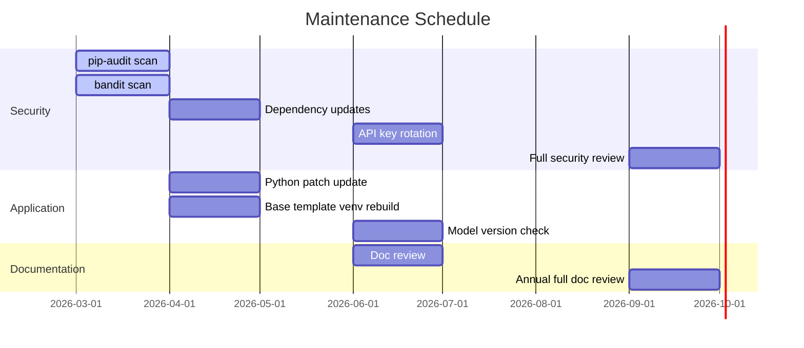

# AI Application Generator — Maintenance Guide

**Version:** 2.1
**Date:** 2026-03-10
**Audience:** DevOps, System Administrators, Lead Developer

---

## Table of Contents

1. [Maintenance Overview](#1-maintenance-overview)
2. [Routine Maintenance Schedule](#2-routine-maintenance-schedule)
3. [Dependency Updates](#3-dependency-updates)
4. [Security Scanning](#4-security-scanning)
5. [Base Template Maintenance](#5-base-template-maintenance)
6. [Log Management](#6-log-management)
7. [Disk Space Management](#7-disk-space-management)
8. [Python Version Upgrades](#8-python-version-upgrades)
9. [AI Provider Model Updates](#9-ai-provider-model-updates)
10. [Testing After Changes](#10-testing-after-changes)
11. [Configuration Review](#11-configuration-review)
12. [Backup and Recovery](#12-backup-and-recovery)

---

## 1. Maintenance Overview

The AI Application Generator requires minimal ongoing maintenance. There is no database, no persistent user data, and no background services running when the orchestrator is stopped. The primary maintenance activities are dependency security updates, periodic security scans, and base template venv refreshes.



---

## 2. Routine Maintenance Schedule

| Task | Frequency | Owner | Effort |
|------|-----------|-------|--------|
| Run `pip-audit` dependency scan | Monthly | DevOps | 15 min |
| Run `bandit` security scan | Monthly | DevOps / Lead Dev | 15 min |
| Review pip-audit and bandit output | Monthly | Security Officer | 30 min |
| Check for Python patch releases | Monthly | DevOps | 10 min |
| Check for FastAPI / uvicorn releases | Monthly | Lead Dev | 10 min |
| Rotate AI provider API keys | Every 90 days | Security Officer | 15 min |
| Review generated-apps disk usage | Monthly | DevOps | 5 min |
| Full dependency update and retest | Quarterly | Lead Dev + DevOps | 2–4 hours |
| Rebuild base template venv | Quarterly (or after dependency update) | DevOps | 30 min |
| Review RBAC and security docs | Every release | Security Officer | 1 hour |
| Full documentation review | Annually | All roles | Half day |

---

## 3. Dependency Updates

### 3.1 Checking for Outdated Packages

```cmd
cd C:\planforaplan
.venv\Scripts\pip.exe list --outdated
```

This lists all packages with newer versions available.

### 3.2 Updating Runtime Dependencies

Edit `pyproject.toml` to raise minimum version pins as needed, then reinstall:

```cmd
.venv\Scripts\pip.exe install --upgrade fastapi uvicorn anthropic httpx jinja2 pydantic pydantic-settings python-dotenv psutil cryptography python-multipart certifi
```

After updating, always rebuild the base template venv and run the full test suite.

### 3.3 Updating Dev Dependencies

```cmd
.venv\Scripts\pip.exe install --upgrade pytest pytest-asyncio bandit pip-audit ruff mypy
```

### 3.4 Pinning Specific Versions

If a newer version introduces breaking changes, pin to the last known-good version in `pyproject.toml`:

```toml
"fastapi>=0.115.0,<0.120.0",
```

Document the reason for the upper bound in a comment.

### 3.5 After Any Dependency Update

1. Run `test.bat` — all tests must pass, bandit must be clean, pip-audit must be clean.
2. Rebuild the base template venv (Section 5).
3. Perform a full end-to-end generation test.
4. Update the dependency version table in `01-ARCHITECTURE.md`.

---

## 4. Security Scanning

### 4.1 Static Analysis with bandit

```cmd
.venv\Scripts\bandit.exe -r src\ -ll
```

- `-ll` reports medium and high severity findings only.
- For full output including low severity: remove `-ll`.
- Expected clean output: `No issues identified.`

For any HIGH severity finding:
1. Review the flagged code.
2. Fix the issue or add `# nosec B<id>  # Justification: <reason>` if it is a confirmed false positive.
3. Re-run bandit to confirm the finding is resolved.
4. Document the finding and resolution in `07-SECURITY-COMPLIANCE.md`.

### 4.2 Dependency CVE Scan with pip-audit

```cmd
.venv\Scripts\pip-audit.exe
```

For any CRITICAL or HIGH vulnerability:
1. Check the recommended fix version.
2. Update the affected package in `pyproject.toml`.
3. Reinstall and re-run pip-audit.

For MEDIUM or LOW vulnerabilities with no fix available:
1. Document in `07-SECURITY-COMPLIANCE.md` under Known Gaps.
2. Set a review date.
3. Monitor the package's advisory for a fix release.

### 4.3 Type Checking with mypy

```cmd
.venv\Scripts\mypy.exe src\
```

Expected clean output: `Success: no issues found in N source files`

### 4.4 Linting with ruff

```cmd
.venv\Scripts\ruff.exe check src\
```

Expected clean output: `All checks passed.`

---

## 5. Base Template Maintenance

The `base-template/.venv/` is a pre-installed Python virtual environment that is copied for every generated app. It must be rebuilt:
- After any change to `base-template/requirements.txt`
- After a Python version upgrade
- After a quarterly dependency refresh

### 5.1 Rebuilding the Base Template venv

```cmd
cd C:\planforaplan\base-template

REM Remove existing venv
rmdir /s /q .venv

REM Recreate
python -m venv .venv
.venv\Scripts\pip.exe install --upgrade pip
.venv\Scripts\pip.exe install -r requirements.txt

REM Verify
.venv\Scripts\python.exe -c "import fastapi; import uvicorn; import jinja2; print('Base template OK')"

cd ..
```

### 5.2 Testing the Base Template

After rebuilding, run the base template directly to confirm it starts:

```cmd
cd C:\planforaplan\base-template
.venv\Scripts\uvicorn.exe main:app --port 8001
```

Expected output includes `Application startup complete.` Navigate to `http://127.0.0.1:8001` and confirm the base template page loads.

Stop the test with Ctrl+C and return to the app directory.

### 5.3 Updating Base Template Requirements

If a generated app consistently fails to start because it needs a package not in the base template, add it to `base-template/requirements.txt`:

```
fastapi>=0.115.0
uvicorn[standard]>=0.34.0
jinja2>=3.1.5
python-multipart>=0.0.18
# Add any other commonly generated packages here
```

Then rebuild the venv (Section 5.1).

---

## 6. Log Management

Server logs are written to stdout in the terminal window. They are not written to a file by default.

### 6.1 Capturing Logs to a File (Optional)

To persist logs for a session:

```cmd
.venv\Scripts\uvicorn.exe app.main:app --host 127.0.0.1 --port 8000 >> app.log 2>&1
```

### 6.2 Log Rotation (if file logging is used)

If capturing logs to a file, rotate monthly:

```cmd
REM Rename current log with date stamp
rename app.log app-2026-03.log

REM A new app.log will be created on next start
```

Old log files should be retained for at least 90 days, then deleted.

### 6.3 Log Security Review

Periodically review log files to confirm:
- No API key content appears in any log line
- No sensitive user data is captured
- Log level is appropriate (INFO for production; DEBUG only for troubleshooting)

---

## 7. Disk Space Management

### 7.1 Generated Apps Directory

Each generation overwrites `generated-apps/latest/`. Disk usage is the size of one generated application (~50–200 KB of source files plus the base template venv copy of ~50–100 MB).

To reclaim disk space:
```cmd
rmdir /s /q C:\planforaplan\generated-apps\latest
```

The directory will be recreated on the next generation.

### 7.2 Python Cache Files

Remove Python bytecode caches periodically:

```cmd
cd C:\planforaplan
for /r /d %d in (__pycache__) do @rmdir /s /q "%d"
del /s /q *.pyc
```

### 7.3 Checking Disk Usage

```cmd
dir C:\planforaplan /s | findstr "bytes"
```

---

## 8. Python Version Upgrades

### 8.1 Checking Current Python Version

```cmd
.venv\Scripts\python.exe --version
```

### 8.2 Upgrading to a New Python Patch Release (e.g., 3.11.x → 3.11.y)

For patch releases within the same minor version (3.11.x):
1. Download and install the new Python 3.11.x.
2. Delete and recreate both virtual environments:

```cmd
cd C:\planforaplan
rmdir /s /q .venv
rmdir /s /q base-template\.venv
setup.bat
```

3. Run `test.bat` to confirm everything works.

### 8.3 Upgrading to a New Minor Release (e.g., 3.11 → 3.12)

Before upgrading:
1. Review the Python changelog for breaking changes affecting the packages used.
2. Update `pyproject.toml` `requires-python` field.
3. Run the full upgrade as in Section 8.2.
4. Pay particular attention to `psutil` and `cryptography` as these have native extensions.

---

## 9. AI Provider Model Updates

### 9.1 Updating the Claude Model

The Claude model is pinned in `src/app/services/ai_provider.py`:

```python
class ClaudeProvider:
    MODEL = "claude-sonnet-4-20250514"
```

To update:
1. Check the [Anthropic model documentation](https://docs.anthropic.com) for the latest stable model string.
2. Update the `MODEL` constant.
3. Test with a full generation cycle.
4. Update `01-ARCHITECTURE.md` dependency table.

### 9.2 Updating the Minimax Model

The Minimax default model is in `MinimaxProvider`:

```python
class MinimaxProvider:
    MODEL = "MiniMax-Text-01"
```

Update the `MODEL` constant to the desired Minimax model and test. Available models are listed at `platform.minimax.io`.

### 9.3 Updating the Gemini Model

The Gemini default model is in `GeminiProvider`:

```python
class GeminiProvider:
    MODEL = "gemini-2.0-flash"
```

Update the `MODEL` constant to the desired Gemini model. Current model names are listed at [Google AI Studio](https://aistudio.google.com).

### 9.4 Adding a New AI Provider

1. Create a new class in `ai_provider.py` implementing the `AIProvider` Protocol (two methods: `__init__` and `async generate(user_prompt, system_prompt) -> str`).
2. Add a `case "newprovider":` branch in `create_provider()`.
3. Update the `ConfigRequest` model in `models/__init__.py` if the provider name needs to be in the allowed pattern.
4. Update the provider dropdown in `src/app/templates/index.html`.
5. Add tests in `tests/test_ai_provider.py`.
6. Update `02-USER-GUIDE.md`, `03-API-GUIDE.md`, and `01-ARCHITECTURE.md`.

---

## 10. Testing After Changes

Any change to the codebase must pass the full test suite before deployment.

### 10.1 Running the Full Test Suite

```cmd
test.bat
```

This runs:
1. `pytest tests\ -v --tb=short` — all unit and integration tests
2. `bandit -r src\ -ll` — static security scan
3. `pip-audit` — dependency CVE scan

### 10.2 Manual End-to-End Test

After any significant change:

1. Start the server: `start.bat`
2. Open `http://127.0.0.1:8000`
3. Configure the AI provider with a valid key
4. Enter a test requirement: `"Build a simple todo list app"`
5. Verify plan generation completes within 30 seconds
6. Approve the plan and submit for execution
7. Verify the generated app deploys and browser opens within 5 minutes
8. Verify the generated app is functional at `http://127.0.0.1:8001`
9. Click Stop and verify the state returns to idle

### 10.3 Test Coverage

Run pytest with coverage (requires `pytest-cov` installed in dev dependencies):

```cmd
.venv\Scripts\pytest.exe tests\ --cov=app --cov-report=term-missing
```

Target: 80% coverage minimum. Coverage below 80% should be reported to the Lead Developer.

---

## 11. Configuration Review

Review the `.env` file quarterly to confirm settings are appropriate:

| Setting | Review Check |
|---------|-------------|
| `APP_HOST` | Should be `127.0.0.1` for local-only. Change to `0.0.0.0` only with authentication enabled. |
| `APP_PORT` | Confirm no conflict with other services on the machine |
| `DEPLOY_DIR` | Confirm the path exists and has write permission |
| `BASE_TEMPLATE_DIR` | Confirm base template directory exists with pre-installed venv |
| `GENERATED_APP_PORT` | Confirm no conflict with other services |
| `LOG_LEVEL` | Should be `INFO` in production; `DEBUG` only for troubleshooting |

---

## 12. Backup and Recovery

### 12.1 What to Back Up

| Item | Backup Required | Notes |
|------|----------------|-------|
| `src/` directory | Yes | Application source code |
| `pyproject.toml` | Yes | Dependency declarations |
| `base-template/main.py`, `requirements.txt`, `templates/` | Yes | Template files (not the venv) |
| `.env` | Yes (securely) | Configuration values — do not store in version control |
| `docs/` | Yes | All documentation files |
| `tests/` | Yes | Test suite |
| `.venv/` | No | Recreated by `setup.bat` |
| `base-template/.venv/` | No | Recreated by `setup.bat` |
| `generated-apps/` | No | Temporary deployment output |

### 12.2 Recovery Procedure

If the application directory becomes corrupted or a deployment fails:

1. Restore source files from backup or version control.
2. Run `setup.bat` to recreate both venvs.
3. Restore `.env` from secure backup.
4. Run `test.bat` to verify all tests pass.
5. Perform a manual end-to-end test (Section 10.2).

---

*Document maintained at `C:\planforaplan\docs\08-MAINTENANCE-GUIDE.md`*
