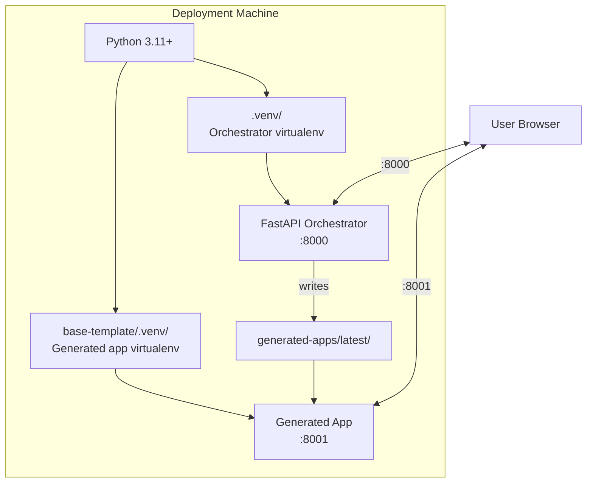

# AI Application Generator — Deployment Guide

**Version:** 2.2  
**Date:** March 2026  
**Audience:** DevOps, System Administrators  
**Platform:** Windows · Linux · macOS · Container (Podman/Docker)

---

## Table of Contents

1. [Deployment Overview](#1-deployment-overview)
2. [Prerequisites](#2-prerequisites)
3. [Directory Structure](#3-directory-structure)
4. [Installation — Windows (PowerShell)](#4-installation--windows-powershell)
5. [Installation — Windows (Command Prompt)](#5-installation--windows-command-prompt)
6. [Installation — Linux / macOS](#6-installation--linux--macos)
7. [Environment Configuration](#7-environment-configuration)
8. [Running in Development Mode](#8-running-in-development-mode)
9. [Running in Production Mode](#9-running-in-production-mode)
10. [Verifying the Deployment](#10-verifying-the-deployment)
11. [Updating an Existing Deployment](#11-updating-an-existing-deployment)
12. [Reverse Proxy Configuration (Network Access)](#12-reverse-proxy-configuration-network-access)
13. [Troubleshooting Deployments](#13-troubleshooting-deployments)

---

## 1. Deployment Overview

The AI Application Generator is a locally-hosted Python FastAPI application. It is designed for single-machine, single-user use. The orchestrator binds to `127.0.0.1:8000` by default, making it accessible only from the local machine.



Two virtual environments are required:
1. **`.venv/`** — the orchestrator's dependencies (FastAPI, anthropic SDK, psutil, etc.)
2. **`base-template/.venv/`** — pre-installed dependencies for generated apps (FastAPI, jinja2, uvicorn)

---

## 2. Prerequisites

| Requirement | Minimum Version | How to Verify |
|-------------|----------------|---------------|
| Python | 3.11.0 | `python --version` |
| pip | 23.0 | `pip --version` |
| Internet access | — | Required for AI API calls and Tailwind CDN in generated apps |
| Disk space | 500 MB free | For two venvs and generated app deployments |
| RAM | 512 MB free | FastAPI is lightweight; AI API calls are network-bound |
| Ports 8000 and 8001 | Available | `netstat -ano \| findstr ":8000 :8001"` |

**Windows specific:**
- Windows 10 / Windows Server 2019 or later recommended
- PowerShell 5.1 or later (recommended — native `.ps1` scripts provided)
- Command Prompt also supported via `.bat` scripts

---

## 3. Directory Structure

After successful installation, the directory structure is:

```
app/
├── .env                        ← Created from .env.example by setup script
├── .env.example                ← Template for environment variables
├── .gitignore
├── .venv/                      ← Orchestrator virtualenv (created by setup script)
│   ├── Scripts/                ← Windows
│   │   ├── uvicorn.exe
│   │   ├── pytest.exe
│   │   └── ...
│   └── bin/                    ← Linux / macOS
│       ├── uvicorn
│       ├── pytest
│       └── ...
├── Containerfile               ← OCI container build file (Podman / Docker)
├── pyproject.toml              ← Project metadata and dependencies
├── setup.ps1                   ← One-time setup script (Windows PowerShell)
├── setup.bat                   ← One-time setup script (Windows Command Prompt)
├── setup.sh                    ← One-time setup script (Linux/macOS)
├── start.ps1                   ← Start the orchestrator (Windows PowerShell)
├── start.bat                   ← Start the orchestrator (Windows Command Prompt)
├── start.sh                    ← Start the orchestrator (Linux/macOS)
├── test.ps1                    ← Run tests and security scans (Windows PowerShell)
├── test.bat                    ← Run tests and security scans (Windows Command Prompt)
├── test.sh                     ← Run tests and security scans (Linux/macOS)
├── base-template/              ← Pre-installed generated app template
│   ├── .venv/                  ← Generated app virtualenv
│   ├── main.py
│   ├── requirements.txt
│   └── templates/
│       └── index.html
├── generated-apps/             ← Deployment output (created at runtime)
│   └── latest/                 ← Most recent generated app
├── src/
│   └── app/
│       ├── main.py
│       ├── config.py
│       ├── state.py
│       ├── prompts.py
│       ├── models/
│       ├── routes/
│       ├── services/
│       ├── templates/
│       └── static/
├── tests/
└── docs/
```

---

## 4. Installation — Windows (PowerShell)

PowerShell scripts are the recommended approach for Windows deployments. They provide richer error messages, proper exit codes, and modern scripting features compared to the legacy `.bat` scripts.

> **Execution Policy:** PowerShell may block unsigned scripts by default. Run the following in an elevated PowerShell session to allow local scripts for the current user:
> ```powershell
> Set-ExecutionPolicy -ExecutionPolicy RemoteSigned -Scope CurrentUser
> ```

### Step 1 — Install Python 3.11+

Download from [python.org](https://python.org/downloads). During installation, check:
- ✅ Add Python to PATH
- ✅ Install pip

Verify in PowerShell:
```powershell
python --version
pip --version
```

### Step 2 — Copy Application Files

Place the application directory at `C:\saabdemo\app\` (or any path without spaces).

### Step 3 — Run Setup

Open PowerShell, navigate to the application directory, and run:

```powershell
cd C:\path\to\app
.\setup.ps1
```

`setup.ps1` performs five steps:
1. Creates `.venv\` using the system Python
2. Upgrades pip inside `.venv\`
3. Installs all dependencies from `pyproject.toml` (including dev tools)
4. Creates `base-template\.venv\` and installs `base-template\requirements.txt`
5. Creates `.env` from `.env.example` if `.env` does not already exist

Expected output ends with:
```
============================================================
 Setup complete.
 Edit .env to configure ports, paths, and log level.
 Run .\start.ps1 to launch the application.
============================================================
```

If any step shows an error, see Section 13 (Troubleshooting).

### Step 4 — Review the Environment File

`setup.ps1` creates `.env` automatically from `.env.example`. Review and edit it if needed:

```powershell
notepad .env
```

The defaults work for a standard local deployment. Edit `.env` only if you need to change ports, paths, or log level.

### Step 5 — Start the Application

```powershell
.\start.ps1
```

Expected output:
```
Starting AI Application Generator on http://127.0.0.1:8000
Press Ctrl+C to stop.

INFO:     Started server process [XXXX]
INFO:     Waiting for application startup.
INFO:     Application startup complete.
INFO:     Uvicorn running on http://127.0.0.1:8000 (Press CTRL+C to quit)
```

### Step 6 — Verify

Open a browser and navigate to `http://127.0.0.1:8000`. The AI Application Generator interface should load.

Run a health check:
```powershell
Invoke-RestMethod http://127.0.0.1:8000/api/health
```
Expected: `status: ok`

---

## 5. Installation — Windows (Command Prompt)

The legacy `.bat` scripts are also available for environments where PowerShell is not preferred.

### Step 1 — Install Python 3.11+

Same as Section 4, Step 1.

### Step 2 — Copy Application Files

Place the application directory at `C:\saabdemo\app\` (or any path without spaces).

### Step 3 — Run Setup

```cmd
cd C:\path\to\app
setup.bat
```

`setup.bat` performs the same five steps as `setup.ps1`. Expected output ends with:
```
============================================================
 Setup complete.
 Edit .env to configure ports, paths, and log level.
 Run start.bat to launch the application.
============================================================
```

### Step 4 — Review the Environment File

```cmd
notepad .env
```

### Step 5 — Start the Application

```cmd
start.bat
```

Expected output is the same as the PowerShell path.

### Step 6 — Verify

```cmd
curl http://127.0.0.1:8000/api/health
```
Expected: `{"status":"ok"}`

---

## 6. Installation — Linux / macOS

Shell scripts matching the Windows `.bat` files are provided for Linux and macOS.

### Step 1 — Install Python 3.11+

**Ubuntu / Debian:**
```bash
sudo apt update && sudo apt install python3 python3-pip python3-venv
python3 --version
```

**macOS (Homebrew):**
```bash
brew install python@3.12
python3 --version
```

### Step 2 — Copy Application Files

Place the application directory at a path of your choice (e.g. `~/app`).

### Step 3 — Run Setup

```bash
cd /path/to/app
chmod +x setup.sh start.sh test.sh
./setup.sh
```

`setup.sh` performs the same five steps as `setup.ps1`:
1. Creates `.venv/` using the system `python3`
2. Upgrades pip inside `.venv/`
3. Installs all dependencies from `pyproject.toml` (including dev tools)
4. Creates `base-template/.venv/` and installs `base-template/requirements.txt`
5. Creates `.env` from `.env.example` if `.env` does not already exist

### Step 4 — Review the Environment File

```bash
nano .env   # or any editor
```

### Step 5 — Start the Application

```bash
./start.sh
```

### Step 6 — Verify

```bash
curl http://127.0.0.1:8000/api/health
```
Expected: `{"status":"ok"}`

On Linux/macOS, the generated app's uvicorn executable will be at `base-template/.venv/bin/uvicorn`. The `_uvicorn_executable()` function in `process_service.py` handles the platform difference automatically.

---

## 7. Environment Configuration

Edit `.env` in the application directory to configure the deployment:

```env
# Orchestrator bind settings
# APP_HOST — IP address the server listens on.
#   127.0.0.1  → local machine only (default, recommended for single-user use)
#   0.0.0.0    → all network interfaces (use only with a reverse proxy + HTTPS)
# APP_PORT — TCP port the server binds to. Change if 8000 is in use.
APP_HOST=127.0.0.1
APP_PORT=8000

# Deployment paths (relative to working directory when the server starts)
DEPLOY_DIR=generated-apps/latest
BASE_TEMPLATE_DIR=base-template

# Port for generated applications
GENERATED_APP_PORT=8001

# Logging level: DEBUG, INFO, WARNING, ERROR
LOG_LEVEL=INFO
```

### Configuration Notes

**`APP_HOST`** — Set to `127.0.0.1` for local-only access. Change to `0.0.0.0` only if a network-accessible deployment is needed (and only with authentication and HTTPS in place — see Section 12).

**`APP_PORT`** — Set to any unused port. The start scripts (`start.sh`, `start.ps1`, `start.bat`) read this value from `.env` at launch time and pass it to uvicorn automatically. You do not need to edit the scripts. The application will be accessible at `http://<APP_HOST>:<APP_PORT>` once started.

**`DEPLOY_DIR`** and **`BASE_TEMPLATE_DIR`** — These are resolved relative to the working directory when the server starts. Use absolute paths if starting the server from a different directory.

> **Windows:** Use forward slashes `/` or doubled backslashes `\\` in paths — Python's `pathlib` handles both.
>
> **Linux/macOS:** Use standard Unix paths.

```env
# Windows absolute path example
DEPLOY_DIR=C:/path/to/app/generated-apps/latest
BASE_TEMPLATE_DIR=C:/path/to/app/base-template

# Linux/macOS absolute path example
DEPLOY_DIR=/home/user/app/generated-apps/latest
BASE_TEMPLATE_DIR=/home/user/app/base-template
```

**`LOG_LEVEL`** — Use `DEBUG` only for troubleshooting. Debug logging is verbose and may capture request details.

---

## 8. Running in Development Mode

Development mode enables auto-reload on code changes. The host and port are read from `.env` by the start scripts; the manual commands below use the defaults — substitute your configured values if different.

**Windows (PowerShell):**
```powershell
.\.venv\Scripts\uvicorn.exe app.main:app --host 127.0.0.1 --port 8000 --reload
```

**Windows (Command Prompt):**
```cmd
.venv\Scripts\uvicorn.exe app.main:app --host 127.0.0.1 --port 8000 --reload
```

**Linux / macOS:**
```bash
.venv/bin/uvicorn app.main:app --host 127.0.0.1 --port 8000 --reload
```

The `start.ps1` / `start.bat` / `start.sh` scripts read `APP_HOST` and `APP_PORT` from `.env` and pass them to uvicorn automatically — they are the recommended way to start the server. Changes to `src/app/` files will restart the server automatically.

**Note:** Auto-reload does not restart the generated app subprocess or affect in-memory state (which is reset on server restart).

---

## 9. Running in Production Mode

For a stable production deployment (no auto-reload):

**Windows (PowerShell):**
```powershell
.\.venv\Scripts\uvicorn.exe app.main:app --host 127.0.0.1 --port 8000 --workers 1
```

**Windows (Command Prompt):**
```cmd
.venv\Scripts\uvicorn.exe app.main:app --host 127.0.0.1 --port 8000 --workers 1
```

**Linux / macOS:**
```bash
.venv/bin/uvicorn app.main:app --host 127.0.0.1 --port 8000 --workers 1
```

**Single worker only:** The application uses module-level in-memory state (`state.py`). Multiple workers would not share state and would cause inconsistent behaviour. Always use `--workers 1`.

**Starting automatically on system boot (Windows Service):**

Use NSSM (Non-Sucking Service Manager) or Windows Task Scheduler to start `start.ps1` at login:

```powershell
# Using Task Scheduler (run as administrator) — adjust the path to your app directory
$action = New-ScheduledTaskAction -Execute "powershell.exe" `
    -Argument "-NonInteractive -File C:\path\to\app\start.ps1" `
    -WorkingDirectory "C:\path\to\app"
$trigger = New-ScheduledTaskTrigger -AtLogOn
Register-ScheduledTask -TaskName "AI App Generator" -Action $action -Trigger $trigger -RunLevel Highest
```

For a proper Windows Service installation, NSSM is recommended:
```cmd
nssm install AIAppGenerator "C:\path\to\app\.venv\Scripts\uvicorn.exe"
nssm set AIAppGenerator AppParameters "app.main:app --host 127.0.0.1 --port 8000"
nssm set AIAppGenerator AppDirectory "C:\path\to\app"
nssm start AIAppGenerator
```

---

## 10. Verifying the Deployment

Run this verification sequence after any deployment:

**Windows (PowerShell):**
```powershell
# 1. Health endpoint
Invoke-RestMethod http://127.0.0.1:8000/api/health
# Expected: status: ok

# 2. Status endpoint
Invoke-RestMethod http://127.0.0.1:8000/api/status
# Expected: phase: idle, progress: 0, message: Ready, url:

# 3. Security headers present
(Invoke-WebRequest http://127.0.0.1:8000/ -Method Head).Headers | Select-String "X-Frame-Options|X-Content-Type-Options|Content-Security-Policy"
```

**Windows (Command Prompt):**
```cmd
REM 1. Health endpoint
curl http://127.0.0.1:8000/api/health
REM Expected: {"status":"ok"}

REM 2. Status endpoint
curl http://127.0.0.1:8000/api/status
REM Expected: {"phase":"idle","progress":0,"message":"Ready","url":null}

REM 3. Security headers present
curl -I http://127.0.0.1:8000/ | findstr "X-Frame-Options X-Content-Type Content-Security"
```

**Linux / macOS:**
```bash
# 1. Health endpoint
curl http://127.0.0.1:8000/api/health
# Expected: {"status":"ok"}

# 2. Status endpoint
curl http://127.0.0.1:8000/api/status

# 3. Security headers present
curl -sI http://127.0.0.1:8000/ | grep -i "x-frame-options\|x-content-type\|content-security"
```

---

## 11. Updating an Existing Deployment

### Minor Update (code changes only, no dependency changes)

1. Stop the server (Ctrl+C).
2. Replace the modified files in `src/app/`.
3. Start the server with `.\start.ps1` (Windows PowerShell), `start.bat` (Windows CMD), or `./start.sh` (Linux/macOS).

### Dependency Update

1. Stop the server.
2. Edit `pyproject.toml` with new version constraints.
3. Reinstall:

   **Windows (PowerShell):**
   ```powershell
   .\.venv\Scripts\pip.exe install -e ".[dev]"
   ```
   **Windows (Command Prompt):**
   ```cmd
   .venv\Scripts\pip.exe install -e ".[dev]"
   ```
   **Linux / macOS:**
   ```bash
   .venv/bin/pip install -e ".[dev]"
   ```
4. Rebuild base template venv (see Maintenance Guide Section 5).
5. Run `.\test.ps1` (Windows PowerShell), `test.bat` (Windows CMD), or `./test.sh` (Linux/macOS) — all tests must pass.
6. Start the server.

### Full Reinstall

**Windows (PowerShell):**
```powershell
# Stop the server first
Remove-Item -Recurse -Force .venv
Remove-Item -Recurse -Force base-template\.venv
.\setup.ps1
```

**Windows (Command Prompt):**
```cmd
REM Stop the server first
rmdir /s /q .venv
rmdir /s /q base-template\.venv
setup.bat
```

**Linux / macOS:**
```bash
rm -rf .venv base-template/.venv
./setup.sh
```

---

## 12. Reverse Proxy Configuration (Network Access)

> ⚠️ **Security Warning:** Making this application accessible over a network without authentication is a security risk. Only proceed after implementing bearer token authentication and enabling HTTPS.

If the application must be accessed from another machine on the network, configure a reverse proxy (nginx or Caddy) with HTTPS.

### nginx Example Configuration

```nginx
server {
    listen 443 ssl;
    server_name your-hostname.local;

    ssl_certificate     /etc/ssl/certs/app.crt;
    ssl_certificate_key /etc/ssl/private/app.key;
    ssl_protocols       TLSv1.2 TLSv1.3;

    # Proxy to FastAPI orchestrator
    location / {
        proxy_pass         http://127.0.0.1:8000;
        proxy_http_version 1.1;
        proxy_set_header   Host $host;
        proxy_set_header   X-Real-IP $remote_addr;
        proxy_set_header   Upgrade $http_upgrade;
        proxy_set_header   Connection "upgrade";
    }
}
```

### Required Additional Changes for Network Deployment

1. In `main.py`, update CORS to include the proxy hostname.
2. Add bearer token authentication middleware.
3. Change `APP_HOST` to `127.0.0.1` (proxy handles external access).
4. Remove `'unsafe-inline'` from CSP by externalising the JavaScript.
5. Add rate limiting with `slowapi`.

---

## 13. Troubleshooting Deployments

### `setup.ps1` / `setup.bat` / `setup.sh` fails at dependency install step

- Check internet connectivity.
- Check if a corporate proxy is blocking pip: set `HTTP_PROXY` and `HTTPS_PROXY` environment variables.
- Manually upgrade pip and retry:

  **Windows (PowerShell):** `.\.venv\Scripts\pip.exe install --upgrade pip`  
  **Windows (Command Prompt):** `.venv\Scripts\pip.exe install --upgrade pip`  
  **Linux/macOS:** `.venv/bin/pip install --upgrade pip`

### PowerShell reports "execution of scripts is disabled on this system"

Run the following in an elevated PowerShell session to allow local scripts:

```powershell
Set-ExecutionPolicy -ExecutionPolicy RemoteSigned -Scope CurrentUser
```

### `ModuleNotFoundError: No module named 'app'`

The server cannot find the `src/app` package. Ensure you are running the start script from the app directory and that the package is installed:

**Windows (PowerShell):**
```powershell
cd C:\path\to\app
.\.venv\Scripts\pip.exe install -e .
.\start.ps1
```

**Windows (Command Prompt):**
```cmd
cd C:\path\to\app
.venv\Scripts\pip.exe install -e .
start.bat
```

**Linux / macOS:**
```bash
cd /path/to/app
.venv/bin/pip install -e .
./start.sh
```

### Server starts but `.env` not found

Run `.\setup.ps1`, `setup.bat`, or `./setup.sh` — they each create `.env` automatically. Or create it manually:

**Windows (PowerShell):** `Copy-Item .env.example .env`  
**Windows (Command Prompt):** `copy .env.example .env`  
**Linux/macOS:** `cp .env.example .env`

### Port 8000 is already in use

Change `APP_PORT` in `.env` to an unused port (e.g., 8080).

### Generated apps fail to start with `No module named 'fastapi'`

The `base-template/.venv/` is missing or broken. Rebuild it:

**Windows (PowerShell):**
```powershell
Push-Location base-template
Remove-Item -Recurse -Force .venv
python -m venv .venv
.\.venv\Scripts\pip.exe install -r requirements.txt
Pop-Location
```

**Windows (Command Prompt):**
```cmd
cd base-template
rmdir /s /q .venv
python -m venv .venv
.venv\Scripts\pip.exe install -r requirements.txt
cd ..
```

**Linux / macOS:**
```bash
cd base-template
rm -rf .venv
python3 -m venv .venv
.venv/bin/pip install -r requirements.txt
cd ..
```

---

*Document maintained at `app/docs/09-DEPLOYMENT-GUIDE.md`*
