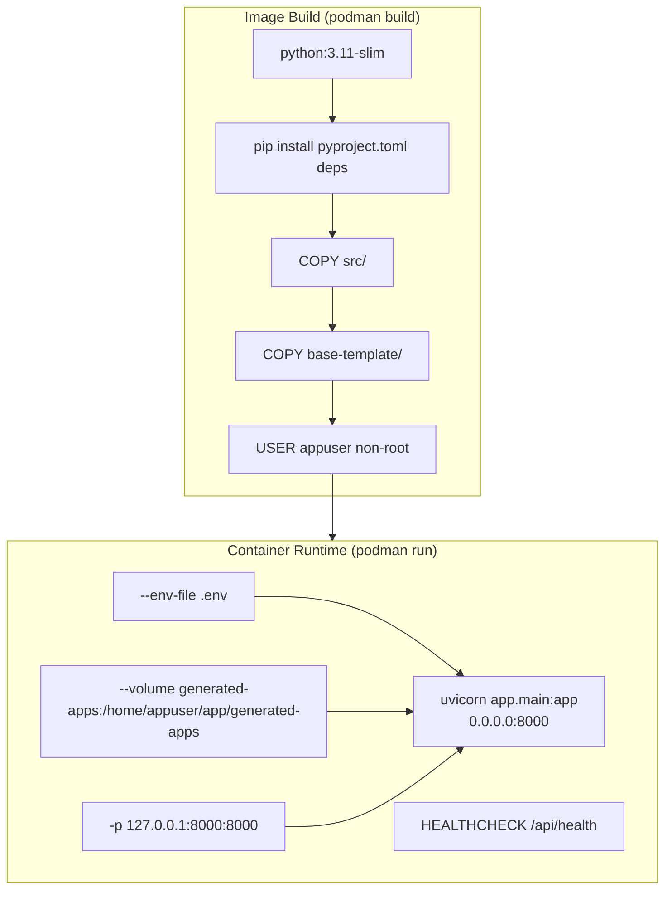

# AI Application Generator — Container Build Guide

**Version:** 2.1  
**Date:** March 2026  
**Audience:** DevOps, System Administrators  
**Container Runtime:** Podman (preferred) · Docker (compatible)  
**Security Standard:** CIS Benchmark Level 2 · NIST SP 800-53 · FIPS 140-3

---

## Table of Contents

1. [Overview](#1-overview)
2. [Prerequisites](#2-prerequisites)
3. [Containerfile Walkthrough](#3-containerfile-walkthrough)
4. [Build the Image](#4-build-the-image)
5. [Run the Container](#5-run-the-container)
6. [Hardened Runtime Flags](#6-hardened-runtime-flags)
7. [Environment Variables at Runtime](#7-environment-variables-at-runtime)
8. [Persistent Volume for Generated Apps](#8-persistent-volume-for-generated-apps)
9. [Health Check Behaviour](#9-health-check-behaviour)
10. [Verifying the Running Container](#10-verifying-the-running-container)
11. [Container Networking](#11-container-networking)
12. [Image Scanning](#12-image-scanning)
13. [Image Tagging and Registry](#13-image-tagging-and-registry)
14. [Updating the Image](#14-updating-the-image)
15. [Troubleshooting Container Builds](#15-troubleshooting-container-builds)
16. [Air-Gapped Deployment](#16-air-gapped-deployment)
17. [Security Notes](#17-security-notes)

---

## 1. Overview

The application ships with a `Containerfile` (OCI-compatible; works with both Podman and Docker) located at `app/Containerfile`.

The container image packages:
- The Python 3.11-slim base image
- All runtime Python dependencies (installed during build)
- The orchestrator source code (`src/`)
- The base template and its pre-installed venv (`base-template/`)

The container **does not** package:
- API keys (supplied at runtime via environment or `--env-file`)
- Generated application output (written to a volume at runtime)
- `.env` configuration (supplied at runtime via `--env-file`)



---

## 2. Prerequisites

### For Podman (recommended)

| Requirement | Version | Install |
|-------------|---------|---------|
| Podman | 4.0 or later | [podman.io](https://podman.io/getting-started/installation) |
| Windows: Podman Desktop | 1.0 or later | [podman-desktop.io](https://podman-desktop.io) |

Verify:
```cmd
podman --version
podman info
```

### For Docker (alternative)

| Requirement | Version | Install |
|-------------|---------|---------|
| Docker Engine | 24.0 or later | [docker.com](https://docs.docker.com/engine/install/) |
| Docker Desktop (Windows) | 4.20 or later | [docker.com](https://docs.docker.com/desktop/install/windows-install/) |

All `podman` commands in this guide can be substituted with `docker` directly — the CLI interface is compatible.

---

## 3. Containerfile Walkthrough

The complete `Containerfile` is at `app/Containerfile`. Here is a line-by-line explanation:

```dockerfile
FROM python:3.12-slim
```
Uses the official Python 3.12 slim image (Debian-based, minimal packages). The slim variant reduces image size and attack surface compared to the full `python:3.12` image. This image is publicly available on Docker Hub — no credentials required.

---

```dockerfile
RUN groupadd --gid 1001 appuser \
    && useradd --uid 1001 --gid appuser --shell /bin/bash --create-home appuser
USER appuser
WORKDIR /home/appuser/app
```
Creates a non-root user `appuser` (UID/GID 1001) with a home directory and immediately switches to it. This satisfies **CIS Benchmark Level 2** requirement to never run container processes as root. All subsequent layers and the runtime process run as `appuser`.

---

```dockerfile
ENV PATH="/home/appuser/.local/bin:${PATH}"
```
Adds the user-local pip scripts directory to `PATH`. Because we run as `appuser` (non-root), pip installs scripts to `~/.local/bin` rather than system directories.

---

```dockerfile
COPY --chown=appuser:appuser pyproject.toml .
COPY --chown=appuser:appuser src/ ./src/
RUN pip install --no-cache-dir --upgrade pip \
    && pip install --no-cache-dir .
```
Copies package metadata and source, then installs all runtime dependencies. Doing `COPY pyproject.toml` before `COPY src/` is a **layer caching optimisation** — if only source code changes, Docker/Podman reuses the cached dependency layer.

`--no-cache-dir` reduces image size by not storing the pip download cache in the layer. The `.` installs the base runtime dependencies from `pyproject.toml` without any dev extras.

---

```dockerfile
COPY --chown=appuser:appuser base-template/ ./base-template/
```
Copies the base template (including its pre-installed `.venv/`) into the image. This makes sub-15-second generated app deployment possible — the venv is baked into the image.

---

```dockerfile
RUN mkdir -p generated-apps
```
Creates the `generated-apps/` directory. This already runs as `appuser` so no `chown` is needed.

---

```dockerfile
EXPOSE 8000
```
Documents that the container listens on port 8000. Informational — actual port mapping is provided at `podman run` / `docker run` time.

---

```dockerfile
HEALTHCHECK --interval=30s --timeout=5s --start-period=10s \
  CMD python -c "import urllib.request; urllib.request.urlopen('http://localhost:8000/health')"
```
Configures the container health check:
- Checks every **30 seconds**
- Marks unhealthy if the check takes more than **5 seconds**
- Allows **10 seconds** startup grace before first check
- Uses Python stdlib `urllib.request` — no curl or wget dependency needed

---

```dockerfile
CMD ["uvicorn", "app.main:app", "--host", "0.0.0.0", "--port", "8000"]
```
The default startup command. Note `--host 0.0.0.0` — inside the container, the server must bind to all interfaces so that the port mapping from `podman run -p` / `docker run -p` works. The external host binding is controlled by the `-p 127.0.0.1:8000:8000` flag at runtime.

---

## 4. Build the Image

### Standard Build (Podman)

**Windows:**
```cmd
cd C:\path\to\app
podman build -t ai-app-generator:2.0 -f Containerfile .
```

**Linux / macOS:**
```bash
cd /path/to/app
podman build -t ai-app-generator:2.0 -f Containerfile .
```

### Standard Build (Docker)

**Windows:**
```cmd
cd C:\path\to\app
docker build -t ai-app-generator:2.0 -f Containerfile .
```

**Linux / macOS:**
```bash
cd /path/to/app
docker build -t ai-app-generator:2.0 -f Containerfile .
```

### Build with No Cache (force fresh dependency install)

```cmd
podman build --no-cache -t ai-app-generator:2.0 -f Containerfile .
```

Use `--no-cache` when updating Python dependencies to ensure the new versions are installed rather than the cached layer.

### Expected Build Output

```
STEP 1/10: FROM python:3.11-slim
STEP 2/10: RUN useradd --create-home appuser
STEP 3/10: WORKDIR /home/appuser/app
STEP 4/10: COPY pyproject.toml .
STEP 5/10: RUN pip install --no-cache-dir --upgrade pip && pip install --no-cache-dir "."
  Collecting fastapi>=0.110.0 ...
  [pip install output]
STEP 6/10: COPY src/ ./src/
STEP 7/10: COPY base-template/ ./base-template/
STEP 8/10: RUN mkdir -p generated-apps && chown appuser:appuser generated-apps
STEP 9/10: USER appuser
STEP 10/10: EXPOSE 8000
...
Successfully tagged localhost/ai-app-generator:2.0
```

### Verifying the Image Was Built

```cmd
podman images ai-app-generator
```

Expected output:
```
REPOSITORY               TAG   IMAGE ID      CREATED       SIZE
localhost/ai-app-generator  2.0   abc123def456  2 minutes ago  ~450MB
```

---

## 5. Run the Container

### Minimal Run (local access only)

```cmd
podman run -d \
  --name ai-app-gen \
  -p 127.0.0.1:8000:8000 \
  --env-file .env \
  ai-app-generator:2.0
```

- `-d` — run in background (detached)
- `--name ai-app-gen` — assigns a name for easy management
- `-p 127.0.0.1:8000:8000` — binds port 8000 on localhost only (not `0.0.0.0`)
- `--env-file .env` — loads environment variables from the local `.env` file

### View Container Logs

```cmd
podman logs -f ai-app-gen
```

### Stop the Container

```cmd
podman stop ai-app-gen
```

### Remove the Container

```cmd
podman rm ai-app-gen
```

### Stop and Remove in One Command

```cmd
podman rm -f ai-app-gen
```

---

## 6. Hardened Runtime Flags

The following flags implement CIS Benchmark Level 2 and NIST SP 800-53 hardening at the runtime layer. Use these for production or security-sensitive deployments:

```cmd
podman run -d \
  --name ai-app-gen \
  -p 127.0.0.1:8000:8000 \
  --env-file .env \
  --read-only \
  --tmpfs /tmp:rw,noexec,nosuid,size=64m \
  --cap-drop ALL \
  --security-opt no-new-privileges \
  --security-opt seccomp=unconfined \
  ai-app-generator:2.0
```

### Flag Reference

| Flag | Purpose | Standard |
|------|---------|----------|
| `--read-only` | Root filesystem is immutable; prevents writes to `/`, `/bin`, `/usr`, etc. | CIS Benchmark L2 |
| `--tmpfs /tmp:rw,noexec,nosuid,size=64m` | Provides a writable `/tmp` with no execution or setuid permission, size-capped | CIS Benchmark L2 |
| `--cap-drop ALL` | Drops all Linux capabilities; process has minimum permissions | CIS Benchmark L2, NIST AC-6 |
| `--security-opt no-new-privileges` | Prevents the container process from gaining additional privileges via setuid or sudo | CIS Benchmark L2 |
| `-p 127.0.0.1:8000:8000` | Binds to localhost only, not all network interfaces | NIST AC-3 |

> ⚠️ **Generated apps directory:** When using `--read-only`, the `generated-apps/` directory must be provided as a writable volume (see Section 8), otherwise the application cannot write generated files and all deployments will fail.

---

## 7. Environment Variables at Runtime

Create a `.env` file for container use. Do **not** include API keys:

```env
APP_HOST=0.0.0.0
APP_PORT=8000
DEPLOY_DIR=/home/appuser/app/generated-apps/latest
BASE_TEMPLATE_DIR=/home/appuser/app/base-template
GENERATED_APP_PORT=8001
LOG_LEVEL=INFO
```

Note: Inside the container, `APP_HOST` must be `0.0.0.0` (the uvicorn CMD already sets this, but the setting is respected from config). The `.env` file is passed via `--env-file` and is not baked into the image.

### Individual Environment Variables

Alternatively, pass individual variables:

```bash
podman run -d \
  --name ai-app-gen \
  -p 127.0.0.1:8000:8000 \
  -e LOG_LEVEL=DEBUG \
  -e DEPLOY_DIR=/home/appuser/app/generated-apps/latest \
  ai-app-generator:2.0
```

---

## 8. Persistent Volume for Generated Apps

Generated applications are written to `generated-apps/latest/` inside the container at runtime. Without a volume, this data is lost when the container is removed. With `--read-only`, a volume is **required**.

### Create a Named Volume

```cmd
podman volume create ai-app-gen-apps
```

### Run with Volume Mounted

```bash
podman run -d \
  --name ai-app-gen \
  -p 127.0.0.1:8000:8000 \
  --env-file .env \
  --read-only \
  --tmpfs /tmp:rw,noexec,nosuid,size=64m \
  --cap-drop ALL \
  --security-opt no-new-privileges \
  -v ai-app-gen-apps:/home/appuser/app/generated-apps \
  ai-app-generator:2.0
```

### Bind Mount (host directory)

To access generated app files directly from the host:

**Linux / macOS:**
```bash
podman run -d \
  --name ai-app-gen \
  -p 127.0.0.1:8000:8000 \
  --env-file .env \
  -v /path/to/app/generated-apps:/home/appuser/app/generated-apps:Z \
  ai-app-generator:2.0
```

**Windows (Podman Desktop):**
```cmd
podman run -d ^
  --name ai-app-gen ^
  -p 127.0.0.1:8000:8000 ^
  --env-file .env ^
  -v C:\path\to\app\generated-apps:/home/appuser/app/generated-apps:Z ^
  ai-app-generator:2.0
```

The `:Z` label on Podman applies the correct SELinux context (required on SELinux-enabled systems; harmless on others).

---

## 9. Health Check Behaviour

The `HEALTHCHECK` in the `Containerfile` uses Python stdlib to call `GET /api/health`:

```dockerfile
HEALTHCHECK --interval=30s --timeout=5s --start-period=10s \
  CMD python -c "import urllib.request; urllib.request.urlopen('http://localhost:8000/health')"
```

| Parameter | Value | Meaning |
|-----------|-------|---------|
| `--interval` | 30s | Check every 30 seconds |
| `--timeout` | 5s | Fail if no response within 5 seconds |
| `--start-period` | 10s | Do not count failures in first 10 seconds (startup grace) |
| Exit code 0 | Healthy | `urlopen` succeeded |
| Exit code non-zero | Unhealthy | Exception raised (connection refused, timeout, HTTP error) |

### Checking Container Health Status

```cmd
podman inspect ai-app-gen --format '{{.State.Health.Status}}'
```

Expected: `healthy`

### Viewing Health Check History

```cmd
podman inspect ai-app-gen --format '{{json .State.Health}}'
```

---

## 10. Verifying the Running Container

After starting the container, run this verification sequence:

```cmd
REM 1. Container is running
podman ps --filter name=ai-app-gen

REM 2. Health check passing
podman inspect ai-app-gen --format "{{.State.Health.Status}}"

REM 3. API health endpoint
curl http://127.0.0.1:8000/api/health

REM 4. Status endpoint
curl http://127.0.0.1:8000/api/status

REM 5. Security headers present
curl -I http://127.0.0.1:8000/ 2>nul | findstr "X-Frame-Options X-Content-Type Content-Security"

REM 6. Confirm non-root user
podman exec ai-app-gen whoami
```

Expected outputs:
- `podman ps` — shows `ai-app-gen` with status `Up X minutes`
- Health status — `healthy`
- `/api/health` — `{"status":"ok"}`
- `/api/status` — `{"phase":"idle","progress":0,...}`
- Security headers — all three appear
- `whoami` — `appuser`

---

## 11. Container Networking

### Port Mapping

| Host | Container | Protocol | Purpose |
|------|-----------|----------|---------|
| `127.0.0.1:8000` | `0.0.0.0:8000` | TCP | Orchestrator API and UI |

The generated application runs **inside the container** on port 8001 (internal only). The user's browser must also be inside the container for the generated app to be accessible, which is impractical for desktop use. See the note below.

> ⚠️ **Generated app accessibility in container mode:** The generated application (port 8001) runs as a subprocess inside the container. To access it from the host browser, port 8001 must also be mapped:
>
> ```cmd
> podman run -d \
>   -p 127.0.0.1:8000:8000 \
>   -p 127.0.0.1:8001:8001 \
>   --env-file .env \
>   ai-app-generator:2.0
> ```
>
> Note that `webbrowser.open()` inside the container will attempt to launch a browser inside the container (which has no display). The browser launch will silently fail — this is acceptable for container deployments. Navigate to `http://127.0.0.1:8001` from the host browser after the success notification.

---

## 12. Image Scanning

Scan the built image for OS-level CVEs before deploying:

### Scan with Trivy (recommended)

```cmd
REM Install Trivy (Windows)
winget install aquasecurity.trivy

REM Scan the image
trivy image ai-app-generator:2.0
```

Expected for a freshly built image: no CRITICAL vulnerabilities in the base python:3.11-slim image.

### Scan with Podman built-in (if available)

```cmd
podman image scan ai-app-generator:2.0
```

### Scan with Grype

```cmd
grype ai-app-generator:2.0
```

### Scan Python Dependencies Inside the Image

```cmd
podman run --rm ai-app-generator:2.0 pip-audit
```

This runs pip-audit inside the container using the installed packages, verifying no CVEs were introduced via pip.

---

## 13. Image Tagging and Registry

### Tagging Convention

```
ai-app-generator:<version>
ai-app-generator:latest
```

Example version tags:
```bash
podman tag ai-app-generator:2.0 ai-app-generator:latest
podman tag ai-app-generator:2.0 registry.example.local/ai-app-generator:2.0
```

### Pushing to a Registry

```bash
# Log in to registry
podman login registry.example.local

# Tag for registry
podman tag ai-app-generator:2.0 registry.example.local/ai-app-generator:2.0

# Push
podman push registry.example.local/ai-app-generator:2.0
```

### Saving to a Tar Archive (for air-gapped transfer)

```cmd
podman save -o ai-app-generator-2.0.tar ai-app-generator:2.0
```

### Loading from a Tar Archive

```cmd
podman load -i ai-app-generator-2.0.tar
```

---

## 14. Updating the Image

When source code or dependencies change, rebuild the image:

```bash
# Stop and remove the running container
podman rm -f ai-app-gen

# Rebuild the image
podman build -t ai-app-generator:2.0 -f Containerfile .

# Run the new image
podman run -d \
  --name ai-app-gen \
  -p 127.0.0.1:8000:8000 \
  --env-file .env \
  ai-app-generator:2.0

# Verify health
podman inspect ai-app-gen --format "{{.State.Health.Status}}"
```

### Cleaning Up Old Images

```cmd
REM Remove untagged (dangling) images
podman image prune

REM Remove specific old image
podman rmi ai-app-generator:1.x
```

---

## 15. Troubleshooting Container Builds

### Build fails: `pip install` network error

**Cause:** Build host has no internet access, or a corporate proxy blocks pip.

**Fix — Set proxy environment variables during build:**
```cmd
podman build \
  --build-arg HTTP_PROXY=http://proxy.corp:8080 \
  --build-arg HTTPS_PROXY=http://proxy.corp:8080 \
  -t ai-app-generator:2.0 \
  -f Containerfile .
```

**Fix — Use a private PyPI mirror:**
Add to `Containerfile` before the pip install step:
```dockerfile
RUN pip config set global.index-url https://pypi.internal.corp/simple
```

---

### Container starts but immediately exits

**Diagnose:**
```cmd
podman logs ai-app-gen
```

Common causes:
- Missing `src/app/__init__.py` — causes `ModuleNotFoundError`
- Bad pip install command — fix: verify the `Containerfile` uses `pip install --no-cache-dir .` (no extras)

**Fix:** Rebuild with `--no-cache` and watch the full build output for errors.

---

### Health check shows `unhealthy`

**Diagnose:**
```cmd
podman inspect ai-app-gen --format "{{json .State.Health}}"
podman logs ai-app-gen
```

Common causes:
- uvicorn failed to start (look for Python exception in logs)
- Port 8000 not reachable inside the container

**Fix:** Run the container in foreground mode (remove `-d`) to see the full startup output:
```cmd
podman run --rm \
  -p 127.0.0.1:8000:8000 \
  --env-file .env \
  ai-app-generator:2.0
```

---

### `--read-only` causes `PermissionError` when writing generated files

**Cause:** The `generated-apps/` directory inside the container is read-only.

**Fix:** Mount a writable volume:
```cmd
podman run -d \
  --read-only \
  --tmpfs /tmp:rw,noexec,nosuid,size=64m \
  -v ai-app-gen-apps:/home/appuser/app/generated-apps \
  ...
```

---

### Podman on Windows: `Error: no such file or directory` on `--env-file`

**Cause:** The `.env` file path uses Windows backslashes.

**Fix:** Use forward slashes or quote the path:
```cmd
podman run --env-file "C:/path/to/app/.env" ...
```

---

## 16. Air-Gapped Deployment

For deployments with no internet access (e.g., air-gapped networks):

### Step 1 — Pre-build on Internet-Connected Machine

```bash
# Build image
podman build -t ai-app-generator:2.0 -f Containerfile .

# Export to tar
podman save -o ai-app-generator-2.0.tar ai-app-generator:2.0
```

### Step 2 — Transfer the Tar File

Transfer `ai-app-generator-2.0.tar` to the air-gapped machine via USB, network share, or approved transfer mechanism.

### Step 3 — Load and Run on Air-Gapped Machine

```bash
podman load -i ai-app-generator-2.0.tar

podman run -d \
  --name ai-app-gen \
  -p 127.0.0.1:8000:8000 \
  --env-file .env \
  ai-app-generator:2.0
```

### Air-Gapped Limitations

| Feature | Air-Gapped Status | Notes |
|---------|------------------|-------|
| Orchestrator API | ✅ Works | Fully contained in image |
| AI API calls (Claude, Minimax) | ❌ Requires internet | Core functionality unavailable without internet |
| Tailwind CDN in generated apps | ❌ Requires internet | Generated app UI will lack styling |
| pip-audit scans | ❌ Requires internet | Run on build machine before transfer |

For a fully air-gapped deployment, a local AI inference server (e.g., Ollama with a compatible model) would need to be configured as an alternative provider. This is outside the scope of the current implementation.

---

## 17. Security Notes

### API Keys

API keys are **never baked into the image**. They must be passed at runtime via the browser UI after the container starts. The image can be safely stored in a registry or shared without exposing credentials.

### Image Layer Inspection

Confirm no secrets are in any image layer:

```cmd
podman history ai-app-generator:2.0
```

Review each layer's command for any sensitive strings. The only `RUN` commands should be `groupadd`/`useradd`, `pip install`, and `mkdir`.

### Non-Root Verification

```bash
podman run --rm ai-app-generator:2.0 whoami
```

Expected output: `appuser`

### Read-Only Root Filesystem

When running with `--read-only`, the container's root filesystem is immutable. Only the explicitly mounted volume (`generated-apps/`) and the tmpfs (`/tmp`) are writable. This prevents any persistent modification to the container from a compromised process.

### Compliance Summary

| Control | Containerfile Implementation | Standard |
|---------|------------------------------|----------|
| Non-root user | `USER appuser` | CIS L2, NIST AC-6 |
| HEALTHCHECK defined | `HEALTHCHECK` directive | CIS L2 |
| Minimal base image | `python:3.12-slim` | CIS L2 |
| No secrets in image | API keys via `--env-file` at runtime | NIST IA-5 |
| Read-only root (runtime) | `--read-only` flag | CIS L2, NIST SC-28 |
| All capabilities dropped | `--cap-drop ALL` (runtime) | CIS L2, NIST AC-6 |
| No privilege escalation | `--security-opt no-new-privileges` | CIS L2 |
| Localhost port binding | `-p 127.0.0.1:8000:8000` | NIST AC-3 |
| FIPS 140-3 crypto | `cryptography>=42.0.0` in pip deps | FIPS 140-3 |

---

*Document maintained at `app/docs/10-CONTAINER-BUILD-GUIDE.md`*  
*References: Podman documentation — https://docs.podman.io; CIS Docker Benchmark — https://www.cisecurity.org/benchmark/docker; NIST SP 800-190 (Container Security) — https://csrc.nist.gov/publications/detail/sp/800-190/final*
