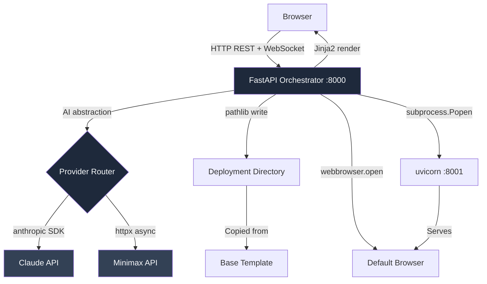
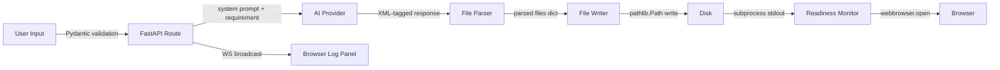

# AI Application Generator - Implementation Plan

**Version:** 2.0  
**Date:** March 6, 2026  
**Status:** Ready for Implementation  
**Tech Stack:** Python 3.11+ / FastAPI  
**Security Standard:** FIPS 140-3, NIST SP 800-53, OWASP Top 10, DISA STIG, CIS Benchmark Level 2

---

## 1. Project Overview

This implementation plan outlines the development of an AI-powered web application generator that transforms natural language requirements into deployable Python web applications. The system operates through a two-stage workflow: the AI first generates an implementation plan for user review, and upon approval, generates complete application code that automatically deploys to a local folder and launches in the browser.

The entire system is Python-based. The orchestration layer, the web frontend, and all generated applications use Python with FastAPI and Jinja2. This eliminates all dependency on Node.js, npm, or JavaScript build tooling.

The core value proposition centres on rapid prototyping capability within a five-minute demonstration window. Users describe a web application in plain English, review and approve an AI-generated plan, and receive a fully functional running application — all without touching the command line.

---

## 2. System Architecture

### 2.1 Architectural Overview

The system uses a client-server model. A pure browser application is insufficient because browsers cannot directly manipulate the file system or execute shell processes. The FastAPI backend bridges this gap, providing REST and WebSocket interfaces to the browser while managing all local file and process operations.



### 2.2 Component Interactions

The interaction follows a strict sequential pattern mirroring the two-stage workflow:

1. Browser submits requirement → FastAPI `/api/plan` → AI provider → plan returned to browser
2. User reviews and approves plan → browser submits to `/api/generate`
3. FastAPI calls AI provider for full code generation
4. FastAPI parses XML-tagged file blocks, writes files to deployment directory
5. FastAPI copies base template, overwrites source files, launches `uvicorn` subprocess
6. FastAPI monitors stdout for readiness signal, calls `webbrowser.open()`
7. Log messages stream to browser via WebSocket throughout

### 2.3 Data Flow



---

## 3. Technology Stack

### 3.1 Orchestrator Backend

The backend is a Python 3.11+ application using FastAPI 0.110 or later. FastAPI is chosen for its native async support (essential for non-blocking AI API calls and WebSocket streaming), automatic OpenAPI documentation, and first-class Pydantic v2 integration for input validation.

Key Python packages:

| Package | Version | Purpose |
|---------|---------|---------|
| `fastapi` | 0.110+ | Web framework and WebSocket support |
| `uvicorn[standard]` | 0.29+ | ASGI server for the orchestrator |
| `anthropic` | 0.25+ | Official Claude API SDK |
| `httpx` | 0.27+ | Async HTTP client for Minimax |
| `jinja2` | 3.1+ | HTML template rendering |
| `pydantic` | 2.x | Request/response validation |
| `pydantic-settings` | 2.x | Environment variable configuration |
| `python-dotenv` | 1.0+ | `.env` file loading |
| `psutil` | 5.9+ | Port detection and process management |
| `cryptography` | 42.x+ | FIPS 140-3 validated crypto operations |
| `python-multipart` | 0.0.9+ | Form data parsing |

All dependencies are declared in `pyproject.toml` with pinned minimum versions.

### 3.2 Frontend

The frontend is served directly by the FastAPI application using Jinja2 templates and Python's `StaticFiles` mount. No separate frontend server is required.

Tailwind CSS is loaded via CDN (`https://cdn.tailwindcss.com`) — no build step. Vanilla JavaScript handles view state transitions and WebSocket connectivity. JetBrains Mono and Inter fonts are loaded from Google Fonts CDN.

### 3.3 Pre-installed Base Template

The base template is a minimal FastAPI + Jinja2 + Tailwind application. Its virtual environment (`.venv/`) and dependencies are installed once when the template is created. Deployment then consists only of copying the template directory and overwriting the source files — no `pip install` required at generation time, enabling the 15-second deployment target.

Base template structure:

```
base-template/
├── .venv/                   # Pre-installed virtual environment
├── main.py                  # Minimal FastAPI app entry point
├── requirements.txt         # Locked dependencies
├── templates/
│   └── index.html           # Base Jinja2 template
└── static/
    └── style.css            # Minimal custom CSS
```

---

## 4. Implementation Phases

### 4.1 Phase 1: Foundation Setup

**Goal:** Working FastAPI skeleton, file system utilities, and base template.

**Step 1 – Project Initialisation**

Create the project directory and set up the Python environment:

```bash
mkdir ai-app-generator && cd ai-app-generator
python3.11 -m venv .venv
source .venv/bin/activate          # Linux/macOS
# or: .venv\Scripts\activate.bat  # Windows
pip install --upgrade pip
```

Create `pyproject.toml`:

```toml
[project]
name = "ai-app-generator"
version = "2.0.0"
requires-python = ">=3.11"
dependencies = [
    "fastapi>=0.110.0",
    "uvicorn[standard]>=0.29.0",
    "anthropic>=0.25.0",
    "httpx>=0.27.0",
    "jinja2>=3.1.0",
    "pydantic>=2.0.0",
    "pydantic-settings>=2.0.0",
    "python-dotenv>=1.0.0",
    "psutil>=5.9.0",
    "cryptography>=42.0.0",
    "python-multipart>=0.0.9",
]

[project.optional-dependencies]
dev = [
    "pytest>=8.0.0",
    "pytest-asyncio>=0.23.0",
    "httpx>=0.27.0",
    "bandit>=1.7.0",
    "pip-audit>=2.7.0",
    "ruff>=0.4.0",
    "mypy>=1.10.0",
]

[tool.ruff]
line-length = 88
select = ["E", "F", "I", "N", "W", "S"]

[tool.mypy]
python_version = "3.11"
disallow_untyped_defs = true
warn_return_any = true

[tool.pytest.ini_options]
asyncio_mode = "auto"
testpaths = ["tests"]
```

**Step 2 – Project Structure**

```
ai-app-generator/
├── pyproject.toml
├── .env.example
├── .gitignore
├── Containerfile                  # Podman build file
├── src/
│   └── app/
│       ├── __init__.py
│       ├── main.py                # FastAPI app factory
│       ├── config.py              # pydantic-settings config
│       ├── routes/
│       │   ├── __init__.py
│       │   ├── api.py             # REST endpoints
│       │   └── websocket.py      # WebSocket endpoint
│       ├── services/
│       │   ├── __init__.py
│       │   ├── ai_provider.py     # AI abstraction layer
│       │   ├── file_service.py    # File system operations
│       │   └── process_service.py # Subprocess management
│       ├── models/
│       │   ├── __init__.py
│       │   └── schemas.py         # Pydantic request/response models
│       └── templates/
│           ├── base.html
│           ├── index.html
│           └── partials/
├── base-template/                  # Pre-installed template
│   ├── .venv/
│   ├── main.py
│   ├── requirements.txt
│   └── templates/
│       └── index.html
├── tests/
│   ├── __init__.py
│   ├── conftest.py
│   ├── test_api.py
│   ├── test_ai_provider.py
│   └── test_file_service.py
└── generated-apps/                # Default deployment root
```

**Step 3 – Configuration with pydantic-settings**

```python
# src/app/config.py
from pydantic_settings import BaseSettings, SettingsConfigDict
from pathlib import Path


class Settings(BaseSettings):
    """Application configuration loaded from environment variables."""

    model_config = SettingsConfigDict(
        env_file=".env",
        env_file_encoding="utf-8",
        case_sensitive=False,
    )

    app_host: str = "127.0.0.1"
    app_port: int = 8000
    deploy_dir: Path = Path("generated-apps/latest")
    base_template_dir: Path = Path("base-template")
    generated_app_port: int = 8001
    log_level: str = "INFO"
    max_requirement_length: int = 4000
    min_requirement_length: int = 10
```

**Step 4 – File System Service**

```python
# src/app/services/file_service.py
import shutil
from pathlib import Path
import logging

logger = logging.getLogger(__name__)


class FileServiceError(Exception):
    """Raised when a file system operation fails."""


def validate_deploy_path(target: Path, deploy_root: Path) -> None:
    """Raise FileServiceError if target is outside deploy_root.

    Prevents CWE-22 directory traversal attacks.
    """
    try:
        target.resolve().relative_to(deploy_root.resolve())
    except ValueError as exc:
        raise FileServiceError(
            f"Path '{target}' is outside the deployment root '{deploy_root}'"
        ) from exc


def copy_base_template(source: Path, destination: Path) -> None:
    """Copy the pre-installed base template to the deployment directory."""
    validate_deploy_path(destination, destination.parent)
    if destination.exists():
        shutil.rmtree(destination)
    shutil.copytree(source, destination, symlinks=False)
    logger.info("Base template copied to %s", destination)


def write_generated_files(
    files: dict[str, str], deploy_root: Path
) -> None:
    """Write AI-generated file contents to the deployment directory."""
    for relative_path, content in files.items():
        target = deploy_root / relative_path
        validate_deploy_path(target, deploy_root)
        target.parent.mkdir(parents=True, exist_ok=True)
        target.write_text(content, encoding="utf-8")
        logger.info("Wrote generated file: %s", target)
```

**Phase 1 completion criteria:** FastAPI starts cleanly, base template copies and runs correctly with `uvicorn`, file system utilities pass unit tests including path traversal rejection.

---

### 4.2 Phase 2: AI Integration

**Goal:** Working AI provider abstraction with plan and code generation endpoints.

**Step 1 – Provider Abstraction (Python Protocol)**

```python
# src/app/services/ai_provider.py
from typing import Protocol
import anthropic
import httpx
import logging

logger = logging.getLogger(__name__)


class AIProviderError(Exception):
    """Raised when an AI provider call fails."""


class AIProvider(Protocol):
    """Protocol defining the AI provider interface."""

    async def generate(self, user_prompt: str, system_prompt: str) -> str:
        """Send a prompt and return the AI response text."""
        ...


class ClaudeProvider:
    """Claude AI provider using the official anthropic SDK."""

    MODEL = "claude-sonnet-4-20250514"

    def __init__(self, api_key: str) -> None:
        self._client = anthropic.AsyncAnthropic(api_key=api_key)

    async def generate(self, user_prompt: str, system_prompt: str) -> str:
        try:
            message = await self._client.messages.create(
                model=self.MODEL,
                max_tokens=8192,
                system=system_prompt,
                messages=[{"role": "user", "content": user_prompt}],
            )
            return message.content[0].text
        except anthropic.AuthenticationError as exc:
            raise AIProviderError("Invalid Claude API key.") from exc
        except anthropic.RateLimitError as exc:
            raise AIProviderError(
                "Claude rate limit exceeded. Please wait and retry."
            ) from exc
        except anthropic.APIError as exc:
            raise AIProviderError(f"Claude API error: {exc}") from exc


class MinimaxProvider:
    """Minimax AI provider using async httpx."""

    API_URL = "https://api.minimax.chat/v1/text/chatcompletion_v2"

    def __init__(self, api_key: str) -> None:
        self._api_key = api_key

    async def generate(self, user_prompt: str, system_prompt: str) -> str:
        headers = {
            "Authorization": f"Bearer {self._api_key}",
            "Content-Type": "application/json",
        }
        payload = {
            "model": "abab6.5s-chat",
            "messages": [
                {"role": "system", "content": system_prompt},
                {"role": "user", "content": user_prompt},
            ],
        }
        try:
            async with httpx.AsyncClient(timeout=120.0) as client:
                response = await client.post(
                    self.API_URL, headers=headers, json=payload
                )
                response.raise_for_status()
                data = response.json()
                return data["choices"][0]["message"]["content"]
        except httpx.HTTPStatusError as exc:
            if exc.response.status_code == 401:
                raise AIProviderError("Invalid Minimax API key.") from exc
            raise AIProviderError(
                f"Minimax HTTP error: {exc.response.status_code}"
            ) from exc
        except httpx.RequestError as exc:
            raise AIProviderError(f"Network error calling Minimax: {exc}") from exc


def create_provider(provider_name: str, api_key: str) -> AIProvider:
    """Factory: return the correct AIProvider instance."""
    match provider_name.lower():
        case "claude":
            return ClaudeProvider(api_key)
        case "minimax":
            return MinimaxProvider(api_key)
        case _:
            raise AIProviderError(
                f"Unknown provider '{provider_name}'. Use 'claude' or 'minimax'."
            )
```

**Step 2 – System Prompts**

Plan generation system prompt:

```
You are a senior Python developer specialising in FastAPI web application design.
Based on the user's requirement, create a detailed implementation plan.
Your plan must include:
1. File structure — every Python file, template, and static asset to be created
2. Component breakdown — FastAPI routes, Jinja2 templates, and their responsibilities
3. Technical approach — libraries, data models, URL structure, data flow
4. Implementation steps — logical development order

Target stack: Python 3.11+, FastAPI, Jinja2 templates, Tailwind CSS via CDN.
Do NOT suggest Node.js, npm, React, or any JavaScript build tooling.

Provide your response in clear markdown format with headings for each section.
```

Code generation system prompt:

```
Generate a complete, working Python web application based on the requirement and plan below.
Use FastAPI + Jinja2 + Tailwind CSS (via CDN) as the technology stack.
Do NOT use Node.js, npm, React, or any JavaScript build tool.

IMPORTANT: Wrap each file in XML tags with this exact format:
<file path="relative/path/to/file">
[file contents here]
</file>

Include ALL necessary files:
- main.py (FastAPI application entry point with uvicorn startup)
- requirements.txt (all pip dependencies, one per line)
- templates/index.html (base Jinja2 template with Tailwind CDN)
- Any additional route files, templates, models, or static assets

Ensure the application starts with: uvicorn main:app --port 8001
All templates must use Jinja2 syntax. Do not use JSX or React components.

Requirement:
{user_requirement}

Plan:
{approved_plan}
```

**Step 3 – File Parser**

```python
# src/app/services/file_service.py (addition)
import re


def parse_generated_files(response: str) -> dict[str, str]:
    """Extract file path and content pairs from XML-tagged AI response.

    Handles multi-line content. Returns empty dict if no files found.
    """
    pattern = re.compile(
        r'<file\s+path="([^"]+)">(.*?)</file>',
        re.DOTALL,
    )
    files: dict[str, str] = {}
    for match in pattern.finditer(response):
        file_path = match.group(1).strip()
        content = match.group(2).strip()
        # Reject absolute paths and traversal sequences
        if file_path.startswith(("/", "\\")) or ".." in file_path:
            logger.warning("Rejected suspicious generated path: %s", file_path)
            continue
        files[file_path] = content
    return files
```

**Phase 2 completion criteria:** Successful API calls to both Claude and Minimax, correct plan markdown returned, correct code generation with XML file extraction, parser rejects path traversal attempts.

---

### 4.3 Phase 3: Process Management and Deployment

**Goal:** Automatic deployment, server startup detection, browser launch, and clean shutdown.

**Step 1 – Port Detection with psutil**

```python
# src/app/services/process_service.py
import psutil
import subprocess
import time
import webbrowser
import logging
from pathlib import Path

logger = logging.getLogger(__name__)


class ProcessServiceError(Exception):
    """Raised when a process operation fails."""


def kill_process_on_port(port: int) -> None:
    """Terminate any process listening on the given port."""
    for conn in psutil.net_connections(kind="inet"):
        if conn.laddr.port == port and conn.status == "LISTEN":
            try:
                proc = psutil.Process(conn.pid)
                proc.terminate()
                proc.wait(timeout=5)
                logger.info("Terminated existing process on port %d (PID %d)", port, conn.pid)
            except (psutil.NoSuchProcess, psutil.TimeoutExpired) as exc:
                logger.warning("Could not cleanly terminate PID %d: %s", conn.pid, exc)
```

**Step 2 – Deployment Workflow**

```python
def deploy_and_start(
    deploy_dir: Path,
    base_template: Path,
    generated_files: dict[str, str],
    port: int,
    log_callback,
) -> subprocess.Popen:
    """Copy base template, write generated files, start uvicorn.

    Args:
        deploy_dir: Target deployment directory.
        base_template: Path to the pre-installed base template.
        generated_files: Dict of relative_path -> content from AI.
        port: Port to run the generated application on.
        log_callback: Callable that receives log message strings.

    Returns:
        The running subprocess.Popen object.
    """
    log_callback("Cleaning deployment directory...")
    copy_base_template(base_template, deploy_dir)

    log_callback("Writing generated files...")
    write_generated_files(generated_files, deploy_dir)

    log_callback(f"Starting application on port {port}...")
    kill_process_on_port(port)

    # Use list-form args — never shell=True or string interpolation (CWE-78)
    process = subprocess.Popen(
        [str(deploy_dir / ".venv" / "bin" / "uvicorn"), "main:app",
         "--host", "127.0.0.1", "--port", str(port)],
        cwd=str(deploy_dir),
        stdout=subprocess.PIPE,
        stderr=subprocess.STDOUT,
        text=True,
    )
    return process


def wait_for_ready(process: subprocess.Popen, port: int, timeout: int = 30) -> str:
    """Monitor subprocess stdout for server readiness.

    Returns the URL when ready. Raises ProcessServiceError on timeout.
    """
    url = f"http://127.0.0.1:{port}"
    deadline = time.monotonic() + timeout
    for line in process.stdout:
        if time.monotonic() > deadline:
            raise ProcessServiceError("Server startup timed out.")
        if "Application startup complete" in line or "Uvicorn running" in line:
            return url
    raise ProcessServiceError("Process ended before signalling readiness.")


def launch_browser(url: str) -> None:
    """Open the default system browser at the given URL."""
    webbrowser.open(url)
    logger.info("Browser launched: %s", url)
```

**Phase 3 completion criteria:** Template copies correctly, `uvicorn` starts and is detected as ready, browser opens to the correct URL, process terminates cleanly on stop.

---

### 4.4 Phase 4: Frontend Development

**Goal:** All four Jinja2 views, WebSocket log streaming, dark theme applied.

**Step 1 – FastAPI Application Factory**

```python
# src/app/main.py
from fastapi import FastAPI
from fastapi.middleware.cors import CORSMiddleware
from fastapi.staticfiles import StaticFiles
from fastapi.templating import Jinja2Templates
from starlette.middleware.base import BaseHTTPMiddleware
from starlette.requests import Request
from starlette.responses import Response
from pathlib import Path
from app.routes import api, websocket
from app.config import Settings

settings = Settings()


class SecurityHeadersMiddleware(BaseHTTPMiddleware):
    """Add security headers to every response (OWASP A05, CIS Benchmark)."""

    async def dispatch(self, request: Request, call_next) -> Response:
        response = await call_next(request)
        response.headers["X-Frame-Options"] = "DENY"
        response.headers["X-Content-Type-Options"] = "nosniff"
        response.headers["Referrer-Policy"] = "no-referrer"
        response.headers["Content-Security-Policy"] = (
            "default-src 'self'; "
            "script-src 'self' https://cdn.tailwindcss.com; "
            "style-src 'self' https://fonts.googleapis.com 'unsafe-inline'; "
            "font-src https://fonts.gstatic.com;"
        )
        return response


def create_app() -> FastAPI:
    app = FastAPI(title="AI Application Generator", version="2.0.0")

    app.add_middleware(SecurityHeadersMiddleware)
    app.add_middleware(
        CORSMiddleware,
        allow_origins=["http://127.0.0.1:8000"],
        allow_methods=["GET", "POST"],
        allow_headers=["*"],
    )

    app.include_router(api.router, prefix="/api")
    app.include_router(websocket.router)

    static_path = Path(__file__).parent / "static"
    if static_path.exists():
        app.mount("/static", StaticFiles(directory=str(static_path)), name="static")

    return app


app = create_app()
```

**Step 2 – Pydantic Request/Response Models**

```python
# src/app/models/schemas.py
from pydantic import BaseModel, Field, field_validator


class ConfigRequest(BaseModel):
    provider: str = Field(..., pattern="^(claude|minimax)$")
    api_key: str = Field(..., min_length=10, max_length=512)


class PlanRequest(BaseModel):
    requirement: str = Field(..., min_length=10, max_length=4000)
    refine: bool = False


class GenerateRequest(BaseModel):
    requirement: str = Field(..., min_length=10, max_length=4000)
    plan: str = Field(..., min_length=10, max_length=16000)


class StatusResponse(BaseModel):
    phase: str
    progress: int = Field(..., ge=0, le=100)
    message: str
    url: str | None = None


class PlanResponse(BaseModel):
    plan: str


class ErrorResponse(BaseModel):
    code: str
    detail: str
```

**Step 3 – REST API Routes**

```python
# src/app/routes/api.py
from fastapi import APIRouter, HTTPException
from app.models.schemas import (
    ConfigRequest, PlanRequest, GenerateRequest,
    StatusResponse, PlanResponse, ErrorResponse
)
from app.services.ai_provider import create_provider, AIProviderError
from app.services.file_service import parse_generated_files
from app.services import process_service
from app import state   # In-memory session state module

router = APIRouter()

PLAN_SYSTEM_PROMPT = """You are a senior Python developer..."""  # Full prompt in implementation
CODE_SYSTEM_PROMPT = """Generate a complete FastAPI application..."""


@router.post("/config", status_code=200)
async def configure(request: ConfigRequest) -> dict:
    """Store AI provider credentials in memory for this session."""
    try:
        provider = create_provider(request.provider, request.api_key)
        # Validate credentials with a minimal test call
        await provider.generate("Hello", "Reply with one word.")
    except AIProviderError as exc:
        raise HTTPException(status_code=401, detail=str(exc)) from exc
    state.set_provider(provider)
    return {"status": "configured"}


@router.post("/plan", response_model=PlanResponse)
async def generate_plan(request: PlanRequest) -> PlanResponse:
    """Stage 1: Generate an implementation plan from a requirement."""
    provider = state.get_provider()
    if provider is None:
        raise HTTPException(status_code=400, detail="Provider not configured.")
    try:
        plan = await provider.generate(request.requirement, PLAN_SYSTEM_PROMPT)
    except AIProviderError as exc:
        raise HTTPException(status_code=502, detail=str(exc)) from exc
    return PlanResponse(plan=plan)
```

**Step 4 – WebSocket Endpoint**

```python
# src/app/routes/websocket.py
from fastapi import APIRouter, WebSocket, WebSocketDisconnect
from app import state
import logging

logger = logging.getLogger(__name__)
router = APIRouter()


@router.websocket("/ws/logs")
async def websocket_logs(websocket: WebSocket) -> None:
    """Stream execution log messages to the connected browser client."""
    await websocket.accept()
    state.register_websocket(websocket)
    try:
        while True:
            await websocket.receive_text()   # Keep connection alive
    except WebSocketDisconnect:
        state.unregister_websocket(websocket)
```

**Step 5 – Jinja2 Templates**

The `base.html` template loads Tailwind CDN, Inter and JetBrains Mono from Google Fonts, and defines the dark slate colour scheme. Four child templates correspond to the four workflow views: `input.html`, `plan.html`, `execution.html`, and `success.html`. Each view section is toggled by JavaScript `display` state. The WebSocket client in `execution.html` appends log messages to the terminal `<div>`.

**Phase 4 completion criteria:** All four views render and transition correctly, WebSocket log messages appear in the terminal panel, plan edit textarea is functional, all buttons call correct API endpoints.

---

### 4.5 Phase 5: Testing, Security Scanning, and Containerisation

**Goal:** Comprehensive testing, clean security scan, Podman container build.

**Step 1 – Unit Tests**

```python
# tests/test_file_service.py
import pytest
from pathlib import Path
from app.services.file_service import parse_generated_files, validate_deploy_path, FileServiceError


def test_parse_generated_files_basic():
    response = '<file path="main.py">print("hello")</file>'
    result = parse_generated_files(response)
    assert result == {"main.py": 'print("hello")'}


def test_parse_rejects_path_traversal():
    response = '<file path="../../../etc/passwd">data</file>'
    result = parse_generated_files(response)
    assert result == {}


def test_validate_deploy_path_rejects_outside():
    root = Path("/tmp/deploy")
    target = Path("/tmp/deploy/../../../etc/passwd")
    with pytest.raises(FileServiceError):
        validate_deploy_path(target.resolve(), root)
```

**Step 2 – Security Scanning**

```bash
# Static security analysis
bandit -r src/ -ll

# Dependency vulnerability scanning
pip-audit

# Type checking
mypy src/

# Linting
ruff check src/
```

All `bandit` HIGH severity findings must be resolved before deployment. `pip-audit` must report no CRITICAL or HIGH CVEs.

**Step 3 – End-to-End Testing**

Test the following scenarios:

- Simple requirement: `"Create a todo list app"` → verify running app within 3 minutes
- Complex requirement: `"Build a dashboard showing a bar chart of monthly sales data"` → verify within 5 minutes
- Invalid API key → HTTP 401, clear error message displayed
- Network failure simulation → retry option presented
- Path traversal in generated file path → rejected silently, warning logged
- Port already in use → existing process killed, new app starts

**Step 4 – Podman Container Build**

`Containerfile` (equivalent to Dockerfile, Podman-native):

```dockerfile
FROM python:3.11-slim

# CIS Benchmark L2: run as non-root user
RUN useradd --create-home appuser
WORKDIR /home/appuser/app

# Install dependencies first for layer caching
COPY pyproject.toml .
RUN pip install --no-cache-dir --upgrade pip \
    && pip install --no-cache-dir .

# Copy application source
COPY src/ ./src/
COPY base-template/ ./base-template/

# CIS Benchmark L2: drop all capabilities, set non-root user
USER appuser

EXPOSE 8000

# Health check
HEALTHCHECK --interval=30s --timeout=5s --start-period=10s \
  CMD python -c "import urllib.request; urllib.request.urlopen('http://localhost:8000/health')"

CMD ["uvicorn", "app.main:app", "--host", "0.0.0.0", "--port", "8000"]
```

Build and run with Podman:

```bash
# Build image
podman build -t ai-app-generator:2.0 .

# Run container (read-only root filesystem where possible)
podman run \
  --read-only \
  --tmpfs /tmp \
  -p 8000:8000 \
  --env-file .env \
  ai-app-generator:2.0
```

**Phase 5 completion criteria:** All unit tests pass, `bandit` no HIGH findings, `pip-audit` no HIGH/CRITICAL CVEs, end-to-end demo completes within 5 minutes, Podman container builds and runs cleanly.

---

## 5. Detailed API Specifications

### 5.1 Endpoint Reference

#### `POST /api/config`

**Request:**
```json
{
  "provider": "claude",
  "api_key": "sk-ant-..."
}
```

**Response 200:**
```json
{ "status": "configured" }
```

**Response 401:**
```json
{ "code": "AUTH_FAILED", "detail": "Invalid Claude API key." }
```

---

#### `POST /api/plan`

**Request:**
```json
{
  "requirement": "Build a task management app with priority levels",
  "refine": false
}
```

**Response 200:**
```json
{
  "plan": "## Implementation Plan\n\n### File Structure\n..."
}
```

---

#### `POST /api/generate`

**Request:**
```json
{
  "requirement": "Build a task management app with priority levels",
  "plan": "## Implementation Plan\n\n..."
}
```

**Response 200:**
```json
{ "status": "deploying", "message": "Generation started" }
```

Deployment progress is streamed via WebSocket `/ws/logs`.

---

#### `GET /api/status`

**Response 200:**
```json
{
  "phase": "running",
  "progress": 100,
  "message": "Application is running",
  "url": "http://127.0.0.1:8001"
}
```

---

#### `POST /api/stop`

**Response 200:**
```json
{ "status": "idle", "message": "Application stopped" }
```

---

#### `WebSocket /ws/logs`

Messages are JSON strings:
```json
{ "level": "info", "message": "Copying base template..." }
{ "level": "success", "message": "Application started at http://127.0.0.1:8001" }
{ "level": "error", "message": "Port 8001 in use. Attempting to free..." }
```

---

## 6. Configuration and Environment

### 6.1 Environment Variables

Create `.env` from `.env.example`:

```env
APP_HOST=127.0.0.1
APP_PORT=8000
DEPLOY_DIR=./generated-apps/latest
BASE_TEMPLATE_DIR=./base-template
GENERATED_APP_PORT=8001
LOG_LEVEL=INFO
```

API keys are **never** stored in `.env`. They are submitted by the user through the browser UI and held only in process memory.

### 6.2 .gitignore

```
.env
.venv/
__pycache__/
*.pyc
generated-apps/
.mypy_cache/
.ruff_cache/
```

---

## 7. Performance Targets

| Phase | Target | Mechanism |
|-------|--------|-----------|
| Plan Generation | ≤ 30 seconds | Single async AI API call |
| Code Generation | ≤ 90 seconds | Async AI API call with streaming support |
| Deployment | ≤ 15 seconds | Pre-installed base template; no pip install needed |
| Browser Launch | ≤ 2 seconds | `webbrowser.open()` (stdlib, synchronous) |
| **Total** | **≤ 180 seconds** | Ample margin within 5-minute window |

The 15-second deployment target is the critical optimisation. Because the base template has its `.venv/` pre-installed, deployment is purely file I/O and process startup — no package resolution or download.

---

## 8. Error Handling Matrix

| Scenario | HTTP Code | User Message | Recovery |
|----------|-----------|-------------|---------|
| Invalid API key | 401 | "Invalid API key. Please check your credentials." | Update config |
| Rate limit exceeded | 429 | "Rate limit exceeded. Please wait and retry." | Auto-retry after 30s |
| Network error | 502 | "Network error reaching AI provider. Check connection." | Manual retry |
| Parse error | 500 | "Unable to parse AI response. Please retry." | Retry generation |
| Deployment error | 500 | Show subprocess stderr output | Check generated code |
| Port conflict | — | "Port in use. Freeing port..." | Auto-resolved via psutil |
| Permission denied | 500 | "Permission denied. Check deployment folder permissions." | Manual fix |
| Path traversal attempt | 400 | "Invalid file path in generated code." | Logged + rejected |

---

## 9. Security Implementation

### 9.1 API Key Security (NIST SP 800-53 IA-5)

API keys are stored in a module-level dictionary in `app/state.py`, scoped to the running process. The `api_key` field is excluded from all log formatters. The key is never echoed in any API response. Python `logging.Filter` is used to scrub any accidental key logging.

### 9.2 Input Validation (OWASP A03, NIST SP 800-53 SI-10)

Every API endpoint uses a Pydantic v2 `BaseModel` for request validation. FastAPI automatically returns HTTP 422 with field-level error details for invalid inputs before any business logic runs.

### 9.3 Path Traversal Prevention (CWE-22, DISA STIG V-230264)

```python
def validate_deploy_path(target: Path, deploy_root: Path) -> None:
    resolved_target = target.resolve()
    resolved_root = deploy_root.resolve()
    try:
        resolved_target.relative_to(resolved_root)
    except ValueError as exc:
        raise FileServiceError("Path outside deployment root") from exc
```

This check is applied to every path before any read or write operation.

### 9.4 Command Injection Prevention (CWE-78)

All `subprocess.Popen` calls use list-form arguments. `shell=True` is never used. User-provided strings are never interpolated into command lists. Port numbers are cast to `int` and validated with Pydantic `Field(ge=1024, le=65535)` before use.

### 9.5 FIPS 140-3 Compliance

Any session token or CSRF token generation uses `secrets.token_hex(32)` (Python stdlib, uses OS-provided randomness) or `cryptography.hazmat.primitives.hashes` backed by OpenSSL. MD5 and SHA-1 are prohibited for any security-relevant purpose.

### 9.6 Security Headers

`SecurityHeadersMiddleware` (defined in `main.py`) adds the following to all responses:

| Header | Value |
|--------|-------|
| `X-Frame-Options` | `DENY` |
| `X-Content-Type-Options` | `nosniff` |
| `Referrer-Policy` | `no-referrer` |
| `Content-Security-Policy` | Restrict to `self` + Tailwind CDN + Google Fonts |

---

## 10. Future Enhancements

**Additional AI Providers:** OpenAI GPT-4o, Google Gemini, or local Ollama models via the same `AIProvider` Protocol.

**Template Selection:** Allow users to choose from multiple base templates (Flask, Django, plain Python HTTP server) rather than FastAPI-only.

**Preview Mode:** AI-generated wireframe or description of the UI before code generation begins.

**Save and Share:** Registry of previously generated applications with metadata and regeneration capability.

**Cloud Deployment:** Add options to deploy to Fly.io, Railway, or other Python-friendly platforms rather than local-only deployment.

**Streaming Generation:** Use the Anthropic streaming API for token-by-token display of AI output in the terminal panel, improving perceived responsiveness.

---

## 11. Summary

This implementation plan provides a complete roadmap for building the AI Application Generator in Python. The architecture uses FastAPI for both orchestration and frontend serving, eliminating the Node.js/React complexity of the previous design. All generated applications are also Python-based (FastAPI + Jinja2 + Tailwind via CDN), providing a consistent, fully Python stack end to end.

The critical performance enabler remains the pre-installed base template, now a Python virtual environment with FastAPI dependencies pre-installed, enabling sub-15-second deployment by eliminating pip install at generation time.

Security is addressed systematically: Pydantic v2 validates all inputs, `pathlib.Path` with traversal checks protects the file system, list-form subprocess arguments prevent command injection, and the `cryptography` library provides FIPS 140-3 compliant cryptographic operations.

---

**Sources and References:**

- FastAPI Documentation: https://fastapi.tiangolo.com
- Anthropic Python SDK: https://github.com/anthropic-ai/anthropic-sdk-python
- httpx async HTTP: https://www.python-httpx.org
- pydantic-settings: https://docs.pydantic.dev/latest/concepts/pydantic_settings/
- psutil Documentation: https://psutil.readthedocs.io
- Python `cryptography` FIPS: https://cryptography.io/en/latest/faq/#fips
- Python `subprocess` security: https://docs.python.org/3/library/subprocess.html#security-considerations
- NIST SP 800-53 Rev 5: https://csrc.nist.gov/publications/detail/sp/800-53/rev-5/final
- OWASP Top 10: https://owasp.org/www-project-top-ten/
- CWE-22 Path Traversal: https://cwe.mitre.org/data/definitions/22.html
- CWE-78 Command Injection: https://cwe.mitre.org/data/definitions/78.html
- DISA STIG Application Security: https://public.cyber.mil/stigs/
- CIS Benchmark Level 2: https://www.cisecurity.org/cis-benchmarks
- Podman Documentation: https://docs.podman.io
- bandit Security Scanner: https://bandit.readthedocs.io
- pip-audit: https://pypi.org/project/pip-audit/

---

**Plan Prepared By:** Iain Reid  
**Date:** March 6, 2026  
**Version:** 2.0
